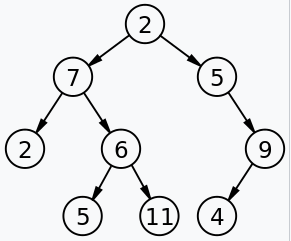
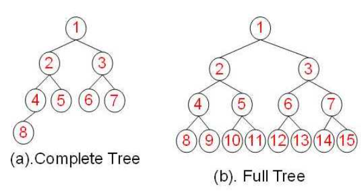
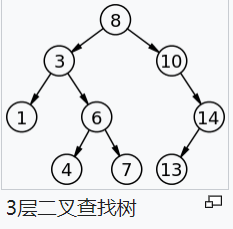

# 二叉树

## 1. 介绍

在计算机科学中，二叉树（英语：Binary tree）是每个节点最多只有两个分支（即不存在分支度大于2的节点）的树结构。通常分支被称作“左子树”或“右子树”。



**二叉树的分支具有左右次序，不能随意颠倒。**

## 2. 基础实现

### 2.1 表示

树结构在存储上就像链表一样，是通过指针把各个节点连接在一起，物理上并不需要存储在一起：

```js
class TreeNode {
  constructor(val, leftNode, rightNode) {
    this.val = val;
    this.left = leftNode || null;
    this.right = rightNode || null;
  }
}
```
### 2.2 遍历

> [leetcode book](https://leetcode-cn.com/leetbook/read/data-structure-binary-tree/xefb4e/)

树可以以递归的方式定义为一个节点（根节点），它包括一个值和一个指向其他节点指针的列表。 递归是树的特性之一。 因此，许多树问题可以通过递归的方式来解决。 

**对于每个递归层级，我们只能关注单个节点内的问题，并通过递归调用函数来解决其子节点问题。**

通常，我们可以通过 “自顶向下” 或 “自底向上” 的递归来解决树问题。

#### 自顶向下

自顶向下首先访问节点，计算一些值，然后递归调用，将这些值传递给子节点。可看作是**前序遍历**的一种方式。

```js
// 以计算树的节点深度为例
function top_down(node, params) {
    // 1. 当节点为空时，结束递归
    if (!node) return;
    // 2. 当节点满足某个条件时，使用 params 更新答案
    if (!node.left && !node.right) {
        ans = Math.max(ans, params)
    }
    // 3. 左子树递归，并传入更新参数
    let left_answer = top_down(node.left, params + 1)
    // 4. 右子树递归，并传入更新参数
    let right_answer = top_down(node.right, params + 1)
}
```

在第二步更新答案中，更新的是外部变量。

#### 自底向上
在每个递归层次上，我们首先对所有子节点递归地调用函数，然后根据返回值和根节点本身的值得到答案。 这个过程可以看作是**后序遍历**的一种。

```js
// 以计算树的节点深度为例
function bottom_up(node) {
    // 1. 当节点为空时，返回某个具体值
    if (!node) return 0;
    // 2. 左子树递归，并传入更新参数
    let left_answer = bottom_up(node.left)
    // 3. 右子树递归，并传入更新参数
    let right_answer = bottom_up(node.right)
    // 4. 根据子节点的答案，计算根节点
    return Math.max(left_answer, right_answer) + 1
}
```

### 2.3 一般解题思路

- 自顶向下需要往子节点传参，自底向上不需要传参
- 自顶向下更新的答案是外部变量，自底向上是根据子节点答案计算根节点，直接返回答案

当遇到树问题时，请先思考一下两个问题：

- 你能确定一些参数，从该节点自身解决出发寻找答案吗？
- 你可以使用这些参数和节点本身的值来决定什么应该是传递给它子节点的参数吗？

如果答案都是肯定的，那么请尝试使用 “自顶向下” 的递归来解决此问题。

或者你可以这样思考：

- 对于树中的任意一个节点，如果你知道它子节点的答案，你能计算出该节点的答案吗？ 

如果答案是肯定的，那么 “自底向上” 的递归可能是一个不错的解决方法。

## 3. 完全二叉树与堆

### 3.1 基本概念

#### 3.1.1 完全二叉树

在一棵二叉树中，若除最后一层外的其余层都是满的，并且最后一层要么是满的，要么在右边缺少连续若干节点，则此二叉树为完全二叉树（Complete Binary Tree）。



- 具有 `n` 个节点的完全二叉树的深度为 `log_2n+1`
- 深度为 `k` 的完全二叉树，至少有 `2^(k - 1)` 个节点，至多有 `2^k - 1`节点。

#### 3.1.2 堆

堆（英语：Heap）是计算机科学中的一种特别的**完全二叉树**。

若是满足以下特性，即可称为堆：
- 给定堆中任意节点P和C，若P是C的母节点，那么P的值会小于等于（或大于等于）C的值
- 若母节点的值恒小于等于子节点的值，此堆称为`最小堆`（min heap）
- 若母节点的值恒大于等于子节点的值，此堆称为`最大堆`（max heap）

在堆中最顶端的那一个节点，称作根节点（root node），根节点本身没有母节点（parent node）。

`最小堆`与`最大堆`是解决寻找 **第 K 大问题**的关键结构。

### 3.2 代码实现


主要实现是通过在增删数据时的操作，使得数据始终保持顶部最小或最大的二叉树堆结构。

关键点在于新增数据时的**上浮操作**和删除数据时的**下沉操作**。

#### 3.2.1 堆的表示

使用数组结构模拟二叉树的实现。

```js
// 构造函数
class MinPQ {
    // 传入比较函数
    constructor(compareFn) {
        // 使用数组模拟二叉树结构，通过索引寻找父子节点
        // 这里使用一个元素占位，是为了方便计算根节点的子节点 2 * k
        this.pq = [null]
        if (compareFn) this.compareFn = compareFn
    }
}
```

#### 3.2.2 数据的上浮

将待插入的数据与其父节点比较，满足大小条件就交换父子节点，然后再次循环，直到根节点。

```js{8-11}
// 将索引 k 的元素向上浮动
function swim(k) {
    while (k > 1) { // k 为根节点时无需移动
        // 获取父节点索引
        let parent = Math.floor(k / 2)
        // 如果父节点不比子节点大，表示移动到合适的位置
        if (!this._big(parent, k)) break;
        // 交换父子节点元素
        this._exch(parent, k)
        // 继续循环
        k = parent
    }
}
```

#### 3.2.3 数据的下沉

将待下沉元素与其子节点中较小的一个比较，决定是否交换。

```js{8-9}
function(k) {
    while (k * 2 <= this.size()) {
        // 左子节点
        let child = k * 2
        // 如果右子节点存在，且比左子节点还小，则使用右子节点与父节点比较
        if (child < this.size() && this._big(child, child + 1)) child++
        if (!this._big(k, child)) break;
        this._exch(k, child)
        k = child
    }
}
```

#### 3.2.4 完整实现

<<< @/codes/算法/1.最小堆.js#algo

## 4. 二叉搜索树

### 4.1 基本概念

二叉查找树（英语：Binary Search Tree），也称为二叉查找树、有序二叉树（ordered binary tree）或排序二叉树（sorted binary tree），是指一棵空树或者具有下列性质的二叉树：

- 若任意节点的左子树不空，则左子树上所有节点的值均小于它的根节点的值；
- 若任意节点的右子树不空，则右子树上所有节点的值均大于它的根节点的值；
- 任意节点的左、右子树也分别为二叉查找树；



二叉查找树相比于其他数据结构的优势在于查找、插入的时间复杂度较低。为 `log n`。二叉查找树是基础性数据结构，用于构建更为抽象的数据结构，如集合、多重集、关联数组等。

### 4.2 基本实现


