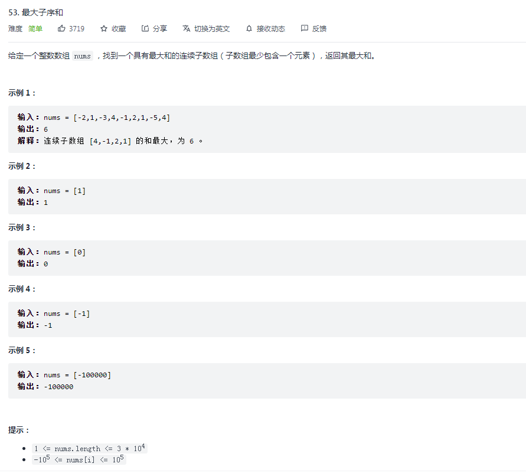

# 分治法

## 1. 概述

在计算机科学中，分治法是建基于多项分支递归的一种很重要的算法范型。

字面上的解释是“分而治之”，就是把一个复杂的问题分成两个或更多的相同或相似的子问题，直到最后子问题可以简单的直接求解，原问题的解即子问题的解的合并。

- 理解及设计分治法算法有难度
  - **为了使递归能够推行，很多时候需要用一个较为概括或复杂的问题去取代原有问题**
  - **并没有一个系统性的方法去适当地概括问题**
- 分治算法通常以数学归纳法来验证
- 其计算成本以解递归关系式来判定。

### 主要思想

分治法的一个主要思想是递归：

1. 分解：将原问题分解为若干个规模较小，相对独立，与原问题形式相同的子问题。
2. 解决：若子问题规模较小且易于解决时，则直接解。否则，递归地解决各子问题。
3. 合并：将各子问题的解合并为原问题的解。

## 2. 以最大子序和为例

### 2.1 读题



### 2.2 分析

因为是简单题，亲测暴力解法也是能够通过的。即维护一个最大值变量，从第一个元素开始，往后累加的同时更新最大值。

```js
let maxSubArray = nums => {
  const len = nums.length;
  let max = nums[0];

  for (let i = 0; i < len; i++) {
    let sum = 0;
    
    for (let j = i; j < len; j++) {
      sum += nums[j];
      max = Math.max(max, sum);
    }
  }

  return max;
}
```

这种方式需要两层循环，时间复杂度是 O(n^2)，空间复杂度是 O(1)，所以还是有点可取之处的（误…

高阶点的做法就是用空间换时间，空间里放什么是需要思考的问题。

### 2.3 动态规划

动态规划是解决这种不确定性的思想之一，这种在动态规划里也是简单题，思路如下：

```js
maxSubArray = nums => {
  const len = nums.length;
  /* 
    定义：dp[j] 为从 0 - j 的区间，以 nums[j] 结尾的最大值

    初始化：dp[0] = nums[0];

    状态转移：
      if (dp[j - 1] >= 0) dp[j] = dp[j - 1] + nums[j]
      else dp[j] = nums[j]
    
    答案：
      Math.max(...dp[j]);
  */
  const dp = new Array(len + 1).fill(0);
  let max = dp[0] = nums[0];

  for (let j = 1; j < len; j++) {
    if (dp[j - 1] >= 0) {
      dp[j] = dp[j - 1] + nums[j];
    } else {
      dp[j] = nums[j];
    }

    max = Math.max(max, dp[j])
  }

  return max;
}
```

个人觉得动态规划里比较头痛的就是定义 dp。很多时候找不出转移方程，就是因为定义得不对，不能够把问题分解成能够覆盖整个父问题的子问题。

在 leetcode book 里学过一些动态规划的分类，还是受益匪浅的。遇到问题挨个套一遍，不行就弃疗，简单极了~

### 2.4 分治法

分治法就是把问题分解成子问题，通过递归，借助子问题的状态解决父问题。

与动态规划类似，关键在于子问题的定义。

```js
maxSubArray = nums => {
  const len = nums.length;
  /* 
    1. 分解子问题：
      把原命题对半拆分，求左右子数组的相关值
    2. 从子问题得到最终解，从子数组中计算一些值，得到父数组的值
      - 因为所求是连续子数组，为子序列情况分类
        - 所以要么包含左边界 lSum
        - 要么包含右边界 rSum
        - 要么不 care（爱含不含，只要最大）mSum
        - 以及整个子数组的和 iSum
      - 父数组根据两个子数组的值，同样维护这四类数据
        - lSum = Math.max(lSon.lSum, lSon.iSum + rSon.lSum)
        - rSum = Math.max(rSon.rSum, rSon.iSum + lSon.rSum)
        - iSum = lSon.iSum + rSon.iSum
        - mSum
          - 父数组的最大值也分情况，一种是跨越子数组分界，一种是未跨越
          - 跨域分界的 = lSon.rSum + rSon.lSum
          - 未跨越分界的 = Math.max(lSon.mSum, rSon.mSum)
          - 上面两数取最值即可
    3. 所求答案即为父数组的 mSum
  */

  // 定义一个函数来维护
  const fn = (left, right) => {
    if (left === right) return {
      lSum: nums[left],
      rSum: nums[left],
      iSum: nums[left],
      mSum: nums[left],
    }

    const mid = left + Math.floor((right - left) / 2);
    const lSon = fn(left, mid);
    const rSon = fn(mid + 1, right);

    const lSum = Math.max(lSon.lSum, lSon.iSum + rSon.lSum);
    const rSum = Math.max(rSon.rSum, rSon.iSum + lSon.rSum);
    const iSum = lSon.iSum + rSon.iSum;
    const mSum = Math.max(Math.max(lSon.mSum, rSon.mSum), lSon.rSum + rSon.lSum);

    return { lSum, rSum, iSum, mSum }
  }

  return fn(0, len - 1).mSum;
}
```

## 思考

从个人的学习感受来说，分治法有时就像动态规划，难点在于如何定义子问题的边界，以及如何从子问题的解推导出最终解。

当子问题定义准确，从子问题得到父问题只是耐心问题。如果花了很久也推不出来，或者情况变得非常复杂，可能需要考虑下重新调整子问题的定义。
