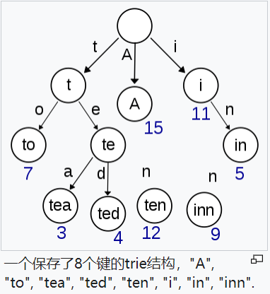

# 前缀树

## 1. 介绍
> [力扣208： 实现 Trie (前缀树)](https://leetcode-cn.com/problems/implement-trie-prefix-tree/)

在计算机科学中，trie，又称前缀树或字典树，是一种有序树，用于保存关联数组，其中的键通常是字符串。

与二叉查找树不同，键不是直接保存在节点中，而是由节点在树中的位置决定。一个节点的所有子孙都有相同的前缀，也就是这个节点对应的字符串，而根节点对应空字符串。一般情况下，不是所有的节点都有对应的值，只有叶子节点和部分内部节点所对应的键才有相关的值。



**trie树常用于搜索提示。如当输入一个网址，可以自动搜索出可能的选择。当没有完全匹配的搜索结果，可以返回前缀最相似的可能。**

## 2. 实现

### 2.1 表示

这里使用稀疏存储的对象来表示，其节点作为对象中的键，键值是节点下一级的节点集合。

对象还需维护一个特殊键名以标识至此为一个完整的字符串。

```js
class Trie {
  this.root = {};
}
```

### 2.2 插入

```js
class Trie {
  // ......

  insert(word) {
    let cur = this.root;

    for (let char of word) {
      if (!cur[char]) cur[char] = {};

      cur = cur[char];
    }

    cur.hasWord = true;
  }
}
```


### 2.3 查找前缀树中是否存在前缀 prefix

查找前缀树中是否有某个前缀，即是从根向后遍历，直到所有字符都能在前缀树中按序找到。

```js
startsWith(prefix) {
  let cur = this.root;

  for (const char of prefix) {
    // 如果中间有节点不存在，直接终止
    if (!cur[char]) return false;

    cur = cur[char];
  }

  // 没有提前终止，表示所有节点都在，返回 true
  return true;
}
```


### 2.4 查找前缀树中的词

查词与查前缀类似，只不过要求末尾字符对应的节点要有 hasWord 属性。

```js
search(word) {
  let cur = this.root;

  for (const char of word) {
    // 同样，中间节点不存在，则直接终止
    if (!cur[char]) return false;

    cur = cur[char];
  }

  // 判断最后节点有无 hasWord 属性
  return !!cur.hasWord;
}
```

### 2.5 封装公共方法

从上可以看出，查找前缀和查找词的方法体类似，只不过查找词多了一步对最终节点的判断。

可以考虑提取出共有方法，实现如下：

```js
_searchPrefix(prefix) {
  let cur = this.root;

  for (const char of prefix) {
    if (!cur[char]) return false;

    cur = cur[char];
  }

  // 把找到的节点返回
  return cur;
}

startsWith(prefix) {
  // 返回值要求布尔值，对返回的节点进行转换
  return !!this._searchPrefix(prefix)
}

search(word) {
  const node = this._searchPrefix(word);

  return node ? !!node.hasWord : false;
}
```

## 3. 应用