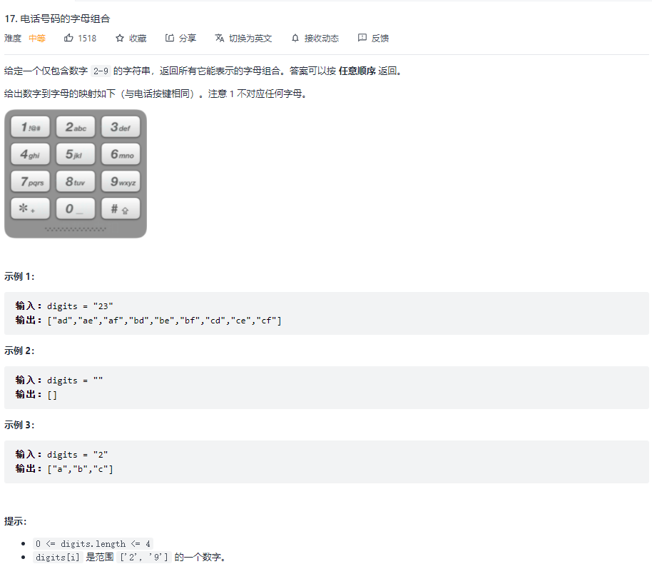
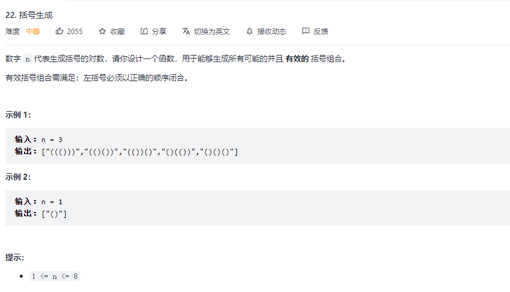

# 回溯法

## 1. 基本思想

回溯法是暴力搜索法中的一种。

回溯法采用试错的思想，它尝试分步的去解决一个问题。在分步解决问题的过程中，当它通过尝试发现，**现有的分步答案不能得到有效的正确的解答的时候，它将取消上一步甚至是上几步的计算**，再通过其它的可能的分步解答再次尝试寻找问题的答案。

回溯法通常用最简单的递归方法来实现，在反复重复上述的步骤后可能出现两种情况：

- 找到一个可能存在的正确的答案
- 在尝试了所有可能的分步方法后宣告该问题没有答案

在最坏的情况下，回溯法会导致一次复杂度为指数时间的计算。

## 2. 以电话号码的字母组合为例
### 2.1 题



### 2.2 算法

```js
// 使用回溯法
const letterCombinations = digits => {
  const map = {
    '2': 'abc',
    '3': 'def',
    '4': 'ghi',
    '5': 'jkl',
    '6': 'mno',
    '7': 'pqrs',
    '8': 'tuv',
    '9': 'wxyz',
  }

  const len = digits.length;
  const res = [];
  if (!len) return res;


  const fn = (index, tmp) => {
    if (index === len) {
      res.push(tmp);
      return;
    }

    let letters = map[digits[index]]
    for (let char of letters) {
      tmp += char;
      // 下一步
      fn(index + 1, tmp);
      // 回溯
      tmp = tmp.substring(0, tmp.length - 1);
    }
  }

  fn(0, '');
  return res;
}
```

## 3. 回溯法解决括号生成问题

刚学完回溯法，这就用上了。

### 3.1 看题



### 3.2 解题

感觉我的代码比官解还要简洁。

```js
const res = [];

  const fn = (lNum, rNum, str) => {
    if (lNum === 0 && rNum === 1) {
      str += ')';
      res.push(str);
      return;
    }

    if (lNum > 0) fn(lNum - 1, rNum, str + '(');
    if (rNum > 1 && lNum < rNum) fn(lNum, rNum - 1, str + ')');
  }

  fn(n - 1, n, '(');
  return res;
}
```


## 4. 思考

回溯法中，最关键的就是对中间过程的维护。

每一步往下走的时候，各种可能性都要走到，每个可能性都要做好过程变量的维护。

之所以叫回溯，就是因为在走不下去，要往回走的时候，需要把过程变量也恢复到原来路口的状态（所谓回溯）。

这种维护有时需要（如过程变量使用对象维护），有时则不需要（如过程变量使用基本类型维护，譬如上述中的括号值，只是通过字符串进行值传递，无需再回溯）。
