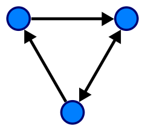
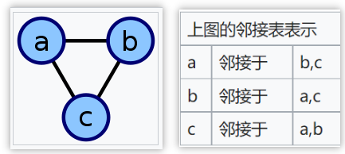
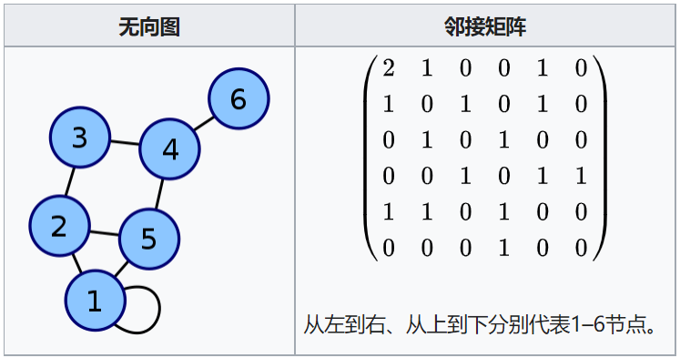

# 图

> 本篇代码部分实现自《算法 第四版》。

## 1. 概述

计算机中的图是一种抽象数据结构，**由一组顶点和一组能够将两个顶点相连的边组成**，实现了数学图论中的无向图和有向图概念。

图结构中包含一个节点集合，以及一个节点对集合作为边集合。边集合除了包含首尾节点，还可能包含相关数值作为权重。



图结构支持以下操作：

- adjacent(G, x, y)：查看是否存在从节点x到y的边；
- neighbors(G, x)：列出所有从x出发的边的另一个顶点y；
- add_vertex(G, x)：如果不存在，将节点x添加进图；
- remove_vertex(G, x)：如果存在，从图中移除节点x；
- `add_edge(G, x, y)`：如果不存在，添加一条从节点x到y的边；
- remove_edge(G, x, y)：如果存在，从图中移除从节点x到y的边；
- get_vertex_value(G, x)：返回节点x上的值；
- set_vertex_value(G, x, v)：将节点x上的值赋为v。

### 1.1 类型

有以下几种方式可以实现图结构：

#### 1.1.1 邻接表



  - 节点存储为对象
  - 每个节点创建一个列表
  - 列表内存储其余的信息，如由此节点出发的边列表

#### 1.1.2 邻接矩阵



  - 一个二维矩阵，其中行与列分别表示边的起点和终点
  - 顶点上的值存储在外部
  - 矩阵中可以存储边的值

## 2. 无向图

无向图中的边仅是两个顶点的连接，没有方向，没有权值。

### 2.1 基本操作

#### 2.1.1 表示

使用邻接表进行表示。

```js
class Graph {
  // 根据节点数量，初始化邻接表
  // 这里用数组存储节点，索引下标表示节点 id
  constructor(n) {
    this.adj = new Array(n).fill(0).map(item => []);
  }
}
```

#### 2.1.2 增加边

增加边时，需要为两个节点分别添加对方节点。

```js
addEdge(v, w) {
  this.adj[v].push(w);
  this.adj[w].push(v);
}
```

> 如果想避免重复添加某条边，可以把邻接表改为 set 结构。

#### 2.1.3 查询节点的边

直接从邻接表中取出即可。

```js
getEdge(v) {
  return this.adj[v];
}
```

### 2.2 遍历

对图的遍历分为深搜和广搜，两种不同的遍历路径，决定了其能解决的问题也不相同。

#### 2.2.1 深搜

深度搜索算法是遍历图最常用的方式，其算法思想类似用回溯法走迷宫，如下：

1. 选择一个没有标记过的路口和通道，走过时铺条绳子
2. 标记所有第一次路过的路口（节点）和通道（边）
3. 来到一个已标记过的路口时（表示之前已走过），使用绳子回退到上一个路口
4. 选择另一个没走过的通道
    - 如果没有满足条件的通道，继续回退
    - 如果有，重复 2、3
5. 结束条件
    - 找到出口时，完成目标
    - 回退到起点时，深搜结束

```js
dfs(v) {
  // 标记集
  const marked = this.adj.map(item => false);

  const fn = (item) => {
    marked[item] = true;
    // 进行处理
    // ……

    for (let w of this.adj[item]) {
      if (!marked[w]) fn(w); 
    }
  }
}
```

#### 2.2.2 广搜

用走迷宫来类比的话，深搜是一个人在走迷宫，广搜是一组人在走迷宫。

使用了一个队列来保存所有已经被标记过，但其邻接表还未被检查过的顶点。

1. 将起点加入队列
2. 取队列的下一个顶点 v 并标记它
3. 将与 v 相邻的所有未被标记过的顶点加入队列
4. 重复 2、3 步
    - 直到队列为空
    - 或完成遍历目标

```js
bfs(v) {
  const queue = [];
  const marked = this.adj.map(item => []);

  marked[v] = true;
  queue.push(v);

  while (!queue.length) {
    const item = queue.shift();

    for (const w of this.adj[v]) {
      if (!marked[w]) {
        // 对节点进行操作
        // ……

        // 标记
        marked[w];
        queue.push(w);
      }
    }
  }
}
```

## 3. 有向图

有向图是由一组顶点和一组由方向的边组成，每条有方向的边都连接着有序的一对顶点。

- **出度**：由该顶点指出的边的总数
- **入度**：指向该顶点的边的总数
- **头**：有向边的第一个顶点
- **尾**：有向边的第二个顶点

### 3.1 基本操作

#### 3.1.1 表示

与无向图一样，同样使用数组实现邻接表结构。

```js
class Digraph {
  constructor(v) {
    this.adj = new Array(v).fill(0).map(item => []);
  }
}
```

#### 3.1.2 添加有向边

与无向边不同，添加有向边时，只向头节点增加边指针。

```js
addEdge(v, w) {
  this.adj[v].push(w);
}
```

#### 3.1.3 查询边

```js
getAdj(v) {
  return this.adj[v];
}
```

### 3.2 有向图的反转

与无向图不同，有向图可以进行反转操作：**将其中所有边的方向取反，这样可以找到指向每个顶点的所有边。**

```js
reverse() {
  const R = new Digraph(this.adj.length);

  for (let v = 0; v < this.adj.length; v++) {
    for (const w of this.adj[v]) {
      // 添加反转后的边
      R.addEdge(w, v);
    }
  }

  return R;
}
```

### 3.3 遍历

#### 3.3.1 深搜

在无向图中，所有节点都是连通的。而有向图存在方向的限制，从一个顶点能否到达另一个顶点就成了比较重要的问题。

使用深搜能够解决这个问题，它能找出从一个顶点能够到达的顶点集。

```js
dfs(v) {
  const marked = this.adj.map(item => false);

  const fn = item => {
    marked[item] = true;

    for (const w of this.adj[item]) {
      if (!marked[item]) fn(w);
    }
  }

  fn(v);
}
```

#### 3.3.2 基于深搜的遍历

上述深搜是从单个起点出发，看它能到达的所有节点。而遍历不过是对所有节点做一遍深搜。

```js {12-14}
dfs() {
  const marked = this.adj.map(item => false);

  const fn = item => {
    marked[item] = true;

    for (const w of this.adj[item]) {
      if (!marked[item]) fn(w);
    }
  }

  // 执行时，不是遍历起点，而是遍历所有节点 
  for (let v = 0; v < this.adj.length; v++) {
    if (!marked[v]) fn(v);
  }
}
```

#### 3.3.3 元素的读取顺序

通过基于深搜的循环，我们已经能够访问到所有元素。不过，我们是以什么顺序对元素进行处理呢？是先处理起点，还是最后再处理起点？

事实上，根据处理起点时机的差异，共有三种遍历排序：

- 前序：先处理起点元素
- 后序：最后处理起点元素
- 逆后序：后序的逆序排列

```js {4-6,9,17-18}
getAll() {
  const marked = this.adj.map(item => false);

  const pre = []; // 前序
  const post = []; // 后序
  const reversePost = []; // 逆后序

  const fn = item => {
    pre.push(item); // 前序

    marked[item] = true;

    for (const w of this.adj[item]) {
      if (!marked[item]) fn(w);
    }

    post.push(item); // 后序
    reversePost.unshift(item); // 逆后序
  }

  // 执行时，不是遍历起点，而是遍历所有节点 
  for (let v = 0; v < this.adj.length; v++) {
    if (!marked[v]) fn(v);
  }

  return {pre, post, reversePost}
}
```

### 3.4 有向环

有向图中可能存在环，如 x 指向 y，y 指向 z，z 指向 x，这就构成了有向图中的环。对有向图中的环进行检测有实际意义。

很多时候，我们并不需要明确找出图中有多少条环，环的路径怎样……只需要确定该有向图是否有环，就已经是很有用的信息了。可以使用深搜来实现。

```js {3,8,15,16,21}
hasCycle() {
  const marked = this.adj.map(item => false);
  const onStack = this.adj.map(item => false);
  let cycle = false;

  const dfs = v => {
    marked[v] = true;
    onStack[v] = true;

    for (const w of this.adj[v]) {
      if (cycle) return;

      if (!marked[w]) {
        dfs(w)
      } else if (onStack[w]) {
        cycle = true;
      }
    }

    // 回溯
    onStack[v] = false;
  }

  // 从起始点开始，依次进行深搜
  for (let v = 0; v < this.adj.length && !cycle; v++) {
    if (!marked[v]) dfs(v);
  }

  return cycle;
}
```

以上算法只是确定有向图中是否有环，如果需要获取环的路径，则在 cycle = true 时回溯一下即可。

### 3.5 拓扑排序

当一批任务具有优先级顺序时，例如任务 A 必须在任务 B 之前完成，任务 D 要在任务 A 之后完成。在安排任务时就有了先后顺序问题。

需要明确的一点是，如果有向图中有环，则绝无可能排好序，因为你不能在完成 A 任务前，先完成 A 任务。

```js
topoLogical() {
  if (!this.hasCycle()) {
    return this.getAll().reversePost;
  }
}
```

## 4. 加权无向图与最小生成树

### 4.1 加权无向图的基本操作

### 4.2 Prim 算法

### 4.3 Kruskal 算法


## 5. 加权有向图与最短路径

### 5.1 加权有向图的基本操作

### 5.2 Dijkstra 算法

