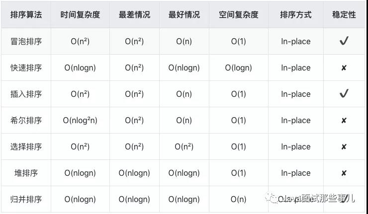

# 排序

## 1. 初级排序

### 1.0 冒泡排序

```js
function bubbleSort(arr) {
  const len = arr.length;

  for (let i = 0; i < len; i++) {
    for (let j = 0; j < len - i - 1; j++) {
      if (less(arr, j + 1, j)) {
        exch(arr, j + 1, j);
      }
    }
  }
}
```

### 1.1 选择排序

1. 找到数组中最小元素
2. 然后将它和数组的第一个元素交换位置
3. 之后在剩下元素中找到最小元素
4. 将它与数组的第二个元素交换位置
5. 循环往复，直到将整个数组排序

```js
function selectSort(arr) {
  const len = arr.length;

  for (let i = 0; i < len; i++) {
    let min = i;
    for (let j = i + 1; j < len; j++) {
      if (less(j, min)) {
        min = j;
      }
    }
    exch(min, i)
  }
}
```
### 1.2 插入排序

两层循环，从左起依次将左边的元素排好序。从左起第二个元素开始，比较其与左边第一个元素的大小，如果小于第一个元素，则交换之。

这样依次遍历，**当前元素左侧的部分永远是有序的**。只需要把当前元素交换到左侧合适的位置（其左侧不小于它时停下），保证左侧始终有序。

```js
function insertSort(arr) {
  const len = arr.length;

  for (let i = 1; i < len; i++) {
    for (let j = i; j > 0 && less(arr, j, j - 1); j--) {
      exch(arr, j, j - 1)
    }
  }
}
```

### 1.3 希尔排序（插入排序的升级版）

对普通插入排序只能移动相邻元素的缺点进行优化，能够交换不相邻的元素以对数组的局部进行排序。其核心思想是<mark>使得数组中任意间隔为 h 的元素都是有序的。</mark>

> 一个 h 有序的数组就是 h 个互相独立的有序数组编织在一起组成的一个数组。

希尔排序权衡了子数组的**规模**和**有序性**，相比一般的插入排序更为高效。

```js
function shellSort(arr) {
  const len = arr.length;
  let h = 1;

  while (h < Math.floor(len / 3)) h = h * 3 + 1;

  while (h >= 1) {
    for (let i = h; i < len; i++) {
      // 重点：这里改变了元素交互的跨度
      for (let j = i; j >= h && less(arr, j, j - h); j -= h) {
        exch(arr, j, j - h)
      }
    }
    h = Math.floor(h / 3);
  }
}
```
## 2. 归并排序

要将一个数组排序，可以先（递归地）将它分成两半分别排序，然后将结果归并起来。

归并算法如下，它提供一种将有序的两个子数组，按照顺序合并为一个数组的方式:

主函数中，使用递归分别归并。

```js
function mergeSort(arr) {
  const len = arr.length;

  // 数组数量小于 2 时，返回原数组
  if (len < 2) return arr;

  // 将数组二等分，并进行归并处理
  const mid = Math.floor(len / 2);
  return merge(mergeSort(arr.slice(0, mid)), mergeSort(arr.slice(mid + 1)));
}
```

```js
function merge(arr1, arr2) {
  const len1 = arr1.length;
  const len2 = arr2.length;
  let idx1 = 0;
  let idx2 = 0;

  // 使用一个辅助数组，把两个有序数组的内容按序放入
  const res = [];
  for (let i = 0; i < len1 + len2; i++) {
    if (idx1 === len1) {
      res[i] = arr2[idx2++]
    } else if (idx2 === len2) {
      res[i] = arr1[idx1++]
    } else if (arr1[idx1] <= arr2[idx2]) {
      res[i] = arr1[idx1++]
    } else {
      res[i] = arr2[idx2++]
    }
  }

  return res;
}
```

## 3. 快速排序

### 3.1 普通快排
快排是递归地将数组分为两部分，并对两部分独立进行排序。归并排序中的划分规则是从中间分割，快排是找一个中间元素，把数组分为小于中间元素的部分，和不小于中间元素的部分。

```js
function quickSort(arr, low, high) {
  if (low === undefined) low = 0;
  if (high === undefined) high = arr.length - 1;

  if (low >= high) return;

  const j = partition(arr, low, high);

  quickSort(arr, low, j - 1);
  quickSort(arr, j + 1, high);
}
```

寻找切分点。

```js
function partition(arr, low, high) {
  let i = low, j = high + 1;

  while (true) {
    while (less(arr, ++i, low)) {
      if (i >= high) break;
    }

    while (less(arr, low, --j)) {
      if (j <= low) break;
    }

    if (i >= j) break;

    exch(arr, i, j);
  }

  exch(arr, low, j);
  return j;
}
```

### 3.2 三向切分

当数组中重复元素很多时，使用标准的快排有很多重复交换。三向切分法即是将数组分为三部分，分别对应小于、等于、大于切分元素的数组元素。

```js
function quickThreeSort(arr, low, high) {
  if (low === undefined) {
    low = 0; 
    high = arr.length - 1;
  }

  if (low >= high) return;

  // 唯一不同点，切分函数返回两个索引，分别指向重复元素端的起点和终点。
  const [lt, gt] = partition(arr, low, high);

  quickThreeSort(arr, low, lt - 1);
  quickThreeSort(arr, gt + 1, high);
}
```

寻找切分点，因为是三向切分，所以这里需要维护两个切分点。

```js
function partition(arr, low, high) {
  let lt = low, gt = high;
  let i = low + 1;

  // 这里会移动首位，所以先把值缓存下来
  const v = arr[low];

  // 只从左向右移动
  while (i <= high) {
    // 当前值小于切分元素时，与重复元素段最左边的交换，并更新索引
    if (arr[i] < v) exch(arr, lt++, i++);
    // 当前值大于切分元素时，与数组最右边的元素交换，更新右边指针
    // 因为当前索引的值是交换过来的未知元素，所以不能更新 i
    else if (arr[i] > v) exch(arr, i, gt--);
    // 当前值与切分元素相等时，更新当前元素索引即可
    else i++;
  }

  return [lt, gt];
}
```

## 4. 堆排序

堆排序是利用能够删除最大最小元素的优先队列特性，进行元素的排序操作。其中核心逻辑是对元素的上浮和下沉移动。关于堆的数据结构内容可以查看[这篇文章](/algo/最小堆.md)。

```js
function heapSort(arr) {
  arr.unshift(0);
  let len = arr.length - 1;

  // 把无序数组构造为最大堆
  for (let k = Math.floor(len / 2); k >= 1; k--) {
    // 从中间元素开始下沉
    sink(arr, k, len);
  }

  while (len > 1) {
    // 将顶部的最大值与数组的最后索引交换，并断开其与堆的链接
    exch(arr, 1, len--);
    // 由于顶部值发生了变化，需要重新恢复至最大堆状态
    sink(arr, 1, len);
  }

  arr.shift();
}
```

下沉逻辑：

```js
function sink(arr, k, len) {
  while (2 * k <= len) {
    let j = 2 * k;

    // 找较大的子节点
    if (j < len && less(arr, j, j + 1)) j++;

    // 如果子节点打不过它，下沉结束
    if (!less(arr, k, j)) break;

    exch(arr, k, j);
    k = j;
  }
}
```

## 5. 桶排序

桶排序是根据数据范围，建立若干桶，将元素放入对应范围的桶中，然后对每个桶内数据进行排序。

```js
function bucketSort(arr, r = 5) {
  const len = arr.length - 1;

  // 根据数据范围构建桶容器
  let max = min = arr[0];
  for (let i = 1; i < len; i++) {
    max = Math.max(max, arr[i]);
    min = Math.min(min, arr[i]);
  }
  const buckets = new Array(r).fill(0).map(item => [])

  // 将数据散列到对应桶容器中
  let range = Math.floor(max - min + 1) / r + 1;
  for (let i = 0; i < len; i++) {
    let idx = Math.floor((arr[i] - min) / range);
    buckets[idx].push(arr[i])
  }

  // 使用其它原地排序算法对桶内元素进行原地排序
  for (let bucket of buckets) {
    // 如快排排序
    quickSort(bucket);
  }

  return buckets.flat();
}
```

## 附 复杂度一览表



## 附 算法中用到的工具函数

```js
function less(arr, i, j) {
  return arr[i] <= arr[j];
}

function exch(arr, i, j) {
  [arr[i], arr[j]] = [arr[j], arr[i]]
}
```