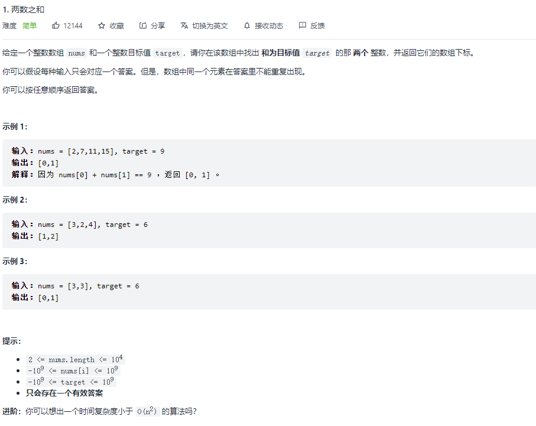

# 我的刷题思路——以两数之和为例

## 1. 读题

### 1.1 题干



### 1.2 分析

这是一道简单题，所以 AC 不是问题，重要的是通过简单题训练解题思路。

从数组中寻找目标值，可能会想到二分法，但是这里的整数数组并没有明确说是有序的，没有骚思路一律先暴力冲一下。

## 2. 解题

### 2.1 暴力一下

如果没有什么好的思路，最简单直接的办法就是代入一下，看看自己如何解这个问题。

直观的想法就是拿一个数，看看后面有没有符合要求的目标值。

```js
var twoSum = function(nums, target) {
  const len = nums.length;

  for (let i = 0; i < len - 1; i++) {
    for (let j = i + 1; j < len; j++) {
      if (nums[i] + nums[j] === target) {
        return [i, j]
      }
    }
  }
};
```


其实在暴力解法里就做了一点小优化：当寻找第二个值的时候，我们不是从头开始找，而是从外层循环 `i` 之后找。它隐含的意思就是，如果 `i` 之前的元素能够匹配，那么外层到不了 `i` 就结束了。

**但这种优化影响不了该解法为 `O(n^2)` 时间复杂度的本质。**

### 2.2 哈希表

可以看到暴力解法在空间复杂度上还是很有优势的，因为它基本不使用外部内存，复杂度为 `O(1)`。

优化的常见思路就是用空间换时间。

我们暴力解法中，第二层循环的目的是找到和 `i` 匹配的元素，由于数组不是有序的，我们不得不一个个遍历。而借助外部内存，我们就可以把该过程缩减为 `O(1)` 复杂度，那就是哈希表。

```js
const twoSum = function(nums, target) {
  const len = nums.length;

  // 使用哈希表存储当前值
  const map = new Map();
  for (let i = 0; i < len; i++) {
    map.set(nums[i], i);
  }

  for (let i = 0; i < len; i++) {
    const needNum = target - nums[i];

    if (map.has(needNum) && i !== map.get(needNum)) {
      return [i, map.get(needNum)]
    }
  }
}
```


由于使用了外部内存，内存复杂度变为 `O(n)`，时间复杂度则降至 `O(n)`；

### 2.3 哈希表的优化

要对上述优化，就要深入细节了。比如有一个表超级大，但前两个元素就能够满足题目要求。在上述解法中，依然要建一个完整的哈希表，空间占用一点没省下来，理想解法是边查边存：

```js
const twoSum = function(nums, target) {
  const len = nums.length;
  const map = new Map();

  for (let i = 0; i < len; i++) {
    const needNum = target - nums[i];

    if (map.has(needNum) && i !== map.get(needNum)) {
      return [i, map.get(needNum)];
    }

    map.set(nums[i], i);
  }
}
```


从结果可以看到，其提升其实有限。

## 3. 思考

从上述解题过程和分析可以看出，**对于算法上一些边角优化并不能从根本上降低该解法的时间复杂度和空间复杂度，反而提升了该解法的理解复杂度和 `coding` 复杂度。**

**因此，我对自己的要求是能够想到暴力解法，然后通过时间空间的操作把整体复杂度降低一个数量级。对于自己 AC 不出的题，我也不会追求极致优化，谋求双 100% 成就。**
