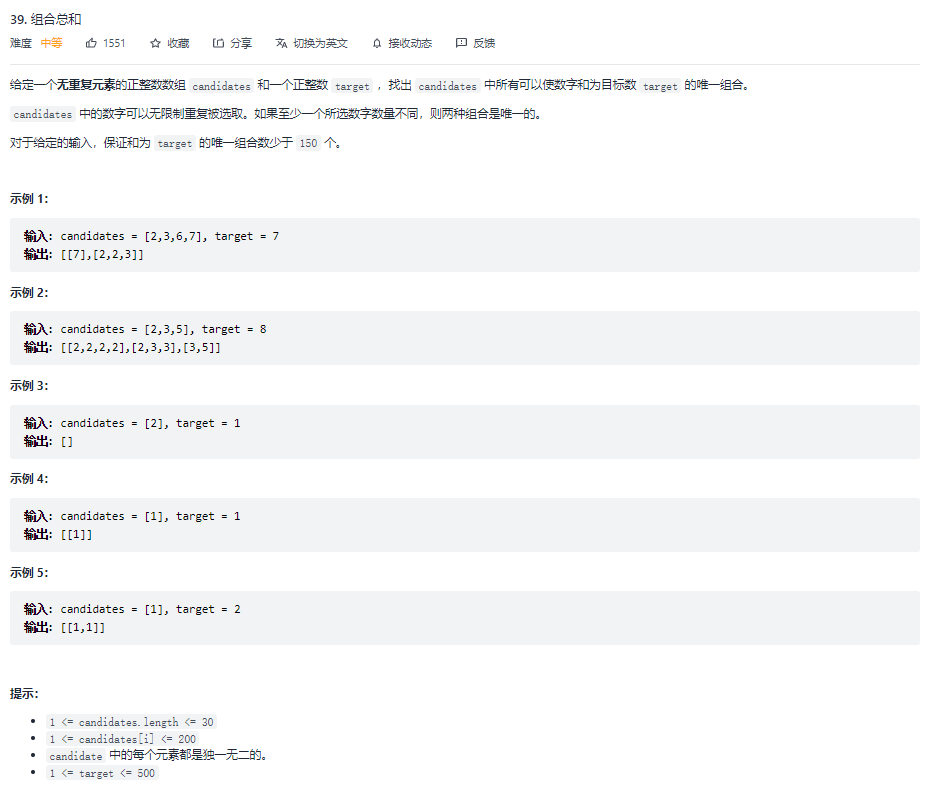

# 回溯法中的过程变量设置与维护
## 1. 题目
### 1.1 原题



### 1.2 思考过程

> 在做这种题的时候，能想到回溯法已经是我最大的进步了。


以 [2, 3, 6, 7] 为例，因为题目没有明确数组是有序的，在求子数组的总和时，只有数组有序了，很多判断才做得出来。以下默认已经做过排序。

当寻找总和为 7 的子数组时，我的考虑思路如下：

1. 首先当然是从左向右，取第一个最小的数 [2]
2. 取过 2 之后，我发现距离目标值差别依旧很大，2 还可以再取 [2, 2]
3. 同样的，还能再取一次 [2, 2, 2]
4. 这时离得很近了，但是还没到达 target，再取一次 [2, 2, 2, 2]
5. ohhhhhh 超了
    - 取最小的都超了，后面也不用再取了
    - 弹栈到 [2, 2] 状态
6. 开始向后取 [2, 2, 3]
7. 命中了，后面也无需再取，继续弹栈到 [2]
8. 这次取 [2, 3]
9. 已经取到索引 1 的位置了，后面无需再从索引 0 开始（因为前面的步骤已经穷尽了索引 0 的可能性）
10. ……

### 1.3 总结

大体思考思路是这样的，从中可以发现几点：

- 最外层循环应该是从第一项一直往后取
- 第二项还是应该从上一步的索引点开始
- 第二项我们不知道取几次
- 取超了之后，我们要回到前面的状态（**回溯法**）
- 从暴力思路中，已经意识到了几个优化点（**剪枝**）

## 2. 实现
### 2.1 无需维护的过程变量

```js
let combinationSum = (candidates, target) => {
  const len = candidates.length;
  // 排序
  candidates.sort((a, b) => a - b);

  const res = [];
  const fn = (arr, index, target) => {
    if (target < 0) return; // 剪枝
    if (target === 0) return res.push([...arr]); // 命中

    // 从上一步的索引点开始取
    for (let i = index; i < len; i++) {
      if (target < candidates[i]) break; // 剪枝

      // 向下走
      fn([...arr, candidates[i]], i, target - candidates[i]);
    }
  }

  // 最外层循环
  for (let i = 0; i < len; i++) {
    fn([candidates[i]], i,  target - candidates[i]);
  }

  return res;
}
```

从以上代码看起来好像用的是递归方法，并没有做回溯。

那是因为我在传递过程变量的时候，直接做了数组的拷贝，而非直接传递地址指针。深层的步骤并不会影响上一步的状态。

这样更容易理解，问题则是**频繁开辟新数组，增加了内存消耗**：


### 2.2 维护过程变量

```js
// 空间优化版
combinationSum = (candidates, target) => {
  const len = candidates.length;
  candidates.sort((a, b) => a - b);

  const res = [];
  const fn = (arr, index, target) => {
    if (target < 0) return;
    if (target === 0) return res.push([...arr]);

    for (let i = index; i < len; i++) {
      if (target < candidates[i]) break;
      // 维护过程变量
      tmp.push(candidates[i])
      fn(tmp, i, target - candidates[i]);
      // 维护过程变量
      tmp.pop();
    }
  }

  // 使用一个数组空间来存储过程变量
  let tmp = [];
  for (let i = 0; i < len; i++) {
    // 维护过程变量
    tmp.push(candidates[i]);
    fn(tmp, i,  target - candidates[i]);
    // 维护过程变量
    tmp.pop();
  }

  return res;
};
```


**有些效果，但并不能带来复杂度本质上的提升，所以我有时候不太去追求这种优化。**
