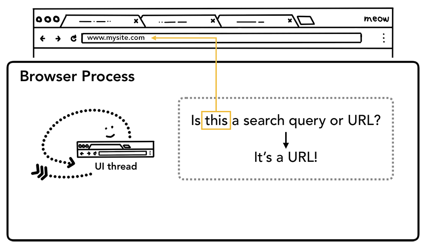
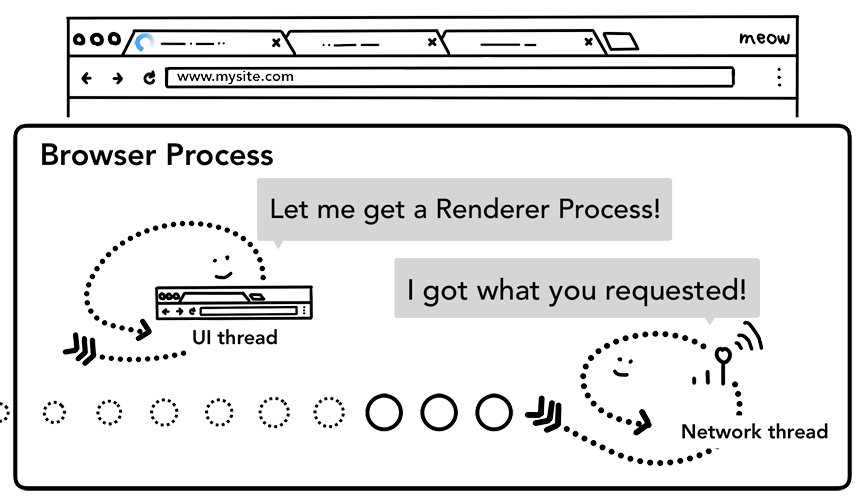
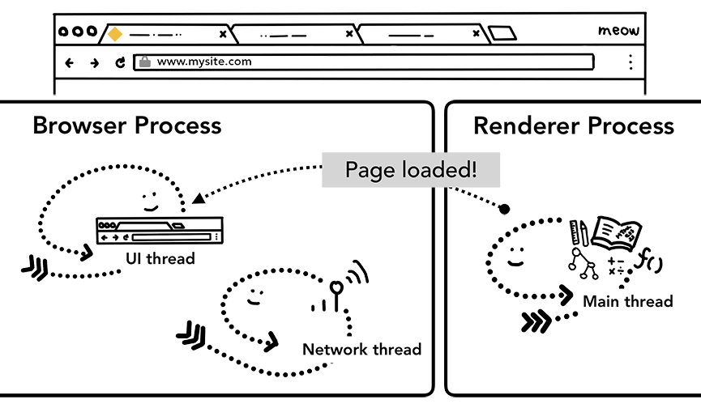
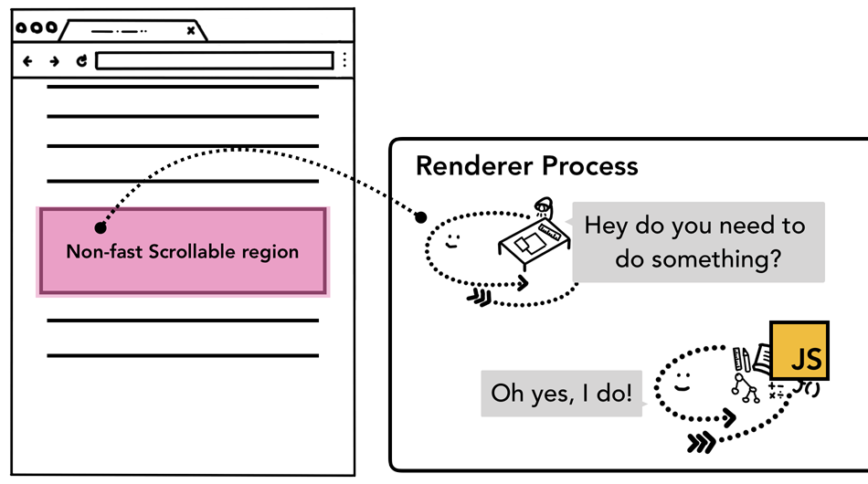

# 浏览器

> 译文：[【第 2319 期】深入了解现代浏览器之四](https://mp.weixin.qq.com/s/XN9wUM-FdWbE1m66jkEgIg)


## 多进程结构

> 原文：[Inside look at modern web browser (part 1)](https://developers.google.com/web/updates/2018/09/inside-browser-part1)

### CPU 与 GPU

CPU 是中央处理单元，可以理解为计算机的`大脑`。

一个 CPU 内核可以理解为一个办公室职员，可以一个一个地处理很多不同任务。现代计算机设备通常是多核 CPU ，有多个职员，可以同时处理多个任务，拥有更高的性能。


### GPU
GPU 是图像处理单元，善于处理跨内核的任务，但它只能处理完成比较简单的工作。如图像处理。


### 应用

当启动一个浏览器应用时，该浏览器应用跑在`操作系统`中，操作系统运行在 CPU / GPU 硬件上。


### 线程与进程

进程是一个应用的执行程序，线程是进程内部用来执行部分执行程序的工作单元。


> 进程是一个盒子，线程则是在进程盒子中游动的鱼

当启动一个`应用`时，会创建一个`进程`。`进程`可能会创建`线程`（们）来辅助工作。`操作系统`会划分一块`内存空间`供`进程`使用，所有的`应用状态`都被保存在这个`私有内存空间`中。当应用被关闭，进程也会关闭，这部分内存就被操作系统释放掉。


一个进程可以要求操作系统启动另一个进程以执行不同任务。此时另一个进程会被划分一块新的内存空间，两个进程间可通过 Inter Process Communication 进行通信。许多应用这样设计，以便于当某个进程崩溃时可以自动重启，而不至于影响应用的其它进程。


### 浏览器中的进程

进程 | 说明
--- | ---
Browser | 处理属于 Chrome 的部分，比如地址栏、书签、前进后退按钮等等，以及一些看不见的需要权限的部分，比如网络请求、文件访问
Renderer | 处理一个网页的内容显示
Plugin | 处理网页用到的插件，比如 flash.
GPU | Handles GPU tasks in isolation from other processes. It is separated into different process because GPUs handles requests from multiple apps and draw them in the same surface.


除了上面几个主要进程，还有一些其它进程。


### 多进程架构的好处

1. 更健壮

Chrome 使用多渲染进程，可以想象为每个 tab 页使用一个渲染进程。当某个 tab 页崩溃时，你只需要直接干掉它，不会影响其它进程。如果是单进程多线程，当其中一个线程崩溃时，整个进程就挂掉了。


2. 安全性和沙箱

浏览器可以使用操作系统提供的限制进程权限的方法，限制特定进程的一些权限。

3. 坏处：内存的浪费

由于进程各自拥有独立内存空间，它们需要各自保存一些基础架构的副本（比如 JavaScript 的渲染引擎 V8）。这意味着一定的内存浪费，因为如果使用单进程的多线程方式，各线程就可以共享一些公共资源。

为了减少内存浪费，Chrome 会根据内存数和计算机性能确定一个进程数量上限，当达到上限后，它会将同一网站的多个 tab 页放在一个进程中渲染。

> 这种减少内存浪费的方案也被用在 browser 进程中。当Chrome运行在强大的硬件上时，它可能会将每个服务拆分为不同的进程，以提供更多的稳定性，但如果它是在一个资源限制的设备上，Chrome将服务合并为一个进程，以节省内存占用。
> 
> 

## 导航流
> [Inside look at modern web browser (part 2)](https://developers.google.com/web/updates/2018/09/inside-browser-part2)

### browser 进程

如前所述，tab 页之外的所有东西都由 browser 进程负责。

browser 进程有许多线程：比如绘制浏览器按钮和输入字段的`UI线程`，处理网络堆栈从互联网接收数据的`网络线程`，控制访问文件的`存储线程`等等。


当你在地址栏中输入一个URL时，你的输入被浏览器进程的`UI线程`处理。

### 一次导航过程

#### 1. 处理 input

当用户开始输入地址栏时，`UI线程`问的第一个问题是“这是搜索查询还是URL?”在Chrome中，地址栏也是一个搜索输入字段，所以`UI线程`需要解析并决定是将您发送到搜索引擎，还是发送到您请求的站点。



#### 2. 开始导航

当用户点击回车时，UI线程启动一个网络调用来获取站点内容。加载微调器显示在选项卡的一角，`网络线程`通过适当的协议，如DNS查找和为请求建立TLS连接。


> `网络线程`可能会收到一个服务器重定向报头，比如HTTP 301。在这种情况下，`网络线程`与服务器请求重定向的UI线程通信。然后，将启动另一个URL请求

#### 3. 读取响应内容

一旦响应体(有效负载)开始进入，`网络线程`将在必要时查看流的前几个字节。响应的Content-Type头应该说明它是什么类型的数据，但是由于它可能丢失或错误，所以这里完成了MIME类型嗅探。正如源代码中所说，这是一件“棘手的事情”。您可以通过阅读注释来了解不同的浏览器如何处理内容类型/有效负载对。


如果响应是一个HTML文件，那么下一步将是将数据传递给渲染过程，但如果它是一个zip文件或其他文件，那么这意味着它是一个下载请求，因此他们需要将数据传递给下载管理器。


这也是 [SafeBrowsing](https://safebrowsing.google.com) 检查发生的地方。如果域和响应数据似乎与已知的恶意站点匹配，则`网络线程`发出警报，显示一个警告页面。此外，会进行Cross Origin Read Blocking (CORB)检查，以确保敏感的跨站点数据不会到达`渲染进程`。


#### 4. 找个渲染进程
一旦所有检查完成，并且`网络线程`确信浏览器应该导航到请求的站点，那么`网络线程`就告诉`UI线程`数据已经准备好了。`UI线程`然后找到一个`渲染进程`来进行网页的渲染。



> 由于网络请求可能需要数百毫秒才能得到响应，因此将应用优化来加快这个过程。当UI线程在第2步向网络线程发送URL请求时，它已经知道它们要导航到哪个站点。UI线程尝试主动寻找或启动一个与网络请求并行的渲染进程。通过这种方式，如果一切按照预期进行，当网络线程接收到数据时，渲染进程已经处于备用位置。如果导航重定向到跨站点，则可能不会使用这个备用进程，在这种情况下可能会需要使用另一个渲染进程。

#### 5. 提交导航

现在数据和渲染进程都准备好了，IPC将从浏览器进程发送到渲染进程，以提交导航。它还传递数据流，以便渲染进程可以继续接收HTML数据。一旦浏览器进程听到确认提交已经在渲染进程中发生，导航就完成了，文档加载阶段开始了。

此时，地址栏被更新，安全指标和网站设置UI反映了新页面的网站信息。该选项卡的会话历史将被更新，所以后退/前进按钮将通过刚刚导航到的站点。当您关闭一个选项卡或窗口时，为了方便选项卡/会话恢复，会话历史记录存储在磁盘上。


#### 6. 初始加载完成

一旦提交了导航，渲染进程就开始加载资源并渲染页面。一旦渲染进程“完成”渲染，它就会向浏览器进程发送一个IPC(这是在页面中所有帧的 onload 事件都被触发并完成执行之后)。此时，UI线程停止选项卡上的加载 loading。



### 从现有页面跳转到其它网址

如果用户再次向地址栏输入不同的URL，会发生什么呢?浏览器过程通过相同的步骤导航到不同的站点。但在此之前，它需要检查当前呈现的站点是否关心 beforeunload 事件。

tab 页中的所有内容都由 renderer 进程控制，包括其中的 JavaScript 代码。所以当 browser 进程想要跳转到新地址时，必须先检查 renderer 进程。


当从当前页导航到一个不同的站点时，浏览器会启用一个单独的 renderer进程处理新导航，而当前 renderer 进程用以处理 unload 等事件。


## 渲染进程

> [Inside look at modern web browser (part 3)](https://developers.google.com/web/updates/2018/09/inside-browser-part3)
> [译文——有一些原文中挂掉的动图](https://www.zhihu.com/column/c_1246004920828198912)

### 渲染进程处理网页内容

渲染进程处理 tab 页中的一切内容。在渲染进程中，主线程处理你发送给用户的大部分代码。如果你使用web worker或service worker，有时候你的JavaScript部分是由worker线程处理的。排版和栅格线程也在渲染过程中运行，以高效和平稳地渲染页面。

渲染进程的核心工作是将HTML、CSS和JavaScript转换成用户可以交互的网页。


### 文档解析

#### 1. DOM 树构建

当渲染进程接收到导航的提交消息并开始接收HTML数据时，主线程开始解析文本字符串(HTML)并将其转换为文档对象模型(DOM)，解析规则由 [HTML 标准](https://html.spec.whatwg.org) 定义。DOM是浏览器对页面的内部表示，也是web开发者可以通过JavaScript与之交互的数据结构和API。


#### 2. 子资源加载

网站通常会用到一些外部资源，如图像、CSS和JavaScript。这些文件需要从网络或缓存加载。

主线程可以在解析构建DOM时一个一个地请求它们，但是为了加快速度，“预加载扫描器”是并发运行的。如果HTML文档中有或<link>之类的内容，预加载扫描程序会查看HTML解析器生成的令牌，并向 browser 进程中的网络线程发送请求。


#### 3. JavaScript 可能阻塞解析

当HTML解析器发现`<script>`标记时，它会暂停HTML文档的解析，并加载、解析和执行JavaScript代码。

因为JavaScript可以使用document.write()之类的东西改变文档的形状，从而改变整个DOM结构(HTML规范中解析模型的概述有一个很好的图表)。所以HTML解析器必须等待JavaScript运行后，才能恢复对HTML文档的解析。

如果你想知道JavaScript执行过程中发生了什么，V8团队就此有一些 [博客文章](https://mathiasbynens.be/notes/shapes-ics) 。

### 告知浏览器如何加载资源

为了更好地加载资源，web开发人员可以通过多种方式向浏览器发送提示。如果你的JavaScript没有使用document.write()，你可以在`<script>`标签中添加async或defer属性。然后浏览器异步加载和运行JavaScript代码，而不会阻塞解析。如果合适的话，你也可以使用JavaScript模块。`<link rel="preload">` 是一种通知浏览器当前导航肯定需要的资源，你想尽快下载。

### 样式计算

有一个DOM并不足以知道页面会是什么样子，因为我们可以用CSS样式化页面元素。主线程解析CSS并确定每个DOM节点的计算样式，即基于CSS选择器应用于每个元素的样式类型。


即使不提供任何CSS，每个DOM节点也有一个计算样式。`<h1>`标记显示大于`<h2>`标记，并且为每个元素定义了边距。这是因为浏览器有一个默认样式表。如果你想知道Chrome的默认CSS是什么样的，你可以在这里看到 [源代码](https://source.chromium.org/chromium/chromium/src/+/master:third_party/blink/renderer/core/html/resources/html.css) 。

### 布局

现在 renderer 进程知道文档的结构和每个节点的样式，但这还不足以呈现页面。想象一下，你正试图通过电话向你的朋友描述一幅画。“有一个红色的大圆圈和一个蓝色的小正方形”的信息不足以让你的朋友知道这幅画到底是什么样子。


布局是个寻找元素几何形状的过程。`主线程`遍历DOM和计算样式，并创建包含xy坐标和边框大小等信息的`布局树`。`布局树`的结构可能与DOM树类似，但它只包含与页面可见内容相关的信息。

如果应用了`display: none`，则该元素不是布局树的一部分(但是，具有`visibility: hidden`的元素是在布局树中)。类似地，如果一个伪类在`{content:"Hi!}`被应用时，它被包含在布局树中，即使该内容不在 DOM 中。


确定页面的布局是一项具有挑战性的任务。即使是最简单的页面布局，比如从上到下的块流，也必须考虑字体的大小和在哪里换行，因为这些会影响段落的大小和形状;这就影响了接下来的段落的位置。CSS可以使元素浮动到一边，掩码溢出项，并改变写入方向。

你可以想象，这个布局阶段有很多工作要做。在Chrome中，有一整个工程师团队在设计布局。如果你想了解他们工作的细节，BlinkOn会议上的 [几次演讲](https://www.youtube.com/watch?v=Y5Xa4H2wtVA) 都被记录下来，非常有趣。

### 绘制

拥有DOM、样式和布局仍然不足以呈现页面。假设你想复制一幅画。您知道元素的大小、形状和位置，但您仍然需要判断您绘制它们的顺序。


例如，可能为某些元素设置z-index，在这种情况下，按照HTML中编写的元素的顺序绘制将导致不正确的呈现。


在这个绘制步骤中，主线程遍历布局树以创建绘制记录。画图记录是“先背景，再文字，再矩形”的画图过程的注解。如果您已经使用JavaScript绘制了`<canvas>`元素，那么您可能对这个过程很熟悉。


#### 更新渲染成本很高

渲染的过程是一个流水线，每个步骤的结果都用于下一个步骤。如果布局树变化了，那么就需要重新为受影响的部分生成绘制记录。

<!--  -->

#### 动画更新

如果要给元素设置动画，浏览器就要在每一帧运行这些操作。大多数的显示器屏幕每秒刷新 60 次(60 fps)，当每一帧都在变化的时候，人就会觉得动画很流畅，但是，如果中间丢了一些帧就会显得很卡顿。


即便渲染能跟得上屏幕刷新，但动画是在主线程上进行计算，也就是说如果主线程一旦因为执行 JavaScript 代码而被阻塞了，动画也就被卡住了。


你可以将动画涉及的 JavaScript 操作分成小块，并使用 requestAnimationFrame() 调度在每一帧上执行，更多请参考 [博客](https://developers.google.com/web/fundamentals/performance/rendering/optimize-javascript-execution) 。也可以在 Web Worker 中运行 JavaScript 以避免阻塞主线程。


### 合成（GPU加速的核心）

#### 如何绘制页面

现在浏览器知道了文档结构、元素的样式、页面的几何关系以及绘制顺序，接下来就该渲染页面了。

把上述信息转换成屏幕上的像素叫做栅格化。最简单的处理方式就是把页面在当前视窗中的部分先转换成像素。如果用户滚动页面，则移动栅格化的画框，填补没有渲染的部分。

<!--  -->

#### 什么是合成

合成是一种将页面的各个部分分离成层，分别栅格化它们，并在一个称为`排序线程`的单独线程中合成页面的技术。如果发生滚动，因为图层已经栅格化了，它所要做的就是合成一个新帧。动画可以以同样的方式实现，移动图层和合成一个新的帧。

<!--  -->

#### 分层

为了找出哪些元素需要在哪个层中，主线程会遍历布局树来创建层树(这部分在DevTools的性能面板中称为“更新层树”)。如果页面的某些部分应该是单独的层(如侧边幻灯片菜单)却没分出来，那么你可以使用CSS中的`will-change`属性来提示浏览器。


您可能想给每个元素都添加层，但是跨过多的层进行合成可能会导致比每一帧光栅化页面的一小部分操作更慢的操作，因此度量应用程序的呈现性能至关重要。

#### 主线程的栅格化与合成

一旦创建了图层树并确定了绘制顺序，主线程就会将该信息提交给合并线程。合并线程把每一层栅格化，一个层可能像整个页面的长度一样大，所以排序线程将它们切成瓦片，并将每个瓦片发送给栅格线程。栅格线程对每个瓦片栅格化，将它们存储在 GPU 内存中。


合并线程可以对不同的栅格线程进行优先级排序，以便视图内(或附近)的东西可以先被栅格化。一个图层也有不同分辨率的多层平铺来处理像放大动作这样的事情。

一旦瓦片被栅格化，合并线程会收集瓦片信息（绘制图块）创建合并帧。

名称 | 解释
---|---
绘制图块 | 瓦片在内存中的位置，以及经过页面合并后，在页面中的绘制位置
合并帧 | 多个绘制图块的合集，形成页面的一个绘制帧

创建好的合成帧通过 IPC 通讯提交给 browser 进程。此时，可能有其它合成帧从 UI 线程或另一个渲染进程传递过来。这些合成帧被传递到 GPU 以便在屏幕上展示。

如果页面发生滚动，合成线程会创建另一个合成帧发送给 GPU。


合成方案的好处是它不涉及主线程。合成线程不需要等待样式计算或JavaScript执行。这就是为什么 [合成动画](https://www.html5rocks.com/en/tutorials/speed/high-performance-animations/) 被认为是实现平滑性能的最佳方案。如果布局或绘制需要再次计算，那么主线程就必须得参与了。

## 用户事件

> [Inside look at modern web browser (part 4)](https://developers.google.com/web/updates/2018/09/inside-browser-part4)
> 
> [译文](https://mp.weixin.qq.com/s/XN9wUM-FdWbE1m66jkEgIg)

### 浏览器角度的输入事件

从浏览器的视角，输入事件包括用户与浏览器的各种手势交互，如鼠标点击、滚动屏幕、按钮、输入……

当用户手势发生，第一个接收到的是 browser 进程。不过，browser 进程只知道交互发生在哪里，因为标签页内容由 renderer 进程处理。所以 browser 进程会把事件发生的类型（如 `click`）和坐标发送给 renderer 进程， renderer 进程通过寻找事件发生的目标元素和触发对应类型的监听函数来响应事件。


### 合成线程响应 input 事件


### 非快速滚动区域

因为执行 JavaScript 代码是主线程的工作，在合成页面时，合成线程会给页面中有事件处理程序的区域标记为「非快速滚动区域」。这样，当事件发生在这个区域时，合成线程能够确保主线程接收到对应事件。

如果不在该区域，合成线程会直接合成页面，无需再通知主线程。



#### 事件处理程序的定义要点

web开发中常见的事件处理模式是事件委托。由于事件是冒泡的，所以您可以在最顶部的元素上附加一个事件处理程序，并基于事件目标委托任务。您可能见过或编写过如下代码：

```js
document.body.addEventListener('touchstart', event => {
  if (event.target === area) {
    event.preventDefault();
  }
});
```

这样只需要添加一个事件处理函数，即可处理页面所有元素的事件，避免页面挂载过多事件处理函数，优化了内存。

但是，如果从浏览器的角度来看这段代码，现在整个页面都标记为一个非快速可滚动区域。这意味着，即使您的应用程序不关心来自页面某些部分的输入，合成线程也必须与主线程通信，并在每次输入事件传入时等待它。这样，合成线程的平滑滚动能力就被打败了。


可以给 addEventListener 传递 [passive:true](https://developer.mozilla.org/zh-CN/docs/Web/API/EventTarget/addEventListener#使用_passive_改善的滚屏性能) 以告知浏览器，你仍然想在主线程中监听事件，但是合成线程可以继续并合成新的帧页面。

```js
document.body.addEventListener('touchstart', event => {
   if (event.target === area) {
       event.preventDefault()
   }
}, {passive: true});
```

### 寻找事件的目标元素

当合成线程向主线程发送输入事件时，首先要运行的是命中测试，以找到事件目标。Hit test使用渲染进程生成的绘制记录数据来找出事件坐标下面的元素。


### 事件的触发频率

通常设备刷新帧率在每秒 60 帧，以保证平滑顺畅的动画效果。而用户的输入可能会超过这个刷新频率：如常见的触摸屏设备的事件频率为每秒 60 - 120 次，常见的鼠标设备的频率为每秒 100 次。

这带来的问题是，如果像 touchmove 这种**连续事件**以每秒 120 次的频率发送给主线程，那么可能会造成触发大量的命中检测以及 JavaScript 脚本的执行。而屏幕只能显示 60 帧，这会带来浏览器性能的损耗。


为了降低这种损耗，浏览器会自动合并**连续事件**，将它们延迟到下一次 requestAnimationFrame 之前发送。


而独立事件如 keyup 等，则不受影响，每次触发时就会发往主线程。

#### 获取原始连续事件

这种优化带来的一个问题就是，无法精确获知用户输入，比如当用户用 mousemove 画了一个弧线时，这种机制相当于对该弧线进行了抽稀，这显然也是不合适的。浏览器为 event 对象提供了 getCoalescedEvents 方法，使用该方法，可以获取事件合并前的信息。


如上图，左侧实线是用户的原始输入，右侧实线是浏览器优化后，只取首末点，把弧线拉成了直线。通过 getCoalescedEvents 方法，可以获取右侧虚线的中间点信息。

```js
window.addEventListener('mousemove', event => {
  // 获取合并前的原始事件对象集
  const rowEvents = event.getCoalescedEvents();
  for (let rowEvent of rowEvents) {
    // 获取 x、y 坐标
    const { pageX, pageY } = rowEvent;
  }
})
```
