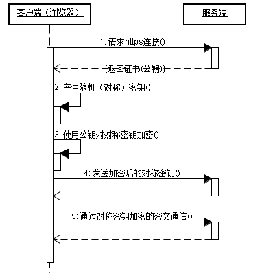

# 前端项目管理

记录那些前端项目中方便项目推进的常用工具。

## 画图
### 时序图
> [时序图的画法——IBM 文档](https://www.ibm.com/docs/zh/rational-soft-arch/9.6.1?topic=diagrams-sequence)

时序图是一种 “统一建模语言”(UML) 图，用来说明参与交互的 对象之间传递的消息的顺序。时序图由一组用生命线表示的对象以及这些对象在交互期间交换的消息组成。

时序图显示在对象之间传递的消息的顺序。时序图还可以显示对象之间的控制结构。例如，用于银行方案的时序图中的生命线可以表示客户、银行出纳或银行经理。客户、银行出纳和银行经理之间的通信由他们之间互相传递的消息表示。时序图显示对象和在对象之间传递的消息。

以下为某项目时序图示例：

