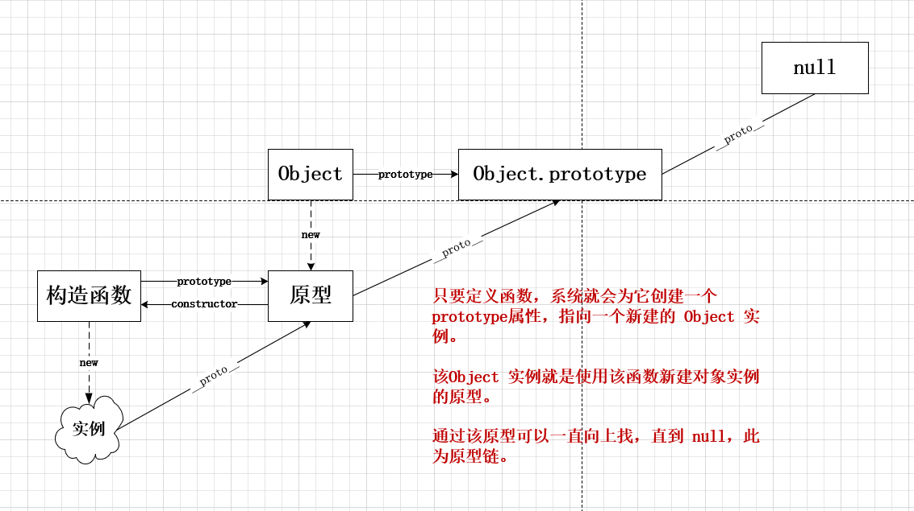
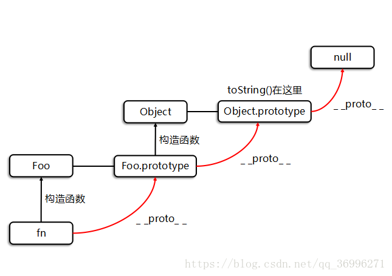
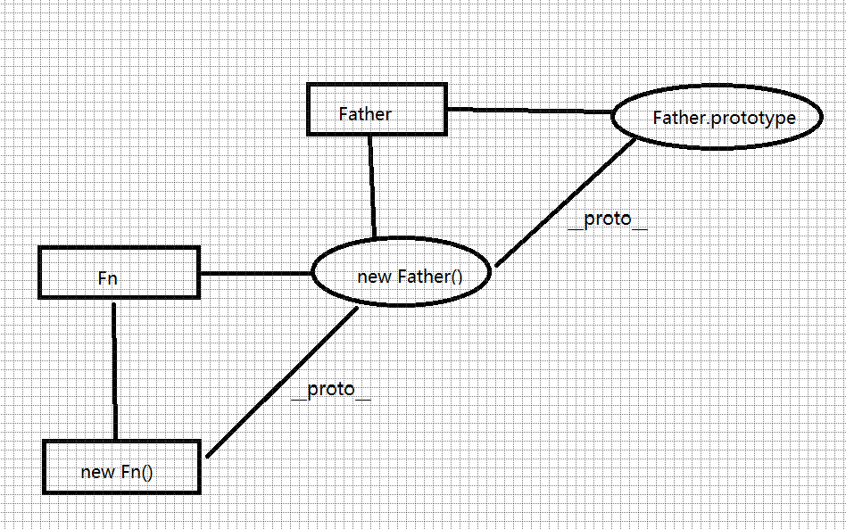
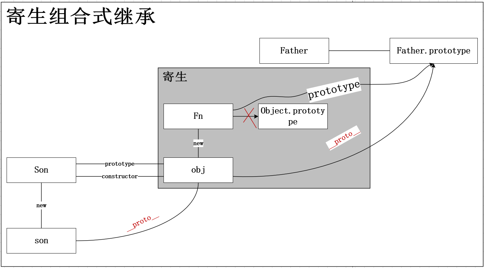

# 原型链与对象继承
## 原型链
只要创建函数，就会按照特定的规则为这个函数创建一个**原型对象**，且为该函数创建一个 `prototype` 属性，指向这个**原型对象**。该**原型对象**有一个 `constructor` 属性，指向该函数，其余属性方法继承自 `Object` 。



```js
// 1. 创建一个函数（可以是构造函数，也可以是普通函数）
function Person(){}
// 2. 自动创建一个原型对象
let yuanxing = Person.prototype
// 3. 原型对象的 constructor 属性指向该函数
yuanxing.constructor === Person // true
```

使用构造函数创建实例对象时，实例对象有一个 `__proto__` 属性，指向构造函数的原型对象。

```js
let zyc = new Person()
zyc.__proto__ === Person.prototype // true
// 使用对象实例的 isPrototypeOf 方法检测原型对象是否在实例对象的原型链上
Person.prototype.isPrototypeOf(zyc) // true
// 使用Object 的静态方法获取实例对象的原型对象
Object.getPrototypeOf(zyc) === Person.prototype // true
```

> 实例对象与构造函数没有直接关系，有间接关系：
> 其原型对象的 constructor 指向构造函数： `zyc.__proto__.constructor = Person`
## 创建对象
### 工厂模式
使用不同参数多次调用该函数，每次都会返回一个包含三个属性和一个方法的对象。
```js
function createPerson(name, age, job) {
    return {
        name, age, job, 
        sayName(){console.log(this.name)}
    }
}

let zyc = createPerson('zyc', 27, '学生')
```

> 工厂模式虽然能够快速创建对象，但它没有解决**对象标识问题**（即新创建的对象是什么类型）。

### 构造函数模式
使用构造函数替代工厂函数，区别如下：

- 未显式地创建对象
- 属性与方法直接赋值给 `this`
- 没有 `return`
```js
function Person(name, age, job) {
    this.name = name
    this.age = age
    this.job = job
    this.sayName = function(){
        console.log(this.name)
    }
}

const zyc = new Person('zyc', 27, '学生')
```

这里使用 new 操作符调用构造函数创建了 Person 类实例对象。
**缺点**
- 构造函数模式的问题在于，其中定义的方法在每次创建实例时都会重新初始化。而各个实例中的方法都是做同样的事，没必要定义多个不同的 Function 实例。
- 虽然可以把函数的定义移到构造函数外部，但这样又会扰乱全局作用域，且自定义类型引用的代码不能很好地聚集在一起。

### 原型模式
使用原型模式，将属性与方法都定义在函数的原型上。
```js
function Person(){}
Person.prototype.name = 'zyc'
Person.prototype.age = 27
Person.prototype.sayName = function(){
    console.log(this.name)
}

const zyc = new Person()
zyc.name = '张三'
zyc.sayName() // 张三
```

**缺点**
- 所有实例默认状态下取得相同属性值
- 对于引用类型的属性值，修改某一实例的属性值，会导致所有实例属性发生改变

### 组合使用构造函数模式和原型模式
属性定义在构造函数中，方便实例化时的传参。方法定义在原型对象，方便共享。
```js
// 构造函数模式
function Person(name, age) {
    this.name = name
    this.age = age
}
// 原型模式
Person.prototype.sayName = function(){
    console.log(this.name)
}

const zyc = new Person('zyc', 27)

zyc.sayName() // zyc
```

问题

- 属性定义和方法定义分离，不方便理解

### 动态原型模式
把属性和方法都定义在构造函数中，其中，定义方法时，先判断该方法是否存在，即方法只会在首次实例化时添加到原型，不会重复定义。
```js
// 构造函数模式
function Person(name, age) {
    this.name = name
    this.age = age
    // 如果实例不存在该方法，则为 Person 类的原型添加之
    if (typeof this.sayName !== 'function' ) {
        Person.prototype.sayName = function() {
            console.log(this.name)
        }
    }
}
```

### ES6 定义类
```js
class Person{
    constructor(name, age) {
        this.name = name
        this.age = age
    }

    sayName() {
        console.log(this.name)
    }
}
```

## 继承
继承的本质是，子类的原型对象是父类的实例对象。从而，将父类绑定在子类实例的原型链中，并实现以下特点：

- 子类实例可以访问到父类实例的方法、属性
- 子类实例也是父类的实例， `instanceof` 判断为 `true`



如上图所示， `Foo类` 即是继承自 `Object` 的子类。 Foo 类的原型 Foo.prototype 是 Object 类的实例 new Object() 。 Foo 类的实例对象 fn 可以访问到 Object 的 toString 方法。

JavaScript 中实现继承即是使子类具有上述两个特点。

以下模式中，使用到的父类统一定义为 Father :
```js
// 构造父类
function Father(name, age) {
    this.name = name
    this.age = age
}
Father.prototype.sayHi = function(){
    console.log(`大家好，我是${this.name}，今年${this.age}岁了，请多多指教。`)
}
```
### 原型链继承
核心：根据定义，直接将**父类的实例**作为**子类的原型**。

特点
    - 子类的实例同时也是父类的实例
    - 可继承父类的方法和属性
    
缺点
    - 无法给属性传值
    - 父类属性的继承无意义

> 虽然继承到了父类的属性，但是无法利用到父类的构造函数进行传参，而是覆写所需属性。
```js
// 构造子类
function Son(name, age, otherProperty){
    // 子类需要覆盖父类属性
    this.name = name
    this.age = age
    this.otherProperty = otherProperty
}
// * 子类原型指向父类实例
Son.prototype = new Person('zyc', 27) // 缺点1：父类只执行一次，无法向父类传参
// * 将子类原型的 constructor 重设为子类对象
Son.prototype.constructor = Son
```

### 借用构造函数继承
核心：子类内部使用父类构造函数的 call 方法，复制父类实例属性给子类。

特点

- 可继承父类属性，可向父类传参
- 可实现多继承

缺点

- 子类的实例不是父类的实例
- 无法继承方法
- 无法实现函数复用

> 通过 call 方法调用父类构造函数，成功实现属性的传参。但由于未进行原型链的操作，父类不在子类实例的原型链上，无法访问到父类方法。

```js
// 构造子类
function Son(name, age, otherProperty){
    // * 使用父类构造函数创建子类属性
    Father.call(this, name, age)
    this.otherProperty = otherProperty
}

const son = new Son('zs', 24, '其它属性')
// 无法继承父类属性
son.sayHi() // 报错，undefined is not a function
// 子类实例不是父类实例
son instanceof Father // false
```
### 组合式继承
使用原型链继承方式建立子类实例与父类的原型连接，借用构造函数方法实现属性传参

特点

- 可以继承父类方法
- 可以传参修改属性
- 子类实例也是父类实例

缺点

- 执行了两次父类构造函数（消耗内存）

```js
// 构造子类
function Son(name, age, otherProperty){
    // * 使用父类构造函数创建子类属性
    Father.call(this, name, age)
    this.otherProperty = otherProperty
}

// * 子类原型指向父类实例，以继承父类方法
Son.prototype = new Person()
// * 将子类原型的 constructor 设为子类对象，完成完整的原型链
Son.prototype.constructor = Son
```
### 原型式继承
用一个函数包装一个对象，返回这个函数的引用，该函数就变成可以随意增添属性的实例或对象。 `Object.create()` 就是这个原理。

缺点

- 所有实例都会继承父类的属性
- 无法实现复用（子类实例的所有属性都是新建实例后添加进去的）
- 没有创建自定义类型


```js
// 构造子类
function Son(obj) {
    // 1. 创建一个空构造函数
    function Fn(){}
    // 2. 让空构造函数的原型指向传入的对象
    Fn.prototype = obj
    // 3. 返回空构造函数的实例，则该实例的原型对象为 obj
    return new Fn()
}

const son1 = Son(new Father())

// 无法实现复用（子类实例的所有属性都是新建实例后添加进去的）
son1.name = '张三'
```

上述代码的原型结构：


### 寄生式继承
在原型式继承的基础上套了一层壳子，以便为实例数据添加属性。
```js
function content(obj) {
    function Fn(){}
    Fn.prototype = obj
    return new Fn()
}

function Son(obj, otherParams){
    const son = content(obj)
    // 添加其它属性
    son.otherParams = otherParams
    return son
}

const son = Son(new Father(), otherParams)
```
### 寄生组合式继承
寄生：在函数内返回对象然后调用。

组合：
1. 函数的原型等于另一个实例。
2. 在函数中用apply或者call引入另一个构造函数，可传参

```js
function content(obj) {
    function Fn(){}
    Fn.prototype = obj
    return new Fn()
}

function Son(name, age){
    // * 借用构造函数模式
    Father.call(this, name, age)
}

// * 寄生式继承
// 关键点! 在这一步省去了组合继承中获取父类实例的步骤
// 尽管传参了，但是并没有执行父级构造函数
Son.prototype = content(Father.prototype)
// * 修复实例的 constructor 属性
Son.prototype.constructor = Son
```
继承链图:



### ES6 继承
```js
// 构造父类
class Father {
    constructor(name, age) {
        this.name = name
        this.age = age
    }
    sayHi() {
        console.log(`大家好，我是${this.name}，今年${this.age}岁了，请多多指教。`)
    }
}

// 构造子类
class Son extends Father {
    constructor(name, age, otherProperty) {
        // 使用父类的构造函数
        super(name, age)
        // 定义其它构造函数
        this.otherProperty = otherProperty
    }

    // 默认继承父类的方法
    // sayHi(){}
}
```
