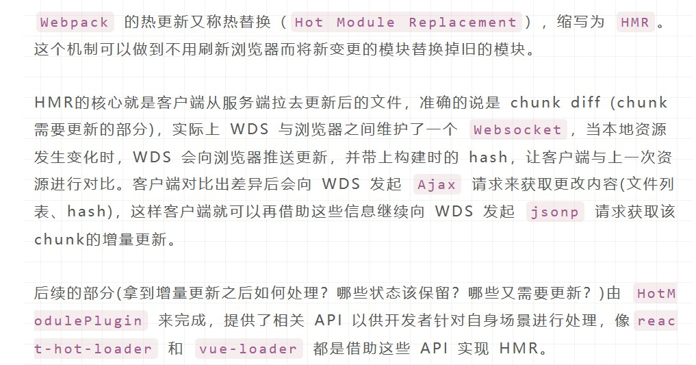

# Webpack 学习笔记

> [《**Webpack 实战（入门，进阶与调优）**》](https://github.com/yuhaoju/webpack-config-handbook)

本质上，webpack 是一个现代 JavaScript 应用程序的静态模块打包器(module bundler)。

[webpack](https://www.webpackjs.com/concepts/)的配置浩如烟海，听说有的单位甚至有 webpack 配置工程师专门负责这块内容。

本着把工具看作黑盒，只学习如何配置、如何使用的原则，记录初始使用 webpack 的情况如下。

## 1. 基本概念

用 webpack 官网的宣传图，其作用就是打包：


webpack 世界里，一张图片、一个 css 、一个 js 、一个 font 等等所有东西都是模块（Module），其中存在着互相引用的依赖关系。 webpack 就是处理这些模块间的依赖关系，并将其打包。对于不同的模块，webpack 使用不同的**加载器**进行处理。

其主要适用场景是当下流行的单页面应用（SPA），由一个 html 文件 和一堆按需加载的 js 、css 等组成。

### 1.1 webpack 构建流程


1. 初始化：读取配置，加载插件，实例化编译器
2. 从 entry 出发，针对每个 module 调用对应的 Loader 编译内容，对 module 依赖的 module 进行递归处理；
3. 将编译后的 module 组装成 Chunk ，将 chunk 转换为文件，输出到指定位置
4. 在以上过程中， webpack 在特定时间节点抛出特定事件， plugins 在监听到相应事件后执行逻辑，改变 webpack 的运行结果。

## 2. Webpack 配置（四大件）

**归根到底， webpack 就是一个 .js 配置文件。**

随着需求的出现，工程配置逐渐完善。

```js
// ./build/webpack.config.js
module.exports = {
    // 在这里书写配置
};

// ./package.json
{
    "script":{
        "dev":"webpack-dev-server --config build/webpack.config.js"
    }
}
```
以上配置之后，当执行 `npm run dev` 时，就会开始打包构建，其配置文件就是 `--config`后面提供的 js 地址。

webpack-dev-server 的其他命令
- --open：自动在浏览器打开页面，默认地址是 127.0.0.1:8080

**webpack-dev-server 同时提供一项热更新功能，通过建立一个 websocket 连接来实时响应代码的修改**。

### 2.1 **入口**
入口的作用是告诉 webpack 从哪里开始寻找依赖。
```js
module.exports = {
    entry:{
        // 寻找根目录下的 main.js 作为依赖入口
        main:'./main'
    }
}
```
### 2.2 **出口**
出口用来配置编译后的文件存储位置及文件名。
```js
const path = require('path')
module.exports = {
    output:{
        // __dirname 是当前模块所在的目录（来自 nodejs api）
        path: path.join(__dirname, './dist'),
        // publicPath 指定资源文件引用的目录
        publicPath: '/dist/',
        // 指定输出文件的名称
        filename: 'main.js'
    }
}
```
按照以上配置，打包后的文件会存储为 build/dist/main.js 。

### 2.3 **加载器**

> loader 用于对模块的源代码进行转换。loader 可以使你在 import 或"加载"模块时预处理文件。因此，loader 类似于其他构建工具中“任务(task)”，并提供了处理前端构建步骤的强大方法。loader 可以将文件从不同的语言（如 TypeScript）转换为 JavaScript，或将内联图像转换为 data URL。loader 甚至允许你直接在 JavaScript 模块中 import CSS文件！

loader 让 webpack 能够去处理那些非 JavaScript 文件（webpack 自身只理解 JavaScript）。loader 可以将所有类型的文件转换为 webpack 能够处理的有效模块，然后你就可以利用 webpack 的打包能力，对它们进行处理。

Loader 本质就是一个函数，在该函数中对接收到的内容进行转换，返回转换后的结果。 因为 Webpack 只认识 JavaScript，所以 Loader 就成了翻译官，对其他类型的资源进行转译的预处理工作。

**遇到非js结尾的模块，webpack会去module中找相应的规则，匹配到了对于的规则，然后去求助于对应的 loader 。**

以打包 css 样式为例：

```js
// 安装加载器
npm i css-loader --save-dev
npm i style-loader --save-dev

// ./build/webpack.config.js
module.exports = {
    module: {
        rules: [
            {
                test: /\.css$/,
                use: ['style-loader','css-loader']
            }
        ]
    }
}
```
在 module.rules 中指定 loader ，每个 loader 都必须包括 test 和 use 选项。 test 使用正则表达式判断该文件类型是否需要使用 use 配置的 loaders 处理。

如果 use 配置了多个 loader （例如以上情况），则处理顺序为自右向左，即先由 css-loader 处理完后，再交给 style-loader 处理。

[这里](https://www.webpackjs.com/loaders/)官方提供了一些加载器列表和相关用法。

### 2.4 **插件**
> 插件是 webpack 的支柱功能。webpack 自身也是构建于，你在 webpack 配置中用到的相同的插件系统之上！
>
> 插件目的在于解决 loader 无法实现的其他事。

loader 被用于转换某些类型的模块，而插件则可以用于执行范围更广的任务。插件的范围包括，从打包优化和压缩，一直到重新定义环境中的变量。

Plugin 就是插件，基于事件流框架 Tapable，插件可以扩展 Webpack 的功能，在 Webpack 运行的生命周期中会广播出许多事件，Plugin 可以监听这些事件，在合适的时机通过 Webpack 提供的 API 改变输出结果。

譬如，项目希望把所有的 css 提取出来，生成一个总的 main.css 文件，需要如下实现：

```js
// 安装 extract-text-webpack-plugin 插件
npm i extract-text-webpack-plugin@next --save-dev

// ./build/webpack.config.js
const ExtractTextPlugin = require('extract-text-webpack-plugin')
module.exports = {
    module: {
        rules: {
            test: /\.css$/,
            // 使用插件改写 use
            use: ExtractTextPlugin.extract({
                use: 'css-loader',
                fallback: 'style-loader'
            })
        }
    },
    plugins: [
        // 重命名提取后的 css 文件
        new ExtractTextPlugin('main.css')
    ]
}
```

## 3. 深入 loader

所谓 `loader` 只是一个导出为函数的 `JavaScript` 模块，函数的 `this` 上下文将由 `webpack` 填充。

其实际功能更像一个**预处理器**—— `Webpack` 只认识 `JavaScript` ，对于其他类型的资源，需要通过预定义的 `loader` 进行转译，输出为 `Webpack` 能够接收的形式。

### 主要配置

`loader` 规则定义在配置文件的 `module` 配置下：

```js
// webpack.config.js
module.exports = {
    module: {
        rules: [
            // 定义 loader 和对应文件类型等配置
        ]
    }
}
```

配置 | 说明 | 参数
--- | --- | ---
exclude | 排除指定目录下的模块 | 正则
include | 包含指定目录下的模块（优先级：exclude > include） | 正则
resource | 被加载的模块 | 相关配置
issuer | 加载者 | 相关配置

### 常用 loader
loader | 功能说明
--- | ---
babel-loader | 将 es6 语法转译为 es5
file-loader | 打包文件类资源，并返回其 publicPath (资源引用路径)
url-loader | 打包文件类资源，当文件大小超过阈值时，使用 base64 编码
vue-loader | 打包 vue 组件

### 自定义 loader

loader 本质上就是一个导出的函数：

```js
// my-custom-loader.js
module.exports = function(content) {
    // 自定义的 loader ，为所有 js 文件添加严格模式
    return `'use strict';\n\n${content}`
}
```

此外，还可以通过 `webpack.config.js` 向其传递 `options` ，以及使用 `webpack` 添加在 `this` 上下文中的对象和函数（参见[官方文档](https://www.webpackjs.com/api/loaders/)）。

## 4. 样式处理

样式内容有两种方式引入到项目文件中：

- 直接插入 style 标签
- 提取到单独的 CSS 文件，通过 link 标签引入

对于第二种方式，通过插件包装后的 loader 实现：

```js{7-10}
// webpack.config.js
module.exports = {
    module: {
        rules: [
            {
                test: /.\css$/,
                use: ExtractTextPlugin.extract({
                    fallback: 'style-loader',
                    use:'css-loader'
                })
            }
        ]
    }, 
    plugins: [
        new ExtractTextPlugin('bundle.css')
    ]
}
```

通过以上配置， css 内容会在经过 `css-loader` 和 `style-loader` 的处理后，保存为 `bundle.css` 文件。

### 4.1 CSS 模块化
启用 css-loader 的 modules 配置项即可。

### 4.2 可用的一些工具
- 插件
    - extract-text-webpack-plugin
    - mini-css-extract-plugin
- 样式预处理
    - Sass/SCSS
    - Less
    - PostCSS
- 样式检测
    - stylelint

## 5. 代码分片
> 实现高性能应用的重要一点是，**让用户每次只加载必要的资源，优先级不太高的资源可以采用延迟加载等技术渐进式地获取**。

代码分片有如下好处：

- 合理的分片可以有效利用客户端缓存

### 5.1 通过入口划分
通过定义多入口，可以将代码提取到不同的文件中，应用场景如下：

- 单页面应用中，可以额外设置一个 lib 入口，存放不常更新的库资源
- 多页面应用，为每个页面创建一个入口

### 5.2 提取公共文件
使用 `CommonsChunkPlugin` / `SplitChunks` 插件，将多个 chunk 的公共部分提取出来。

提取公共 chunk 有以下好处：

- 减少重复模块的打包时间
- 减小整体资源体积

### 5.3 资源的异步加载
异步加载通过把暂时用不到的模块延迟加载，使页面初次渲染时所需资源尽可能少，后续模块等待恰当的时机再加载。

webpack 提供了一个 import 函数进行模块及其依赖的异步加载：

```js
// a.js
export function add(a, b) {
    return a + b
}
// b.js
if (needLoad) {
    import(/* webpackChunkName: "a-chunk-name" */'./a.js').then(({add}) => {
        add(1, 2) // 3
    })
}
```

如上，当时机合适，模块 a 才会被加载。在打包时， a 被打包为独立模块，可以在 import 函数的注释对 a 模块进行命名。

a 模块属于项目的间接资源，其存储在 `output.publicPath` 路径下。

## 6. 生产环境配置
当在 webpack 配置中开启生产环境， webpack 会自动添加许多适用于生产环境的配置项，减少人为手动的操作。

```js
// webpack.config.js
module.exports = {
    mode:'production',
}
```

### 6.1 source map 配置
source map 是将编译、打包、压缩后的代码映射回源代码的过程，对于 debugger 有很大帮助。

开启 source map 是配置 devtool 项。

```js
// webpack.config.js
module.exports = {
    devtool: 'source-map'
}
```

在生成 bundle 文件时，会同时生成 map 文件，并在 bundle 文件中追加一句注释标识 map 文件的地址。

当使用 F12 打开浏览器开发者工具时， map 文件会同时被加载，然后浏览器使用它来对打包后的 bundle 文件进行解析，分析出源代码的目录结构与内容。

:::tip 提示
map 文件可能很大，但只要不开启开发者工具，浏览器是不会加载的，对于普通用户没有影响。
:::

尽管 source-map 不会影响用户的浏览体验，但是会带来安全问题，所有人都可能通过开发者工具查看到源代码。

配置项 | 说明
--- | ---
source-map | 完整的 map 文件和引用，任何人都可以查看源代码
hidden-source-map | 有完整 map 文件，但不在 bundle 中添加引用地址，需要利用第三方服务（如Sentry）托管 map 文件
nosources-source-map | 可以看到源码目录结构，但文件内容被隐藏，可以看到错误栈或行数

另一种方式是通过配置 nginx 服务器，将 .map 文件只对固定白名单（如公司内网）开放，方便调试的同时，也保证了安全性。

### 6.2 资源压缩
当设置为生产环境，代码压缩是默认配置。

使用的是 terser-webpack-plugin 插件。

### 6.3 缓存
缓存是浏览器重复使用已经获取过的资源，以减少网络请求，缓解带宽压力，提高浏览体验。

具体的缓存策略由服务器决定，浏览器会在资源过期前使用本地缓存进行响应。

为保证用户及时获取到最新资源，需要为文件名添加 hash 值以保证更新。

## 7. 打包优化
关于优化的一条经验之谈是：**不要过早优化**。

一般是当项目发展到一定规模，性能问题随之而来，再去分析和对症下药。

### 7.1 打包原理
1. 从配置中获取打包入口
2. 配置 loader 规则，对入口模块进行转译
3. 对转译后的模块进行依赖检索
4. 对新找到的模块重复 2，3，直到没有新依赖

步骤 2 和 3 是递归执行，由于 webpack 是单线程，所有模块必须依次执行转译（即使不存在依赖关系）。

通过 HappyPack 可以开启多个线程，并行转译操作，提高打包速度。

### 7.2 缩小打包作用域
通过配置 rule 中的 include 和 exclude 项，提高打包精确度。

### 7.3 tree shaking （摇树优化）
tree shaking 是在打包过程中进行代码检测，对于模块中那些没有被用到的部分，会被移除。

以下代码为例：

```js
// utils.js
export function fn1() {}
export function fn2() {}

// index.js
import {fn1} from './utils
fn1()
```
utils 模块有两个工具函数， index 只使用到 fn1 函数，把 utils 完全打包，就会有资源浪费。

webpack 提供的摇树优化，在打包时会对 fn2 函数添加一个标记，在进行生产环境打包时，将其移除（正常开发模式下依然存在）。

tree shaking 只能对 es6 模块生效。因为 es6 模块的依赖关系是在代码编译时构建的，而非运行时。

:::tip
webpack 提供的 tree shaking 优化本身只是为死代码加上标记，真正去除死代码是通过压缩工具实现的。
:::

## 8. 开发调优
### 一些效率插件
插件 | 作用
--- | ---
webpack-dashboard | 优化控制台中的打包信息展示方式
webpack-merge | 合并 webpack 的配置文件
speed-measure-webpack-plugin | 输出 webpack 各个步骤的构建时间
size-plugin | 监控打包资源的体积变化

## 9. 模块热替换

> [Webpack HMR 原理解析](https://zhuanlan.zhihu.com/p/30669007)
> [再来一打Webpack面试题](https://juejin.im/post/6844904094281236487)

在一般开发模式，是在调整代码后，手动更新构建项目，手动刷新页面，然后手动操作到更新的位置，以查看修改效果，然后再改代码。

后来，一些开发工具能够检测代码改动，然后自动构建，触发网页刷新，如 live-reload。

webpack 又进了一步，让代码在网页无刷新的情况下得到最新改动，即在**保留页面当前状态的前提下呈现代码的最新改动**，这就是模块热替换功能（HMR）。



### 启动热替换模式
要开启热替换功能，需要使用 webpack-dev-server 启动项目：

```bash
# 安装 webpack-dev-server 插件
yarn -D add webpack-dev-server
# 使用 serve 模式构建和启动项目
webpack serve
```

开启后，资源的体积比原本大了很多，因为 webpack 为了实现 HMR 注入了很多相关代码。

### 何时拉取
1. WDS（webpack-dev-server） 与浏览器之间维护了一个 websocket
2. 当资源发生变化， WDS 向浏览器推送更新事件，并带上最新构建的 hash 值
3. 客户端拿到构建 hash ，与上一次资源对比（因为源文件更新并不一定更改构建结果）

> live-reload 也是依赖这种实现的。

### 拉取什么
当客户端知道发生了更新，会向 WDS 发起请求，获取**更改文件的列表**。

客户端借助该列表，继续向 WDS 发起请求，获取更改文件的内容。

### 如何更新
客户端获取到了 chunk 更新，但应当如何处理这些更新，保留哪些状态，更新哪些状态，这需要开发者自行决定。

webpack 提供了相关 api ，帮助开发者在合适的契机进行状态的处理。
