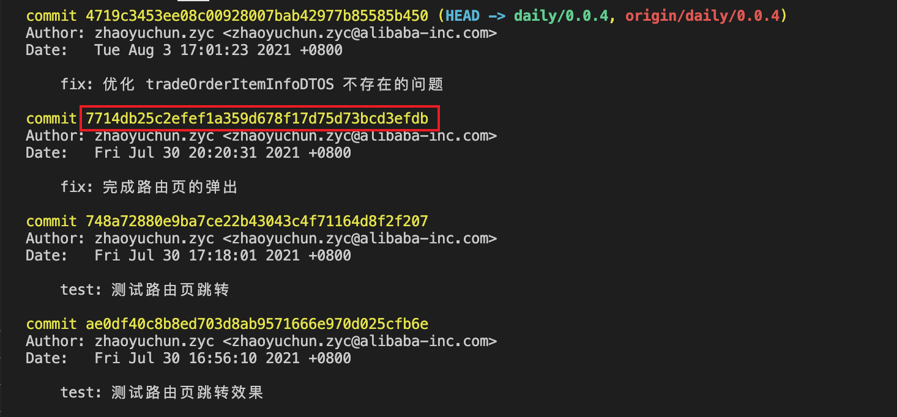

# git 相关
> [git book](https://git-scm.com/book/zh/v2)
## commit
> [Commit message 和 Change log 编写指南——阮一峰](https://www.ruanyifeng.com/blog/2016/01/commit_message_change_log.html)

> [Git 使用规范流程——阮一峰](https://www.ruanyifeng.com/blog/2015/08/git-use-process.html)

### 提交规范

- feat: 新增功能
- fix: 修复 bug
- docs: 文档相关的改动
- style: 对代码的格式化改动，代码逻辑并未产生任何变化(例如代码缩进，分号的移除和添加)
- test: 新增或修改测试用例
- refactor: 重构代码或其他优化举措
- chore: 项目工程（构建工具等）方面的改动，代码逻辑并未产生任何变化
- revert: 恢复之前的提交

## git 工作流
> [目前最流行的 github 分支模型](https://guides.github.com/introduction/flow/)

> [Git 工作流程——阮一峰](https://www.ruanyifeng.com/blog/2015/12/git-workflow.html)

Git 作为一个源码管理系统，不可避免涉及到多人协作。协作必须有一个规范的工作流程，让大家有效地合作，使得项目井井有条地发展下去。

工作流是**功能驱动开发**模式，即需求是开发的起点，先有需求再有功能分支（feature branch）或者补丁分支（hotfix branch）。完成开发后，该分支就合并到主分支，然后被删除。

### 最早的工作流 Git Flow

Git Flow 最主要的特点：

1. 项目存在两个长期分支：master、develop
  - master 存放发布版本
  - develop 用于日常开发
2. 根据功能需求，存在三类短期分支
  - 功能分支（feature branch）
  - 补丁分支（hotfix branch）
  - 预发分支（release branch）

由于它需要同时维护两个长期分支，比较麻烦。而且，这个模式基于**版本发布**的，目标是一段时间以后产出一个新版本。

但是，很多网站项目是**持续发布**，代码一有变动，就部署一次。这时，master分支和develop分支的差别不大，没必要维护两个长期分支。

### Github Flow

它是 Git Flow 的简化版，只维护一个长期分支，且不区分短期分支的类别。

1. 根据需求拉取新分支
2. 开发完成后，向 master 发起 PR
3. 大家对分支代码进行讨论
4. PR 被接受，合并进 master，删除分支

该流程非常简单，适合持续发布。但是对于一些发布和上线存在 gap 的场景下，可能存在 master 最新代码与发布版本不一致的问题，还是要额外再维护一个发布分支。

### Gitlab Flow

Gitlab Flow 综合了两个流程的优点，能够适应不同开发环境的同时，又有单主分支的便利。

- 上游优先
  - 只存在一个主分支，是所有分支的上游
  - 只有上游分支采纳了的变更，才能应用到其它分支
- 对于持续发布
  - 在 master 分支外，再建立环境分支
  - master -> pre-production -> production
- 对于版本发布
  - 每次发布，都从 master 拉一个稳定版本分支
  - 只有 bug 修复，才可以合并到该稳定版本分支，并更新小版本号

## 附：实战
### 如何为 git 配置多个 SSH key
> [Git 配置多个 SSH-Key](https://gitee.com/help/articles/4229#article-header0)

### 分支的合并与新建
> [分支的新建与合并](https://git-scm.com/book/zh/v2/Git-%E5%88%86%E6%94%AF-%E5%88%86%E6%94%AF%E7%9A%84%E6%96%B0%E5%BB%BA%E4%B8%8E%E5%90%88%E5%B9%B6)

### 丢弃本地的修改

> [git 丢弃本地修改的所有文件（新增、删除、修改）](https://blog.csdn.net/leedaning/article/details/51304690)

```bash
# 丢弃本地所有已修改且未提交的内容
git checkout .
```

### 查看远程仓库地址

```bash
git remote -v
```

### 版本回退

可能做了一些提交，甚至已经 push 到远程仓库了，但是又想回到某个历史版本，可以使用下面方法。

首先，查看下历史提交记录。

```bash
# 查看提交记录
git log
```



红框部分为 commit_id，这是进行版本回退的关键：

```bash
# 使本地代码回到指定提交历史版本（本地代码被修改）
git reset --hard 7714db25c2efef1a359d678f17d75d73bcd3efdb
```

推送远程仓库，把远程也回退到历史版本：

```bash
# 使用 --force 强制推送，否则会 push 失败（本地与远端版本不一致）
git push origin [your-branch-name] --force
```

### 移除本地分支

```bash
# 当本地分支已经 push 到远端时
git branch -d [your-branch-name]

# 如果还没 push 到远端，可以使用 -D 强制删除
git branch -D [your-branch-name]
```