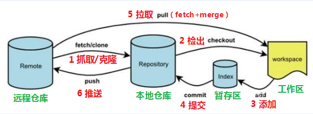

# git 学习笔记
> [git book](https://git-scm.com/book/zh/v2)

为避免由于物理层面的意外，导致代码的丢失，有必要将本地代码托管到一个靠谱的云平台。

git是一个开源的分布式版本控制系统，可以有效、高速地处理从很小到非常大的项目版本管理。Git 是分布式的，每台电脑拥有的东西都是一样的。Git 有中心服务器，仅仅是为了方便交换大家的修改，但是这个服务器的地位和其他每个人的PC是一样的。

常用的 git 管理平台很多，由于众所周知的原因，本文使用 [gitee](https://gitee.com/) 做代码托管。

## 1. 基本概念


- **远程仓库**：在局域网或互联网上的一个主机，存放代码库的主机或平台，比如`gitee.com(码云)`

- **本地仓库**：在本地主机上的一个代码库，可以独立存在，也可以与远程仓库进行关联。`.git文件夹`目录中存储了很多配置信息、日志信息和文件版本信息、工作区、暂存区信息等。

- **暂存区**：把修订的文件，从工作区经过 `add（添加）`后与某一个仓库分支进行关联，只要进入缓存区的文件才能 `commit` (提交)到本地仓库。`.git文件夹`中有很多文件，其中有一个 `index` 文件就是暂存区，也可以叫做 `stage` 。 `暂存区` 是一个临时保存修改文件的地方。

- **工作区**：对任何文件的修订，都在工作区，工作区不与任何仓库关联，需要通过暂存区提交到本地仓库。

## 2. 基本推送流程

### 2.1 新建 远程仓库
由于本地项目是业务代码，考虑到安全性，选择创建私有仓库。

### 2.2 远程仓库 -> 本地仓库
```sh
# clone 命令
git clone https://gitee.com/anontree/wh_mapping.git
```
clone 私有仓库时，输入上述命令后，会被要求输入用户名和密码，且该用户需为私有仓库中的成员。

使用 clone 命令时，除了将 `远程仓库` 的内容拉取到 `本地仓库` ，还会直接把内容 `checkout` 到 `工作区` 。

上述命令执行完毕后，会生成 `wh_mapping` 文件夹，进入文件夹，即可看到 `远程仓库` 中的代码。

因为是新建的仓库，所以看到的内容应该是空的。如果在新建仓库时勾选了 `README.md` 选项，则会在本地看到这个 `gitee` 自动生成的 `README.md` 。

### 2.3 已有代码  ->  暂存区
将本地已有的所有项目文件 `copy` 到 `wh_mapping` 文件夹中，这时，等于把文件放到了 `工作区` 。

为了将 `工作区` 的文件更新到 `本地仓库` ，乃至提交到 `远程仓库` ，首先需要把文件添加到 `缓存区` ：

```sh
# 添加变化的文件
git add test.js

# 也可添加所有修改过/新增的文件
git add .
```
此时修改的内容已经来到 `暂存区` ，可以查看详情：
```sh
# 查看暂存区的状态
git status

# 简写的状态（推荐使用）
git status -s
```

既然是 `暂存区` ，就可以把不想提交的内容 撤销 回来：
```sh
# git reset 文件名
git reset test.js
```
在我们的 `工作区` 中，有一些文件可能比较大，或者太琐碎，不需要通过远程管理，比如 `node_modules` 里的库文件。

可以在 `.gitignore` 中进行设置：
```sh
# wh_mapping/.gitignore
node_modules/ # 库文件夹下的所有文件
.vscode # vscode 配置文件
```
### 2.4 暂存区 -> 本地仓库
使用 `commit` 命令，从 `暂存区` 提交到 `本地仓库` ：

```sh
git commit -m '这里写提交的一些情况说明'
```
这样， `工作区` 的变化就已经保存到 `本地仓库` 了。

### 2.5 本地仓库 -> 远程仓库
使用 `push` 命令，把变更提交到 `远程仓库` ：
```sh
# git push 远端仓库名 分支名
git push origin master
```
因为这是初次提交，不存在代码冲突情况。但实际情况，在提交变更的时候，可能此时的 `远程仓库` 已经在 `clone` 之后有了新的变化，所以需要在 `push` 之前，重新获取一下 `远程仓库` 的内容，并与 `工作区` 的内容 `合并（merge）` 起来：
```sh
# git pull 远端仓库名 分支名
git pull origin master
```

使用 `pull` 命令，会在拉取 `远端仓库` 之后，自动把变更 `合并` 到 `工作区` 中，如果存在冲突，则需先解决冲突（线下方式），再进行 `push` 。

### 2.6 小结 
这样，就基本实现了本地代码的远程托管，每次做了修改之后，就以下一通操作：
```sh
# 添加到暂存区
git add .
# 转到本地仓库
git commit -m '提交信息'
# 拉取远程变化
git pull origin master

# 提交到远程仓库
git push origin master
```
:::warning 提示
如有冲突，则解决冲突后，需要重新 add + commit + pull + push
:::

## 3. 最佳实践

### 3.1 提交规范
> [Commit message 和 Change log 编写指南——阮一峰](https://www.ruanyifeng.com/blog/2016/01/commit_message_change_log.html)

> [Git 使用规范流程——阮一峰](https://www.ruanyifeng.com/blog/2015/08/git-use-process.html)

- feat: 新增功能
- fix: 修复 bug
- docs: 文档相关的改动
- style: 对代码的格式化改动，代码逻辑并未产生任何变化(例如代码缩进，分号的移除和添加)
- test: 新增或修改测试用例
- refactor: 重构代码或其他优化举措
- chore: 项目工程（构建工具等）方面的改动，代码逻辑并未产生任何变化
- revert: 恢复之前的提交

## 4. git 工作流
> [目前最流行的 github 分支模型](https://guides.github.com/introduction/flow/)

> [Git 工作流程——阮一峰](https://www.ruanyifeng.com/blog/2015/12/git-workflow.html)

Git 作为一个源码管理系统，不可避免涉及到多人协作。协作必须有一个规范的工作流程，让大家有效地合作，使得项目井井有条地发展下去。

工作流是**功能驱动开发**模式，即需求是开发的起点，先有需求再有功能分支（feature branch）或者补丁分支（hotfix branch）。完成开发后，该分支就合并到主分支，然后被删除。

### 4.1 最早的工作流——Git Flow

Git Flow 最主要的特点：

1. 项目存在两个长期分支：master、develop
  - master 存放发布版本
  - develop 用于日常开发
2. 根据功能需求，存在三类短期分支
  - 功能分支（feature branch）
  - 补丁分支（hotfix branch）
  - 预发分支（release branch）

由于它需要同时维护两个长期分支，比较麻烦。而且，这个模式基于**版本发布**的，目标是一段时间以后产出一个新版本。

但是，很多网站项目是**持续发布**，代码一有变动，就部署一次。这时，master分支和develop分支的差别不大，没必要维护两个长期分支。

### 4.2 Github Flow

它是 Git Flow 的简化版，只维护一个长期分支，且不区分短期分支的类别。

1. 根据需求拉取新分支
2. 开发完成后，向 master 发起 PR
3. 大家对分支代码进行讨论
4. PR 被接受，合并进 master，删除分支

该流程非常简单，适合持续发布。但是对于一些发布和上线存在 gap 的场景下，可能存在 master 最新代码与发布版本不一致的问题，还是要额外再维护一个发布分支。

### 4.3 Gitlab Flow

Gitlab Flow 综合了两个流程的优点，能够适应不同开发环境的同时，又有单主分支的便利。

- 上游优先
  - 只存在一个主分支，是所有分支的上游
  - 只有上游分支采纳了的变更，才能应用到其它分支
- 对于持续发布
  - 在 master 分支外，再建立环境分支
  - master -> pre-production -> production
- 对于版本发布
  - 每次发布，都从 master 拉一个稳定版本分支
  - 只有 bug 修复，才可以合并到该稳定版本分支，并更新小版本号

## 附：实际使用中常见的问题场景

### 如何为 git 配置多个 SSH key
> [Git 配置多个 SSH-Key](https://gitee.com/help/articles/4229#article-header0)

### 分支的合并与新建
> [分支的新建与合并](https://git-scm.com/book/zh/v2/Git-%E5%88%86%E6%94%AF-%E5%88%86%E6%94%AF%E7%9A%84%E6%96%B0%E5%BB%BA%E4%B8%8E%E5%90%88%E5%B9%B6)

### 丢弃本地的修改

> [git 丢弃本地修改的所有文件（新增、删除、修改）](https://blog.csdn.net/leedaning/article/details/51304690)

```bash
# 丢弃本地所有已修改且未提交的内容
git checkout .
```

### 查看远程仓库地址

```bash
git remote -v
```

### 版本回退

可能做了一些提交，甚至已经 push 到远程仓库了，但是又想回到某个历史版本，可以使用下面方法。

首先，查看下历史提交记录。

```bash
# 查看提交记录
git log
```


红框部分为 commit_id，这是进行版本回退的关键：

```bash
# 使本地代码回到指定提交历史版本（本地代码被修改）
git reset --hard 7714db25c2efef1a359d678f17d75d73bcd3efdb
```

推送远程仓库，把远程也回退到历史版本：

```bash
# 使用 --force 强制推送，否则会 push 失败（本地与远端版本不一致）
git push origin [your-branch-name] --force
```

### 移除本地分支

```bash
# 当本地分支已经 push 到远端时
git branch -d [your-branch-name]

# 如果还没 push 到远端，可以使用 -D 强制删除
git branch -D [your-branch-name]
```

### 将本地代码连接到远程仓库
首先，初始化 `本地仓库` ，并将文件更新进去：
```sh
# 在本地代码文件夹中
git init
git add .
git commit -m "提交信息"
```

然后，为本地仓库添加远程地址：

```sh
git remote add origin git@gitee.com:anonbug/****.git
```

如果远程仓库为空，可以直接 `push` ：
```sh
git push origin master
```

如果远程仓库已有其他数据，需要先 pull 下来。因为此时的本地仓库刚初始化，常规 pull 操作会报错 `fatal: refusing to merge unrelated histories` 。需要额外添加一个 `--allow-unrelated-histories` 命令：
```sh
git pull origin master --allow-unrelated-histories
```

`pull` 之后会跳出 `vim编辑器` 让你写一些说明文字，可以直接使用以下命令退出(冒号也要输入)：
```sh
:wq
```

然后再执行 `push` 命令就可以了。

### 为 git 切换远程连接的方式
在 clone 项目的时候，可以使用 https 方式或 ssh 方式，二者都会为 git 命令生成一个 origin 远程仓库名。

如果需要切换协议，比如为了使用 公钥 简化 push 流程，必须使用 ssh 方式。

```sh
# 移除现有远端
git remote rm origin

# 添加新远端
# git add 远端名（可自定义，比如我习惯改为 gitee） 远端ssh连接
git add gitee git@gitee.com:username/um.git
```
