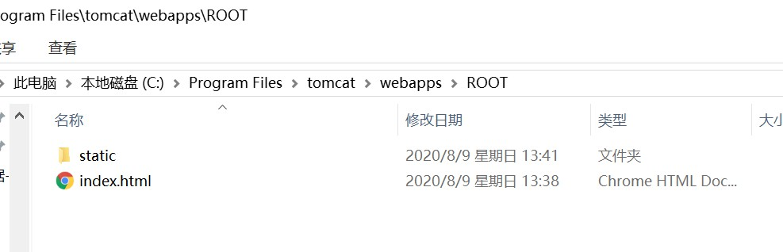
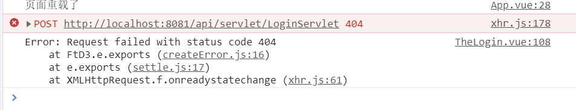
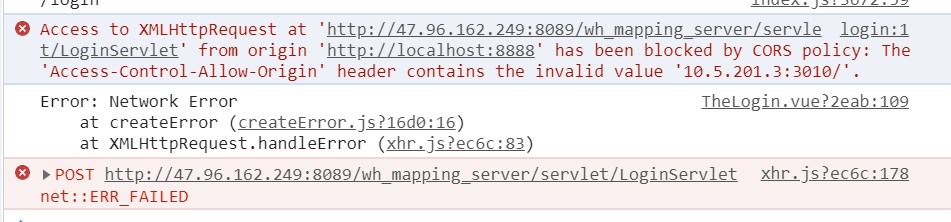
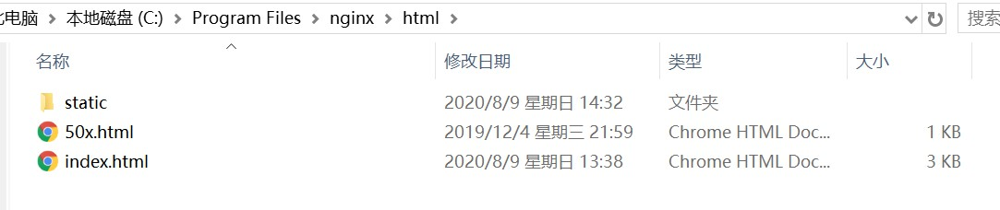
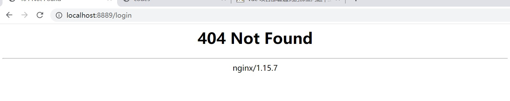
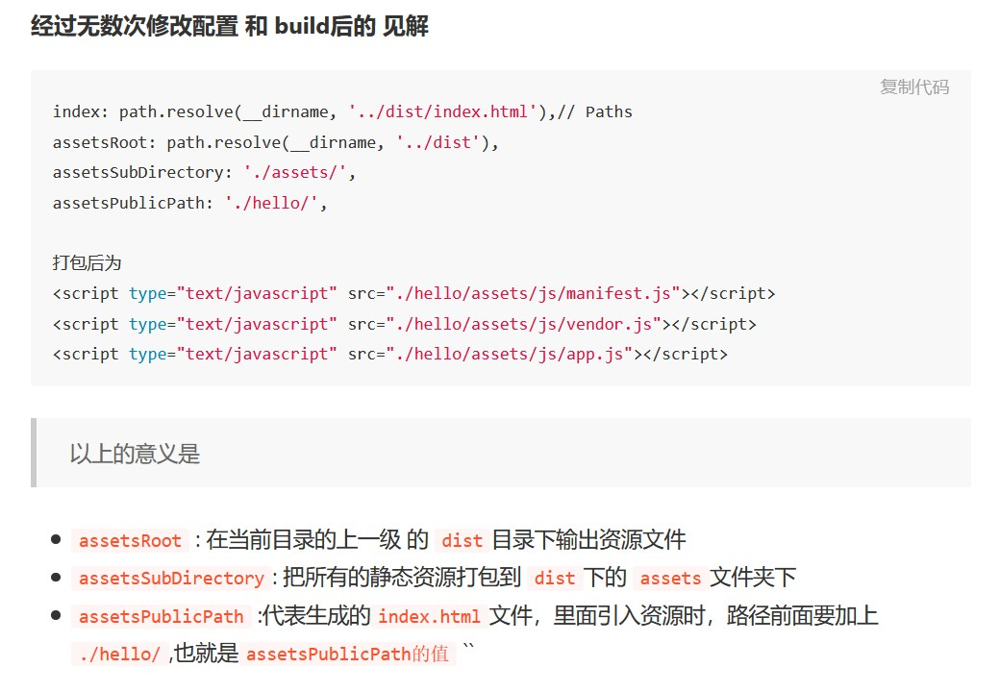
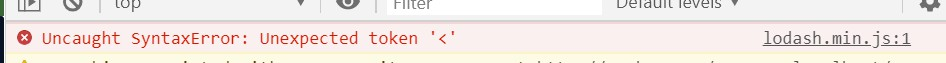
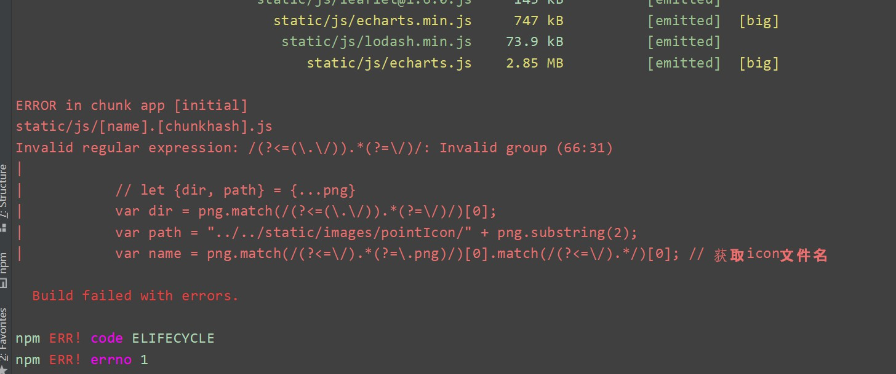

# vue 项目部署遇到的那些问题

<div class="diy-menu">

[[toc]]

</div>

## 1. 部署到 tomcat 服务器
**目标**：使用 localhost:8080 可直接访问项目

### 1.1 操作步骤

1. npm run build

保持默认配置，打包项目，在项目根目录下的 dist 文件夹生成 static文件夹和 index.html 文件

2. 将dist 文件夹下的内容拷贝到 tomcat 相应位置：
tomcat/webapps/ROOT/



3. 启动服务器，使用 localhost:8080 访问

ps：可以修改 tomcat 端口，查看[如何修改](https://blog.csdn.net/qq_40180411/article/details/82112344)

### 1.2 问题
当我们部署完成后，可能会出现这样的问题：



原因是跨域失败。

在开发时，可以使用 proxy 代理来解决跨域问题：

```js
// config\index.js
module.exports = {
    dev:{
        proxyTable: {
            '/api': {
                target: 'http://ip地址:8089/wh_mapping_server' , // 部署地址
                // secure: false,  // 如果是https接口，需要配置这个参数
                changeOrigin: true, // 如果接口跨域，需要进行这个参数配置
                pathRewrite: {
                    '^/api': '/' // 路径的替换规则
                }
            },
        },
    }
}

// login.vue
axios.post("/api/servlet/LoginServlet", "其他参数")
```
在跨域访问时，以 `/api/servlet/loginServlet/...`调用，可以自动替换 `/api/`为`http://ip:端口/servelet/...`。

这里，proxyTable 做了两件事（参考这篇[proxyTable简要叙述](https://www.cnblogs.com/wasbg/p/12659610.html)）：

1. 替换请求接口：api -> http://ip:端口
2. 提供一个代理服务器，由代理服务器去请求数据，再返回给 axios 

其中，第二点很重要，通过这个代理服务器，无需后端配合设置 header 直接实现跨域，这样我们就可以请求那些并非我们控制下的 api 接口。

这也就是为什么，如果只是手动提供端口，并不能解决跨域问题：
```js
// login.vue
axios.post("http://ip:端口/servlet/LoginServlet")
```


解决办法就是我们自己在生产环境提供一个代理服务器。

## 2. 部署到 nginx 代理服务器

### 2.1 步骤
1. 生成 dist 文件（同上，不多介绍）
2. 将 dist 文件夹下的内容拷贝到 nginx 目录下：nginx/html

3. 配置 nginx 文件

```
server{
	listen       8889;
    server_name  localhost;
	location / {
        root html;
		index index.html index.htm
    }
}
```

这时就可以访问项目了，不过还是没能解决跨域问题。

### 2.2 跨域配置
我们现在的请求接口依然是以 /api 开头的链接，在 dev 模式下，我们通过 proxyTable 实现了接口的替换，在 nginx 服务器下，实现思路也类似。

本篇中的代理配置参考这篇文章：[用nginx的反向代理机制解决前端跨域问题](https://www.cnblogs.com/gabrielchen/p/5066120.html)，配置如下：

```
server{
    # 在上述配置后面接着写
    location /api/ {
        # 使用正则表达式重写 api
		rewrite ^/api/(.*)$ /wh_mapping_server/$1 break;
	    proxy_pass http://47.96.162.249:8089; #代理的地址
	}
}
```

用例子解释下这个代理配置。

当请求链接为 `/api/servlet/loginServlet` 时，匹配到这个 代理location ，正则表达式 `^/api/(.*)$` 匹配以 `/api/`开头，以任意多项任意符号结尾的表达式，并传值给 $1 ，即当前 $1 即是 `servlet/loginServlet` 。rewrite 之后，请求链接变成 `localhost:8080/wh_mapping_server/servlet/loginServlet` 。

此时的服务器还是 ，proxy_pass 将 `localhost:8080` 变为代理后的服务器。

大功告成！

:::tip 
修改 nginx.conf 之后，一定要使用命令 `nginx.exe -s reload` 重启 nginx 服务器，来使修改生效。

否则，你就会像我一样，卡在这里半天，还在想是哪里配置得不对。

这里有两篇参考文章：
    - [代理不生效问题](https://blog.csdn.net/lzhfdxhxm/article/details/104736292/) 
    - [重启失败问题](https://blog.csdn.net/kung_com/article/details/95627305)
:::

### 2.3 问题
我的项目路由使用的 history 模式，获得了一个好看的地址路径。但是在部署到 nginx 之后，会出现问题。

当刷新 localhost:8080 时，行为还算正常；可是当地址带路由时，譬如 localhost:8080/login ，就会出现问题：



这个问题， `vue-router 官方` 已经帮我们提供了[解决方案](https://router.vuejs.org/zh/guide/essentials/history-mode.html#%E5%90%8E%E7%AB%AF%E9%85%8D%E7%BD%AE%E4%BE%8B%E5%AD%90)，针对不同的服务器，有相应的配置说明。在nginx 下，添加一行配置：
```{6}
server{
	listen       8889;
    server_name  localhost;
	location / {
        root html;
        try_files $uri $uri/ /index.html;
		index index.html index.htm
    }
}
```
## 3. 将项目部署到二级目录

上述两种部署方式，都将项目丢在服务器的根目录里，通过 localhost:8080 直接访问。这样固然方便，却略显奢侈，我们的项目也不都是有资格占据主页的。

很多时候，需要提供一个二级目录，即 `localhost:8080/myprj` 这种形式。

### 3.1 项目代码修改
[base 选项](https://router.vuejs.org/zh/api/#base)更改路由设置：
```js
// router/index.js
const router = new Router({
    base: "/myprj/"
})
```

[publicPath](https://cli.vuejs.org/zh/config/#publicpath)配置部署包：
```js
// config/index.js
module.exports = {
    publicPath:"/myprj/"
}
```

### 3.2 部署
事实上，在经过上面修改之后，剩下的部署步骤与第二章的部署如出一辙。

1. 打包：npm run build
2. 拷贝
3. 启动服务器

:::warning
这样其实不是真正的二级目录，而是假的二级目录，在设置的这个端口上依然只有这么一个服务。

资源，文件都在一级目录，只是通过 3.1 中的设置，使得呈现出了二级目录的效果。

真正实现二级目录的部署，考虑到资源路径的引用等等问题尚未解决。
:::
## 附：其他坑
### 部署中的路径问题
index.htm 中引入的资源，最好都放在 static 中，引入 node_modules 文件夹中的文件容易出问题。

引用 static 文件时，使用绝对路径 `/static/js/...`，否则容易出现强刷后加载资源失败的问题。

关于 assetsPublicPath ，[有人](https://juejin.im/post/6844903702419996685)做了一些试验，得出了以下结论：




关于静态数据处理的几个博客(容后研究)：
- [vue 配置vue.config.js 处理static文件夹下的静态文件](https://blog.csdn.net/delebasou/article/details/106834620?utm_medium=distribute.pc_relevant.none-task-blog-BlogCommendFromMachineLearnPai2-2.channel_param&depth_1-utm_source=distribute.pc_relevant.none-task-blog-BlogCommendFromMachineLearnPai2-2.channel_param)

### 资源报错问题


经过测试，问题在于 index.html 中的路径引用有问题。

```html
<!-- index.html -->

<!-- 原文件 -->
<script src="./static/js/lodash.min.js"></script>

<!-- 将路径改为绝对路径即可 -->
<script src="/static/js/lodash.min.js"></script>
```
### 正则表达式问题

在文件打包时遇到如下问题：



经过查询，在[这篇问答](https://stackoverflow.com/questions/29370007/regex-look-behind-invalid-regular-expression-s-invalid-group)里找到答案，原因在于这个`向后引用`， js 只是部分支持了这个语法，在打包时， vue 不认，所以报错。

```js
let png = "./abcd/1234.png"

// 原想通过这种方式，获取 abcd
png.match(/(?<=(\.\/)).*(?=\/)/)[0] // abcd

// 修改为了以下方式：
png.match(/(\.\/).*(?=\/)/)[0].slice(2) // abcd
```

### 无法通过ip访问
部署在阿里云服务器上，可以使用 localhost 访问项目，使用 ip 地址却访问失败。

因为阿里云上有其他人的项目，所以也不敢轻易尝试网上提供的方式。

仔细看了下别人部署的项目，配置也没什么特别的，却可以轻松访问。然后我把项目端口改了个与别人相近的一个，结果……成功了。

大概是我原来的端口占用了什么东西吧，但是使用 localhost 却可以访问，就很神奇……