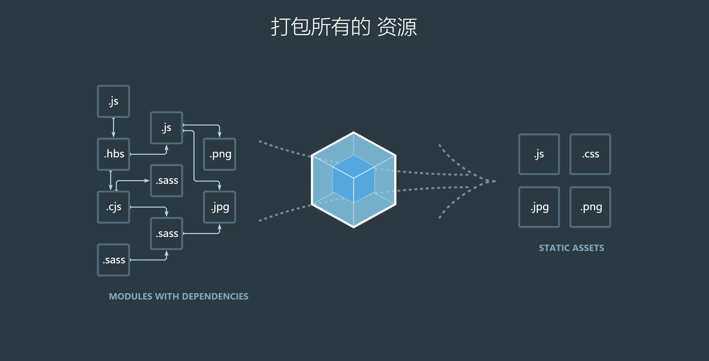
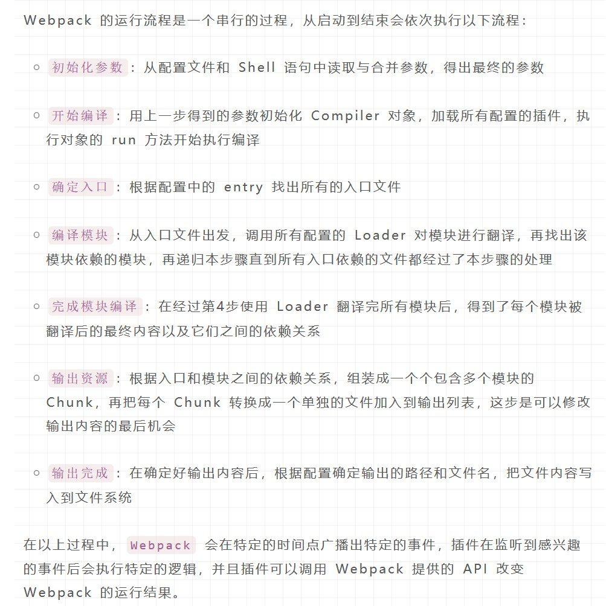
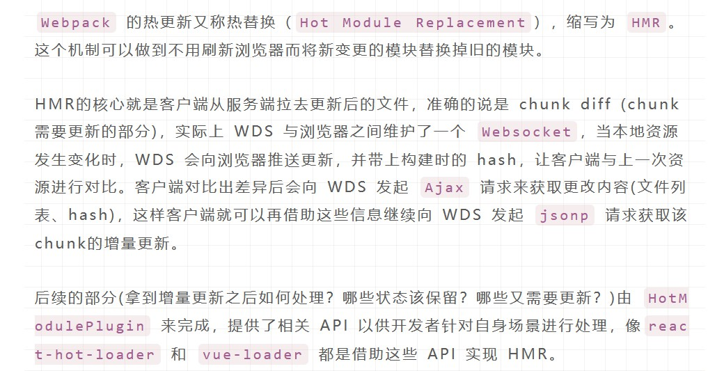

# webpack 入门

<div class="diy-menu">

[[toc]]

</div>

本质上，webpack 是一个现代 JavaScript 应用程序的静态模块打包器(module bundler)。

[webpack](https://www.webpackjs.com/concepts/)的配置浩如烟海，听说有的单位甚至有 webpack 配置工程师专门负责这块内容。

本着把工具看作黑盒，只学习如何配置、如何使用的原则，记录初始使用 webpack 的情况如下。

> 本文内容大部分出自 《vue.js实战》第10章：使用 webpack。

## 1. 认识
用 webpack 官网的宣传图，其作用就是打包：



webpack 世界里，一张图片、一个 css 、一个 js 、一个 font 等等所有东西都是模块（Module），其中存在着互相引用的依赖关系。 webpack 就是处理这些模块间的依赖关系，并将其打包。对于不同的模块，webpack 使用不同的**加载器**进行处理。

其主要适用场景是当下流行的单页面应用（SPA），由一个 html 文件 和一堆按需加载的 js 、css 等组成。

### webpack 构建流程


1. 初始化：读取配置，加载插件，实例化编译器
2. 从 entry 出发，针对每个 module 调用对应的 Loader 编译内容，对 module 依赖的 module 进行递归处理；
3. 将编译后的 module 组装成 Chunk ，将 chunk 转换为文件，输出到指定位置
4. 在以上过程中， webpack 在特定时间节点抛出特定事件， plugins 在监听到相应事件后执行逻辑，改变 webpack 的运行结果。

### webpack 热更新原理
> [Webpack HMR 原理解析](https://zhuanlan.zhihu.com/p/30669007)
> [再来一打Webpack面试题](https://juejin.im/post/6844904094281236487)




## 2. 配置
**归根到底， webpack 就是一个 .js 配置文件。**

随着需求的出现，工程配置逐渐完善。

```js
// ./build/webpack.config.js
module.exports = {
    // 在这里书写配置
};

// ./package.json
{
    "script":{
        "dev":"webpack-dev-server --config build/webpack.config.js"
    }
}
```
以上配置之后，当执行 `npm run dev` 时，就会开始打包构建，其配置文件就是 `--config`后面提供的 js 地址。

webpack-dev-server 的其他命令
- --open：自动在浏览器打开页面，默认地址是 127.0.0.1:8080

**webpack-dev-server 同时提供一项热更新功能，通过建立一个 websocket 连接来实时响应代码的修改**。

### 2.1 **入口**
入口的作用是告诉 webpack 从哪里开始寻找依赖。
```js
module.exports = {
    entry:{
        // 寻找根目录下的 main.js 作为依赖入口
        main:'./main'
    }
}
```
### 2.2 **出口**
出口用来配置编译后的文件存储位置及文件名。
```js
const path = require('path')
module.exports = {
    output:{
        // __dirname 是当前模块所在的目录（来自 nodejs api）
        path: path.join(__dirname, './dist'),
        // publicPath 指定资源文件引用的目录
        publicPath: '/dist/',
        // 指定输出文件的名称
        filename: 'main.js'
    }
}
```
按照以上配置，打包后的文件会存储为 build/dist/main.js 。

### 2.3 **加载器**

> loader 用于对模块的源代码进行转换。loader 可以使你在 import 或"加载"模块时预处理文件。因此，loader 类似于其他构建工具中“任务(task)”，并提供了处理前端构建步骤的强大方法。loader 可以将文件从不同的语言（如 TypeScript）转换为 JavaScript，或将内联图像转换为 data URL。loader 甚至允许你直接在 JavaScript 模块中 import CSS文件！

loader 让 webpack 能够去处理那些非 JavaScript 文件（webpack 自身只理解 JavaScript）。loader 可以将所有类型的文件转换为 webpack 能够处理的有效模块，然后你就可以利用 webpack 的打包能力，对它们进行处理。

Loader 本质就是一个函数，在该函数中对接收到的内容进行转换，返回转换后的结果。 因为 Webpack 只认识 JavaScript，所以 Loader 就成了翻译官，对其他类型的资源进行转译的预处理工作。

**遇到非js结尾的模块，webpack会去module中找相应的规则，匹配到了对于的规则，然后去求助于对应的 loader 。**

以打包 css 样式为例：

```js
// 安装加载器
npm i css-loader --save-dev
npm i style-loader --save-dev

// ./build/webpack.config.js
module.exports = {
    module: {
        rules: [
            {
                test: /\.css$/,
                use: ['style-loader','css-loader']
            }
        ]
    }
}
```
在 module.rules 中指定 loader ，每个 loader 都必须包括 test 和 use 选项。 test 使用正则表达式判断该文件类型是否需要使用 use 配置的 loaders 处理。

如果 use 配置了多个 loader （例如以上情况），则处理顺序为自右向左，即先由 css-loader 处理完后，再交给 style-loader 处理。

[这里](https://www.webpackjs.com/loaders/)官方提供了一些加载器列表和相关用法。

### 2.4 **插件**
> 插件是 webpack 的支柱功能。webpack 自身也是构建于，你在 webpack 配置中用到的相同的插件系统之上！
>
> 插件目的在于解决 loader 无法实现的其他事。

loader 被用于转换某些类型的模块，而插件则可以用于执行范围更广的任务。插件的范围包括，从打包优化和压缩，一直到重新定义环境中的变量。

Plugin 就是插件，基于事件流框架 Tapable，插件可以扩展 Webpack 的功能，在 Webpack 运行的生命周期中会广播出许多事件，Plugin 可以监听这些事件，在合适的时机通过 Webpack 提供的 API 改变输出结果。

譬如，项目希望把所有的 css 提取出来，生成一个总的 main.css 文件，需要如下实现：

```js
// 安装 extract-text-webpack-plugin 插件
npm i extract-text-webpack-plugin@next --save-dev

// ./build/webpack.config.js
const ExtractTextPlugin = require('extract-text-webpack-plugin')
module.exports = {
    module: {
        rules: {
            test: /\.css$/,
            // 使用插件改写 use
            use: ExtractTextPlugin.extract({
                use: 'css-loader',
                fallback: 'style-loader'
            })
        }
    },
    plugins: [
        // 重命名提取后的 css 文件
        new ExtractTextPlugin('main.css')
    ]
}
```