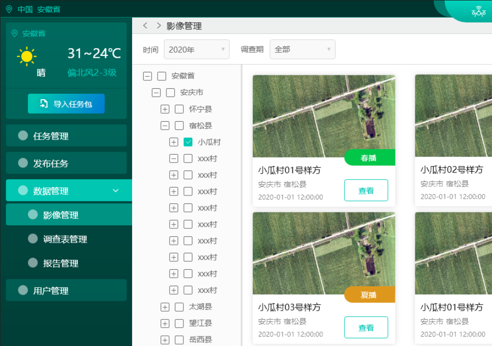
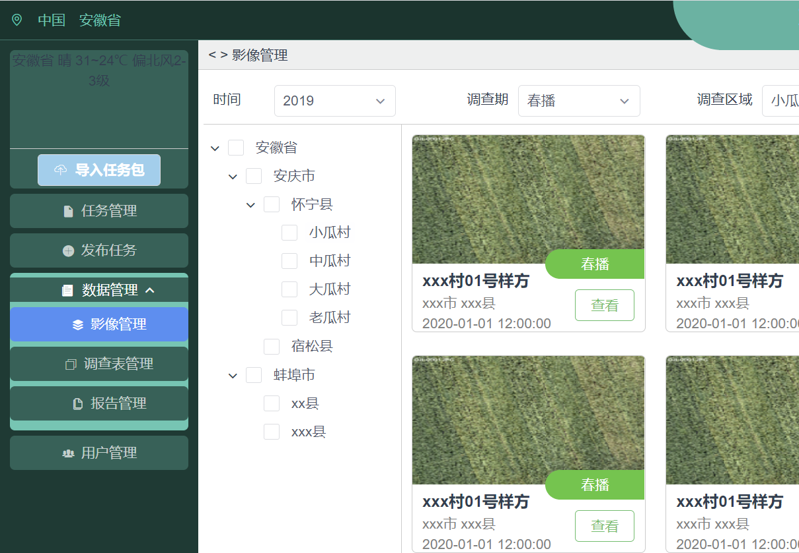
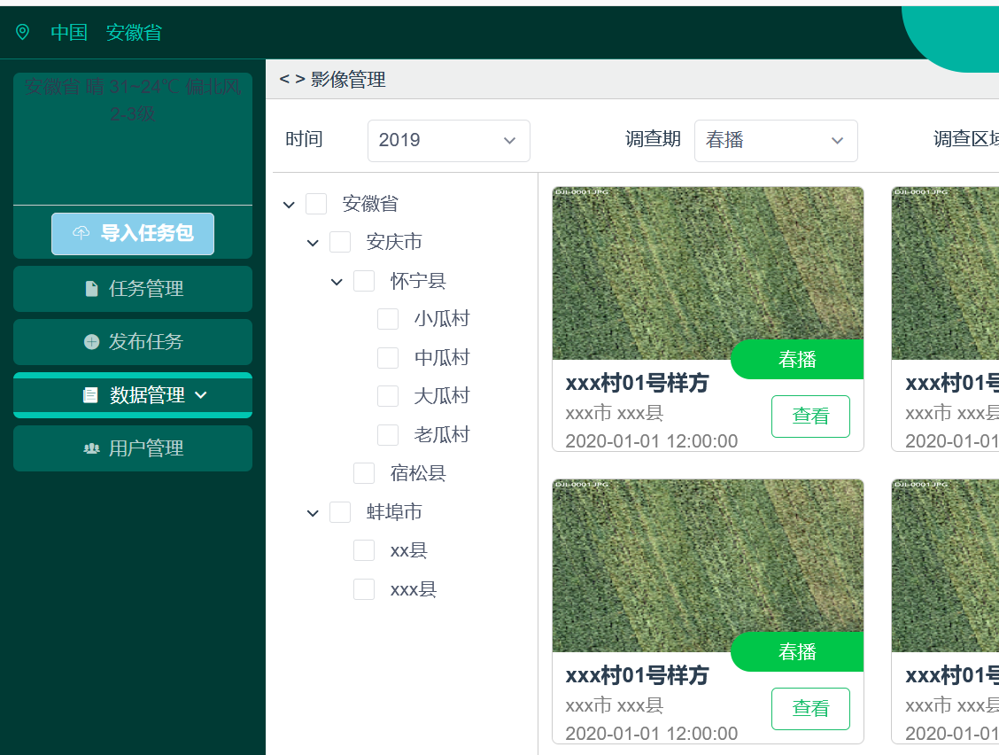
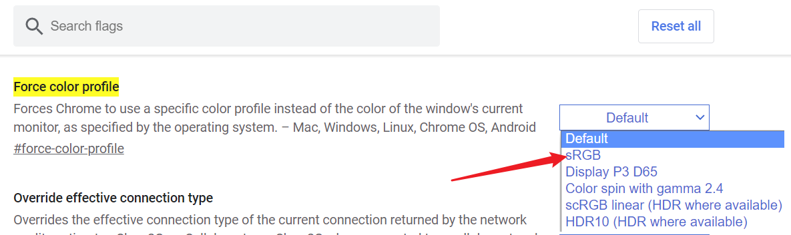

# 浏览器爬坑

### 色差问题
使用 chrome 做开发调试。从 ui 稿吸取色彩，但是在浏览器中的颜色比设计稿淡了不少。

**设计稿**

**chrome 表现**

起初我以为是因为设计稿使用了渐变，我吸取到的是偏淡的部分，就一直没在意。

直到有一次，为了测试兼容性问题，我用火狐打开了开发页面，然后：

原来不是我不对劲！

搜了一下，不止我一个遇到这个问题。v2ex 上早有[讨论](https://www.v2ex.com/t/144561)，而且楼里也有老哥给出了解决方案，顺便还吐槽了一下：

> 今天上午给 x230 加载了原厂的颜色配置文件，结果就发现 chrome 的蓝色被渲染成紫色了
解决方法是 chrome://flags/#force-color-profile，强制改成 sRGB 就好了🌚没想到这么多年了还是有这种情况。。

亲测有效。

操作步骤是在 chrome 地址栏输入 `chrome://flags/#force-color-profile`，对弹出的选项选择 `sRGB`，最后重启浏览器就可以。

