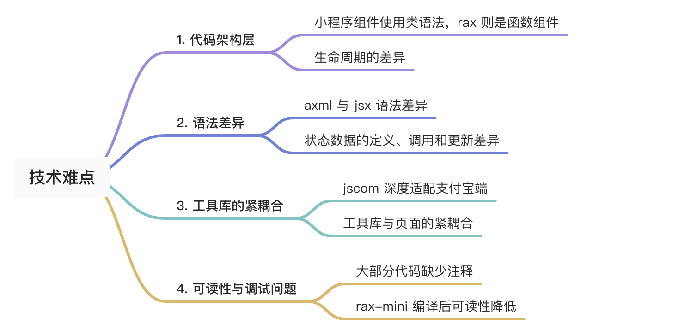
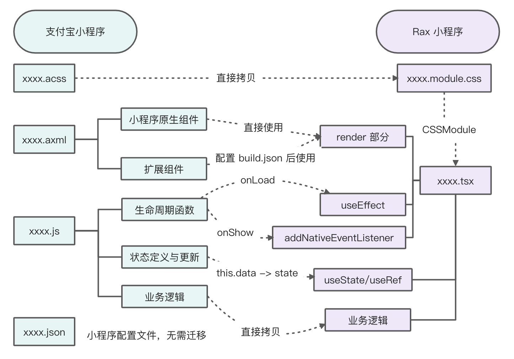
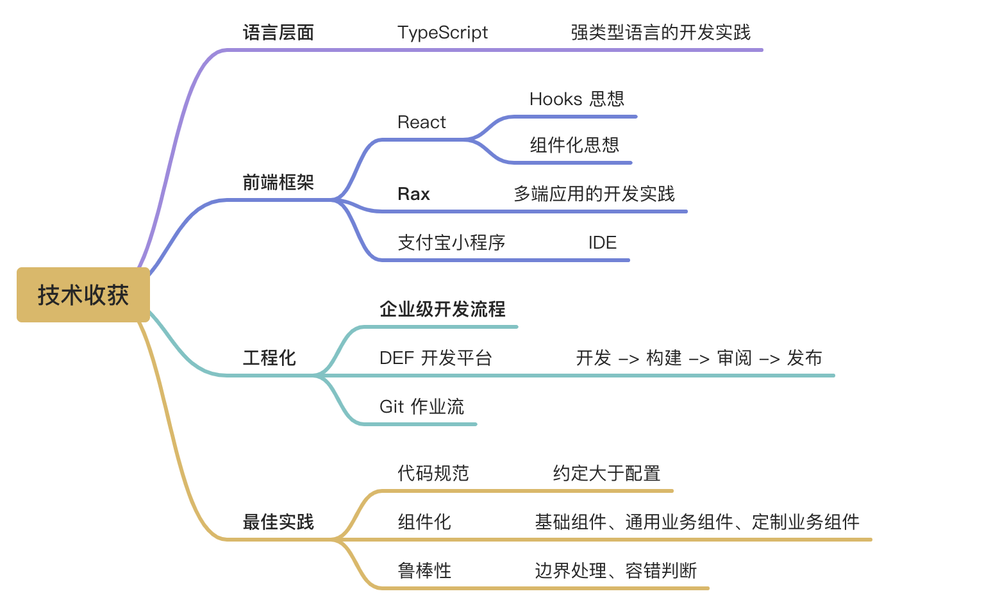
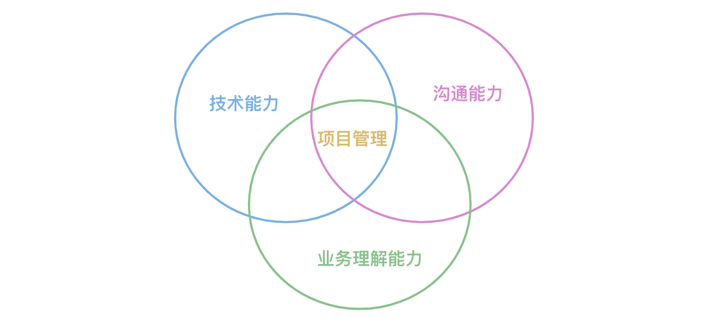

# 实习故事

## 迁移项目
### 遇到的难题

Rax 多端工程已经支持了将 Rax 多端项目转换为能在小程序端运行的代码，同时也支持支付宝小程序的原生组件和扩展组件的调用，支持支付宝小程序 my API，在 Hook 设计中支持小程序生命周期事件的支持。这也是选择将支付宝小程序迁移到 Rax 多端平台的技术可能性。



基于上述技术难点或卡点，在项目伊始，选择小步快跑的方式，通过两三个简单页面的迁移实践，探索出了一个相对全面与可行的技术方案，并形成了 迁移技术方案文档，迁移前后的主要对应关系如下：



尽管上述迁移方案能够解决大部分问题，但是由于两者架构的差异，还是会有些意料之外的 bug。其中我印象最深的是首页状态不更新的问题。当时我所有业务函数、交互结构都已经迁移过来了，但页面表现始终与原小程序不一致。由于涉及到 jscom SDK 库的调用，很难确定问题到底是在前端迁移出了差错，还是 jscom SDK 有兼容性问题，抑或是小程序和 Rax 在架构层面的问题。

这使我花了两三天时间去定位问题，反复对比小程序和 Rax 首页的执行流程，一点点深入到 jscom 内部探究具体实现，Rax 编译后的代码可读性很差，增加了调试的难度。最终发现了状态不更新的原因是意外形成了函数闭包。原来在首页定义了一个依赖当前数据状态的函数，然后将该函数传给了工具库：
```ts
// home.tsx
// 首页定义了一个依赖 state 的函数
const onDeviceData = (data) => {
  // 使用到了首页 useState 定义的 state 状态集
  if (!deviceData.bindDevices[state.curSwiperIndex]) {
    my.setStorageSync({
      key: 'activeIndex',
      data: 0,
    });
    updateState({
      curSwiperIndex: 0,
    });
  }
}

usePageShow(() => {
  // 将该函数传给了工具库
  mobApp.deviceManager.setOnDataHandler((data) => onDeviceData(data));
})

```
工具库把传过来的函数保存了下来，并在其内部维护的数据更新时，自动执行该函数，实现了外部页面对工具库数据的动态监听：

```ts
// jscom/mob/device/DeviceManager.js
class DeviceManager {
  setOnDataHandler(handler) {
    // 把传入的函数保存了起来
    this.onDataHandler = handler
  }
  
  setData(deltaData) {
    let oldData = JSON.parse(JSON.stringify(this.data))
    Object.assign(this.data, deltaData)
    sysUtil.nextTick(() => {
      if (this.onDataHandler) {
        // 当工具库使用 setData 更新 data 时，自动触发传入的函数
        this.onDataHandler(this.data, oldData)
      }
    })
  }
}
```

这样乍一看没什么问题，但实际上传入的 onDeviceData 已经形成了一个闭包，将函数定义时当前帧的 state 作为闭包内的变量一起传入了 DeviceManager。当 DeviceManager 数据更新时，onDeviceData 确实执行的，但它依赖的 state 变量不是 Home 页当前帧的最新状态，导致逻辑异常。

为什么小程序可以正常执行呢？看一下前面的迁移方案：
 
在状态获取时，小程序使用的是 this.data ，迁移后使用的是 state。小程序中 this 的指向不会发生改变，尽管它也被闭包进了 DeviceManager，但 this.data 仍然指向了最新的页面状态。而 Rax 设计上遵循 React 的设计理念，state 是不可变的，每一帧的 state 都是一个全新的变量，导致闭包后就没办法获取到最新状态。

解决方案就是在 Rax 中模拟小程序 this 的行为，为 state 套上一个稳定指向的盒子，恰巧 useRef 就提供了这么个不可变盒子的特性，将原有程序改造如下：

```ts
// home.tsx
// 定义一个不可变盒子
const stateRef = useRef(state);
useEffect(() => {
  // 当 state 变化时，更新 stateRef 盒子的内容指向
  stateRef.current = state;
}, [state])

// 首页定义了一个依赖 state 的函数
const onDeviceData = (data) => {
  // 使用 stateRef.current 替代 state
  if (!deviceData.bindDevices[stateRef.current.curSwiperIndex]) {
    // ...
  }
}
```

### 总结

这次迁移是我相对独立完成的第一个项目， 师兄在给我讲解业务需求、跑通小程序中的登陆鉴权后，就放心大胆地交给我了。期间的迁移方案选择、技术卡点攻克、任务排期与人员分工等完全由我做主，我也在几个关键节点及时与师兄进行了同步，陈述自己的想法和理由，得到了师兄的鼓励和认可。

特别是在解决了 4.5 中提到的卡点问题，增加了自己独立解决问题的信心，更为深入地理解了 Rax 小程序的生命周期和架构理念。

## 服务承接页项目

这个项目不像一键闪修中做一点扫码买单的需求，它是我第一个从零开始的项目，我也因此完整参与了从 prd 评审，到后端技术方案评审，到 UI 稿评审，再到前端技术方案的设计、人员分工与排期，以及现在 coding 的过程。我也从一开始的对于业务不够熟悉，只能局部地理解需求，变到能够对各方工作提出疑问和建议，能够在技术方案选型、分工排期遭到质疑时据理力争，坚持自己的技术判断，通过沟通解决问题。感觉自己的项目管理能力有了一定的提升。

另一点收获就是在实践中感受到了组件化开发的力量，也体会到 TypeScript 强类型语言的强大之处：在抽取公共组件时，通过良好定义的组件 Props 接口，其它页面在复用时能够得到充分的传参提示，从而把大量传参错误扼杀在编码期，减少运行时的调试负担。

## 总体收获

这次实习经历，收获最大的就是提升了自己的技术视野，看到了当下在流行哪些技术，以后有哪些发展方向。除此之外，在语言层面、前端框架方面、工程化实践上都有一些落地的收获。



我认为自己实习阶段一个最大的亮点，就是在提升技术能力，锻炼沟通技巧，理解业务的基础上，做了一点类似项目管理的工作。



随着实习工作的深入，工作量的增加，仅凭个人力量已难以满足业务的进度要求。在我到阿里整整一个月时，师兄跟我谈心交流，提了一个中肯的建议：不要把自己当做实习生，而是要用正式员工的立场要求自己，主动去推进项目，评估风险，寻求资源，承担责任。因此在后期我也敢于承担项目责任，为了更好地完成项目，自己在理解业务的基础上拟定技术方案，与各方沟通确认，积极寻求外包资源，在前端领域扮演项目管理者的角色。
