# 计算机网络概述
> [计算机网络微课堂——B站](https://www.bilibili.com/video/BV1c4411d7jb)
## 1. 概述
简单定义：由一些**通用**、**可编程**的硬件互连而成，这些硬件能够用来**传送不同类型的数据**，并能**支持各种应用**。

并不限于一般计算机，还包括了手机等智能硬件。

### 分类
按覆盖范围分类：

- 广域网 WAN
  - 传统意义上的互联网
- 城域网 MAN
  - 校园网、企业网等
- 局域网 LAN
  - 路由器一般有一个 WAN 口连接广域网，有多个 LAN 口扩展出局域网
- 个域网 PAN

## 2. 网络模型

### OSI 模型
开放式系统互联通信参考模型，一种概念模型，<mark>试图使各种计算机在世界范围内连为网络的标准框架</mark>。将计算机网络体系结构划分为 7 层：
| 层级 | 名称 | 说明|
--- | --- | ---
| 7 | 应用层 | 用户应用程序与网络之间的接口|
| 6 | 表示层 | 协商数据交换格式 相当公司中简报老板、替老板写信的助理|
| 5 | 会话层 | 允许用户使用简单易记的名称建立连接 相当于公司中收寄信、写信封与拆信封的秘书 |
| 4 | 传输层 | 提供终端到终端的可靠连接 相当于公司中跑邮局的送信职员|
| 3 | 网络层 | 使用权数据路由经过大型网络 相当于邮局中的排序工人  |
| 2 | 数据链路层 | 决定访问网络介质的方式 |
| 1 | 物理层 | 将数据转换为可通过物理介质传送的电子信号 相当于邮局中的搬运工人|

该模型是定义良好的`协议规范集`，它定义了层次结构、层次关系、各层可能的任务，以协调进程间通信标准的制定，<mark>没有提供可以实现的方法</mark>。**它不是一个标准，而是制定标准时使用的概念性框架。**

### TCP/IP 模型
---

> [TCP/IP模型的一个简单解释_阮一峰](http://www.ruanyifeng.com/blog/2009/03/tcp-ip_model.html)

`TCP/IP` 模型是一种**现行**的网络模型。

`TCP/IP` 模型不仅指 `TCP` 和 `IP` 两个协议，而是由 `FTP` 、 `SMTP` 、 `TCP` 、 `UDP` 、 `IP` 等协议构成的**协议簇**。所谓“协议”可以理解成机器之间交谈的语言，每一种协议都有自己的目的。

 `TCP/IP` 模型一共包括几百种协议，对互联网上交换信息的各个方面都做了规定。

其四个分层和每层涉及的主要协议如下：

| 层级 | 名称 | 说明 | 相关协议 |
---|---|---|---
| 4 | 应用层 | 为应用进程提供服务，对于不同种类采用不同协议 | SMTP（邮件服务）、HTTP（Web服务）、TELNET（远程登录服务）、FTP（文件传输协议） |
| 3 | 传输层 | 向进程通信提供通用的数据传输服务| TCP、UDP|
| 2 | 网际层 | IP 选址与路由选择  | IP（V4）、IPV6 |
| 1 | 链路层 | 传递有地址的帧、错误检测、传输二进制数据  | ARP/RARP、以太网、ADSL |

### 五层模型
五层模型是出于教学的需要，综合 OSI 模型和 TCP/IP 模型的优点，把计算机网络体系结构划分为五层，各层需要解决的问题如下：

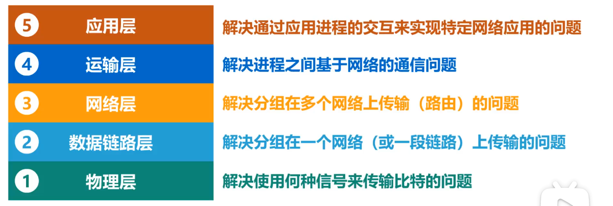

举例说明一次典型请求的网络过程，从浏览器输入网址，到从服务器返回响应的网络全过程，[这一段视频](https://www.bilibili.com/video/BV1c4411d7jb?p=9) 讲得非常清晰生动，动画效果爆炸，墙裂推荐！

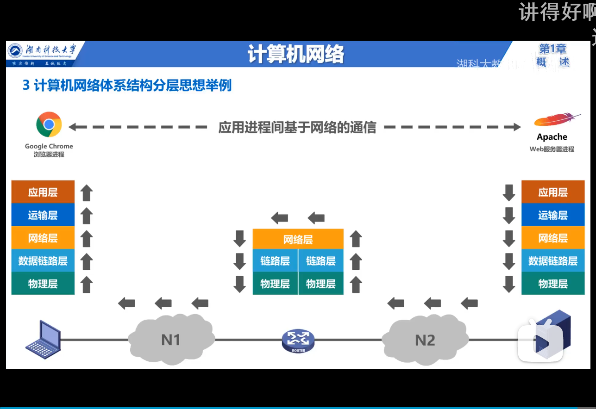

## 3. 基本概念
### 术语概览
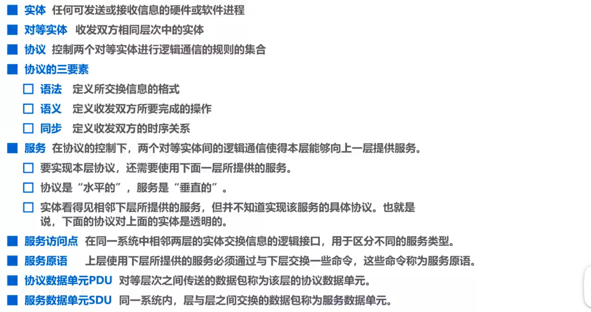

### 实体，服务与协议
三者关系如下图：

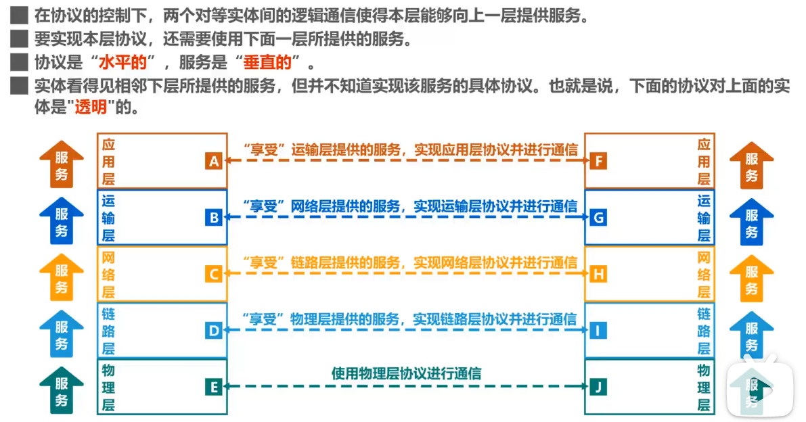

### 协议数据单元
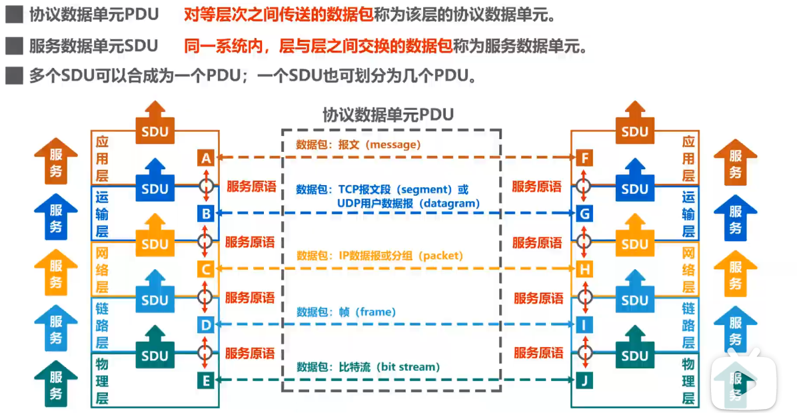

## 4. 性能指标
### 速率
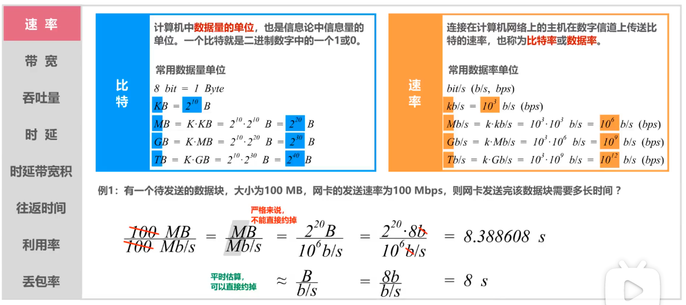

### 带宽
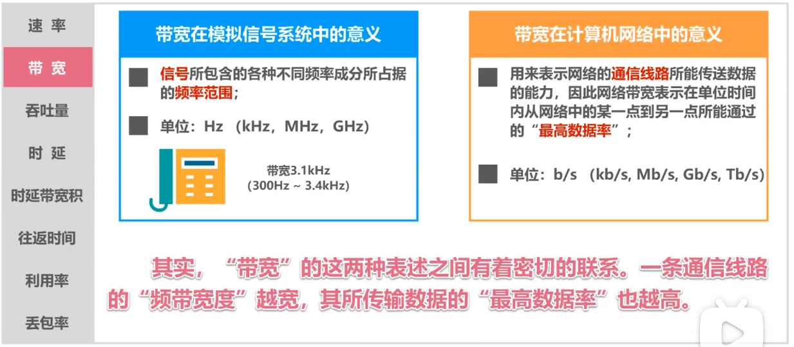

### 吞吐量
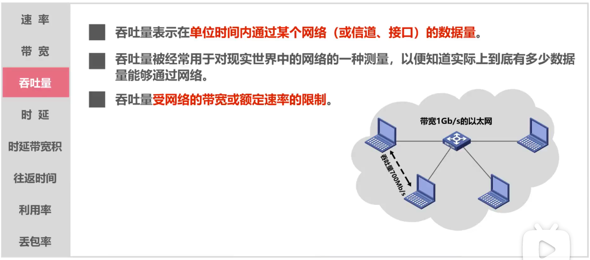

### 时延

对于发送时延和传播时延哪个会占主导地位，需要具体问题具体分析：

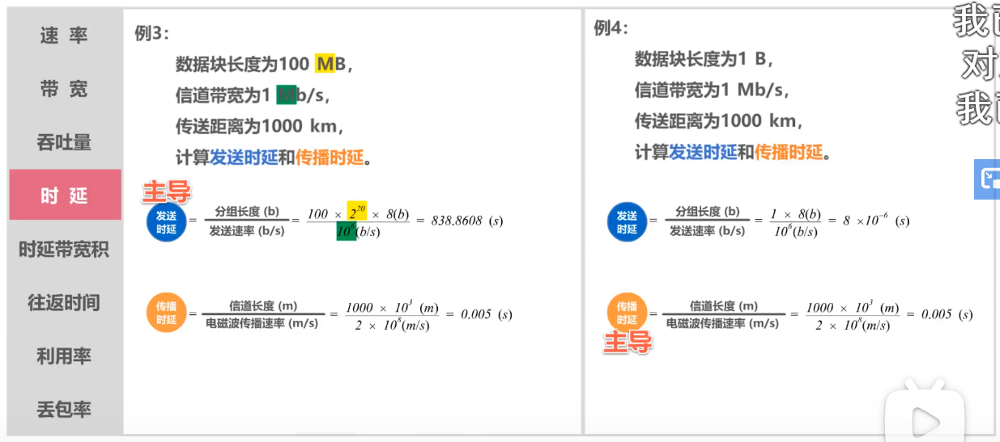

### 时延带宽积
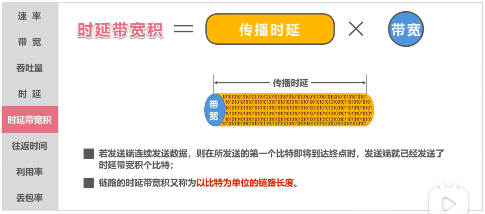

### 往返时间
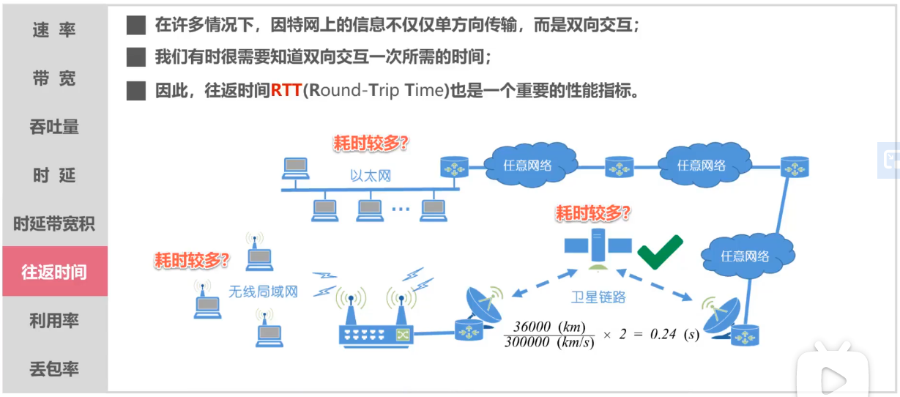

### 利用率
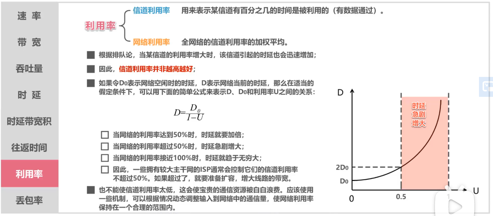

### 丢包率
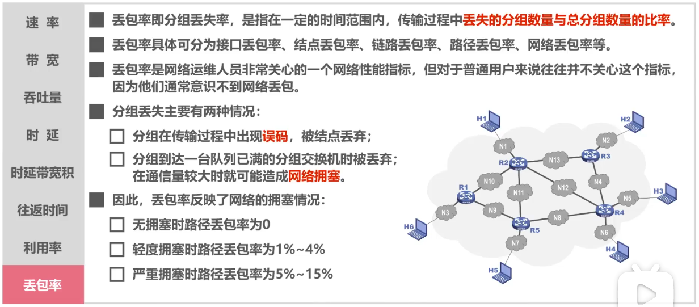
