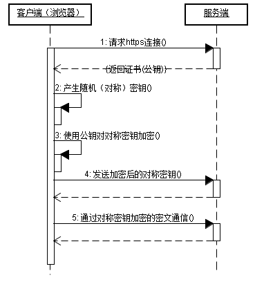

# HTTP 系列

## HTTP/1.1 协议
> [HTTP教程 —— MDN](https://developer.mozilla.org/zh-CN/docs/Web/HTTP)

超文本传输协议是用于**传输超媒体文档**的应用层协议，服务于 Web 浏览器与 Web 服务器之间的通信，遵循经典 `C/S` 架构，客户端打开一个连接以发送请求，然后等待服务器的响应。

HTTP 是一种无状态协议，服务器在两次请求之间不会保留任何数据。

### HTTP 流
> [典型的 HTTP 会话——MDN](https://developer.mozilla.org/zh-CN/docs/Web/HTTP/Session)

客户端想要与服务端进行信息交互时有以下几步：

1. 打开一条 TCP 连接
2. 发送一个 HTTP 报文（Request）
3. 读取返回的 HTTP 报文（Response）
4. 关闭 TCP 连接

HTTP 协议本身并不需要其底层的传输层协议是面向连接的，只需要它是可靠的。由于 TCP 比 UDP 更可靠，所以 HTTP 通常依赖 TCP 进行消息传递（但连接并不是必须的）。

#### 短连接

HTTP/1.0 是最早期的模型，只支持短连接。每一个 HTTP 请求都由它自己独立的连接完成；这意味着发起每一个 HTTP 请求之前都会有一次 TCP 握手，而且是连续不断的。

TCP 协议握手会耗费时间，所以 TCP 本身具备保持更多的热连接来适应负载的能力。**短连接未能充分使用到 TCP 具备的能力**，性能较低。

#### 长连接

从 HTTP/1.1 开始，连接在完成第三阶段后不再关闭，客户端可以再次发起新的请求。这意味着第二步和第三步可以连续进行数次。

一个长连接会保持一段时间，重复用于发送一系列请求，节省了新建 TCP 连接握手的时间，还可以利用 TCP 的性能增强能力。

不过这个连接也不会一直保留着：连接在空闲一段时间后会被关闭(服务器可以使用 Keep-Alive 协议头来指定一个最小的连接保持时间)。

**流水线连接**

默认情况下，HTTP 请求是按顺序发出的。下一个请求只有在当前请求收到应答过后才会被发出。为了提升请求效率，HTTP/1.1 还支持流水线，即在同一条长连接上发出连续的请求，而不用等待应答返回。这样可以避免连接延迟。理论上讲，性能还会因为两个 HTTP 请求有可能被打包到一个 TCP 消息包中而得到提升。就算 HTTP 请求不断的继续，尺寸会增加，但设置 TCP 的 MSS(Maximum Segment Size) 选项，仍然足够包含一系列简单的请求。

> HTTP/1.1引入了流水线（被证明难以实现）和持久连接的概念：底层的TCP连接可以通过 `Connection` (close/keep-alive)头部来被部分控制。HTTP/2则发展得更远，通过在一个连接复用消息的方式来让这个连接始终保持为暖连接。 

### Proxies 代理
在浏览器和服务器之间，有许多计算机和其他设备转发了HTTP消息。由于Web栈层次结构的原因，它们大多都出现在传输层、网络层和物理层上，对于HTTP应用层而言就是透明的，虽然它们可能会对应用层性能有重要影响。还有一部分是表现在应用层上的，被称为代理（Proxies）。代理（Proxies）既可以表现得透明，又可以不透明（“改变请求”会通过它们）。代理主要有如下几种作用：

- 缓存（可以是公开的也可以是私有的，像浏览器的缓存）
- 过滤（像反病毒扫描，家长控制...）
- 负载均衡（让多个服务器服务不同的请求）
- 认证（对不同资源进行权限管理）
- 日志记录（允许存储历史信息）

### 无状态 与 cookie
HTTP是无状态的：在同一个连接中，两个执行成功的请求之间是没有关系的。这就带来了一个问题，用户没有办法在同一个网站中进行连续的交互，比如在一个电商网站里，用户把某个商品加入到购物车，切换一个页面后再次添加了商品，这两次添加商品的请求之间没有关联，浏览器无法知道用户最终选择了哪些商品。而使用HTTP的头部扩展，HTTP Cookies就可以解决这个问题。把Cookies添加到头部中，创建一个会话让每次请求都能共享相同的上下文信息，达成相同的状态。

注意，HTTP本质是无状态的，使用Cookies可以创建有状态的会话。

**Set-Cookie**

设置响应头部，服务器通过该头部告知客户端保存 Cookie 信息。:wink: 😙 

- `<cookie名>=<cookie值>` :(可设置多条)
- Secure : 标记为 Secure 的 Cookie 只应通过被 HTTPS 协议加密过的请求发送给服务端
- HttpOnly ：无法被 JS 脚本访问，此类 Cookie 仅作用于服务器
- SameSite=Strict/None/Lax :允许服务器要求某个 cookie 在跨站请求时不会被发送，从而阻止 CSRF 。

> 一般情况下，可通过 Document.cookie 属性创建和访问 Cookie 。

**Cookie**

现在，对该服务器发起的每一次新请求，浏览器都会将之前保存的Cookie信息通过 Cookie 请求头部再发送给服务器。

> Cookie 生命周期
> 
> - 会话期 Cookie 是最简单的 Cookie：浏览器关闭之后它会被自动删除，也就是说它仅在会话期内有效。会话期Cookie不需要指定过期时间（Expires）或者有效期（Max-Age）。==需要注意的是，有些浏览器提供了会话恢复功能，这种情况下即使关闭了浏览器，会话期Cookie 也会被保留下来，就好像浏览器从来没有关闭一样，这会导致 Cookie 的生命周期无限期延长。==
> - 持久性 Cookie 的生命周期取决于过期时间（Expires）或有效期（Max-Age）指定的一段时间。

> [表情包 emoji](https://emoji.muan.co/#)

### 实现 API
- 原生：XMLHTTPRequest 、 Fetch 。
- 第三方库： axios 、 ajax
- 服务端消息推送： EventSource 

> [利用WebSocket和EventSource实现服务端推送](https://www.jianshu.com/p/958eba34a5da)

### CORS

**Origin**

请求首部字段 Origin 指示了请求来自于哪个站点。该字段仅指示服务器名称，并不包含任何路径信息。该首部用于 CORS 请求或者 POST 请求。

无需手动设置，当开发者使用 XMLHttpRequest 对象发起跨源请求时，它们已经被设置就绪。

**Access-Control-Allow-Origin**

Access-Control-Allow-Origin 响应头指定了该响应的资源是否被允许与给定的origin共享。

- 指定域名或 *

组合使用 Origin 和 Access-Control-Allow-Origin 就能完成简单的访问控制：
- Origin ： http://foo.example
- Access-Control-Allow-Origin : http://foo.example

或

- Access-Control-Allow-Origin ：*

**Access-Control-Allow-Credentials**

- true : 唯一有效值，如果不需要 credentials ，直接忽略该头

Access-Control-Allow-Credentials 响应头表示是否可以将对请求的响应暴露给页面。返回true则可以，其他值均不可以。

Credentials可以是 cookies, authorization headers 或 TLS client certificates。

### HTTP 报文
> [HTTP消息——MDN](https://developer.mozilla.org/zh-CN/docs/Web/HTTP/Messages)

**请求报文**

- | 内容 | 解释
--- | --- | ---
状态头 | 请求方法 | GET/POST/PUT/DELETE
- | 请求路径 | /
- | 版本号 | HTTP/1.1、HTTP/2
请求头 | 可选头部| 可自定义
请求体 | 传递参数 | 请求的传参

常见请求头
- `Host: <host>:<port>`：指明了请求将要发送到的服务器主机名和端口号。

**响应报文**

### 缓存
> [彻底弄懂强缓存与协商缓存——简书](https://www.jianshu.com/p/9c95db596df5)

缓存是一种保存资源副本并在下次请求时直接使用该副本的技术。**当 web 缓存发现请求的资源已经被存储，它会拦截请求，返回该资源的拷贝，而不会去源服务器重新下载。**

缓存的关键主要包括 request method 和目标 URI（**一般只有 GET 请求才会被缓存**）。

#### 缓存场景

- 一个检索请求的成功响应: 状态码 200
- 永久重定向: 响应状态码 301
- 错误响应: 响应状态码 404
- 不完全的响应: 响应状态码 206，只返回局部的信息
- 除了 GET 请求外，如果匹配到作为一个已被定义的 cache 键名的响应 ？？？

#### 协商缓存

缓存分为强缓存和协商缓存。强缓存时浏览器直接从本地缓存中获取数据，不与服务器交互。协商缓存则需要浏览器发送请求到服务器，服务器判断是否可使用本地缓存。

**Cache-control**
- no-store : 没有缓存
- no-cache ：缓存但重新验证
- public ：公共缓存（中间人均可缓存）
- private ：私有缓存（针对单个用户，中间人不得缓存）
- max-age=12312 ：过期时间（相对于请求发起的时间，单位为秒）
- must-revalidate ：校验方式（缓存在考虑使用一个陈旧资源，必须先验证其状态）

在过期时间之前，直接使用缓存资源。过期之后，也不会立即清除，而是先附加一个 `If-None-Match` 头，值为 `ETag` ，判断该资源是否还算新鲜。服务器将客户端请求带过来的 ETag 与当前版本的资源 ETag 进行比较，如何两值匹配，则响应 304 （Not Modified），表示资源副本依旧新鲜。

> 304 响应头也可同时更新缓存文档的过期时间。

**ETag**

ETag HTTP响应头是资源的特定版本的标识符。如果给定URL中的资源更改，则一定要生成新的 Etag 值。 因此 Etags 类似于指纹，比较 Etags 能快速确定此资源是否变化。

ETag 之间的比较使用的是**强比较算法**，即只有在每一个字节都相同的情况下，才可以认为两个文件是相同的。在 ETag 前面添加 W/ 前缀表示可以采用相对宽松的算法。

**If-Match/If-Not-Match**

- `<etag_value>, <etag_value>, …`

请求首部 If-Match 的使用表示这是一个条件请求。在请求方法为 GET 和 HEAD 的情况下，服务器仅在请求的资源满足此首部列出的 ETag 值时才会返回资源。

**Expires**

- `<http-date>`

包含日期时间，在此时间之后（比较 Date 头部，该通用头部包含了报文创建的日期和时间），响应资源过期。

如果 Cache-Control 设置了 max-age 指令，则 Expires 会被忽略。

**Last-Modified**

包含源头服务器认定的资源作出修改的日期及时间。被用作一个验证器判断资源是否彼此一致。

其精度比 ETag 低（只能精确到一秒），是一个备用机制。它可以配合 `If-Modified-Since` 进行缓存验证。

**Vary**

- Vary: `<header-name>, <header-name>, ...`
- 逗号分隔的一系列http头部名称，用于确定缓存是否可用。

当缓存服务器收到一个请求，只有当前的请求和原始（缓存）的请求头跟缓存的响应头里的Vary都匹配，才能使用缓存的响应。

### HTTP 状态码
> [HTTP 响应代码——MDN 文档](https://developer.mozilla.org/zh-CN/docs/Web/HTTP/Status)
客户端的每次请求，服务器都必须予以回应，回应包括`HTTP状态码`和`数据`两部分。 HTTP 状态码是一个三位数，分为五类：

| 分类 | 说明 |
|------|----------------|
| 1xx  | 相关信息       |
| 2xx  | **操作成功**   |
| 3xx  | 重定向         |
| 4xx  | **客户端错误** |
| 5xx  | **服务器错误** |

成功的状态码

状态码 | 说明
--- | ---
200 | 成功，包含网页内容，可缓存
204 | No Content ,客户端请求的资源存在，但是是空的
301 | 永久移动，请求的网页已移动到新的位置，自动将请求者转到新位置
302 | 历史移动，暂时移动到新位置，后续应继续使用当前位置
304 | 内容未修改，不返回内容（可使用缓存）

> [204 与 304 的区别](https://blog.csdn.net/qwqasd123456/article/details/100529483)

> 204: 客户的输入已被接受，但服务端不返回任何内容，用户 UI 不应有变化
> 304: 有主体数据，但客户端已拥有该数据，没必要重复发送（协商缓存）

## HTTPS 协议
> [HTTPS 与 SSL 证书概要——菜鸟教程](https://www.runoob.com/w3cnote/https-ssl-intro.html)

HTTP 协议是明文传输，信息安全无保障。HTTPS 则在 HTTP 与 TCP 之间增加了一层安全协议（SSL）来对信息进行加密。HTTPS 开发的主要目的，是**提供对网络服务器的身份认证**，保护交换数据的隐私与完整性。

HTTPS 在传输数据之前需要客户端（浏览器）与服务端（网站）之间进行一次握手，在握手过程中将确立双方加密传输数据的密码信息。

HTTPS 的两个重要作用：服务器身份认证、传输加密。

### HTTPS 通信步骤

1. 浏览器将自己支持的一套加密规则发送给网站 
2. 网站从中选出一组加密算法与 HASH 算法，并将自己的身份信息以证书的形式发回给浏览器。证书里面包含了网站地址，加密公钥，以及证书的颁发机构等信息
3. 浏览器获得网站证书之后浏览器要做以下工作： 
   1. 验证证书的合法性
      - 颁发证书的机构是否合法
      - 证书中包含的网站地址是否与正在访问的地址一致
   2. 如果证书受信任，或者是用户接受了不受信的证书，浏览器会生成一串随机数的密码，并用证书中提供的公钥加密
   3. 使用约定好的 HASH 算法计算握手消息，并使用生成的随机数对消息进行加密，最后将之前生成的所有信息发送给网站
4. 网站接收浏览器发来的数据之后要做以下的操作
   1. 使用自己的私钥将信息解密取出密码，使用密码解密浏览器发来的握手消息，并验证 HASH 是否与浏览器发来的一致
   2. 使用密码加密一段握手消息，发送给浏览器
5. 浏览器解密并计算握手消息的 HASH
   - 如果与服务端发来的 HASH 一致，握手过程结束
6. 后续的通信数据将由之前浏览器生成的随机密码并利用对称加密算法进行加密

**浏览器与网站互相发送加密的握手消息并验证，目的是为了保证双方都获得了一致的密码，并且可以正常的加密解密数据，为后续真正数据的传输做一次测试。**

### HTTPS 是对称加密与非对称加密搭配使用

由上述步骤可以看出，在验证服务器身份时，使用的是非对称加密：

1. 服务器告知浏览器 `公钥`
2. 浏览器使用 `公钥` 加密信息
3. 服务器使用 `私钥` 解密信息

而在数据传输阶段使用的是对称加密：

1. 浏览器使用服务器 `公钥` 加密并发送 `对称密钥`
2. 服务器使用 `私钥` 解密获取 `对称密钥`
3. 握手完成
4. 浏览器和服务器均使用 `对称密钥` 进行业务信息的传输

**搞这么复杂最主要的原因是：**

1. **安全性**：两边需要使用相同的密钥，需要使用一种安全的方式交换密钥，单纯使用对称加密，无法实现密钥交换
2. **传输效率**：只使用非对称加密是可以满足安全性要求的，但是相同加密级别下，非对称加密的计算耗时高于对称加密的 2-3 个数量级

### 附：SSL 证书
SSL 证书通常由 CA 机构颁发，以**验证网站身份**和加密数据。如果只是个人网站出于**加密传输**的需要，也可以自行制作 SSL 证书，但浏览器会提示「证书不受信任」。

SSL 证书以证书链的形式组织，首先要有根 CA 机构颁发的根证书，再由根 CA 机构颁发一个中级 CA 机构的证书，最后由中级 CA 机构颁发具体的 SSL 证书，这三级证书形成一条证书链。

根证书：

中级证书：

SSL 证书：

浏览器的验证过程也是沿着路径一级级验证。

1. 首先验证根 CA 证书
   - 如果根证书不受信任，其下所有证书都不受信任
   - 根 CA 机构证书在操作系统安装过程中默认安装一些
2. 然后验证中级证书
   - 不同中级机构负责颁发不同类型的证书
3. 最后验证 SSL 证书

## HTTP/2 协议

HTTP 协议第一个主要版本为 1.1 ， 2.0 版本的协议于 2015年5月 发布，被多数浏览器所支持。截至2019年，已有 36% 的网站支持 HTTP/2 。 HTTP/2 保留了 HTTP/1.1 的大部分语义，采用了新的方式进行编码和传输，速度上得到很大提升（查看两种请求的速度差异 [demo](https://http2.akamai.com/demo)）。

HTTP/1.x 报文有一些性能上的缺点：

- Header 不像 body，它不会被压缩。
- 两个报文之间的 header 通常非常相似，但它们仍然在连接中重复传输。
- 无法复用。当在同一个服务器打开几个连接时：TCP 热连接比冷连接更加有效。

HTTP/2在HTTP/1.1有几处基本的不同:

- HTTP/2是二进制协议而不是文本协议。不再可读，也不可无障碍的手动创建，改善的优化技术现在可被实施。
- 这是一个复用协议。并行的请求能在同一个链接中处理，移除了HTTP/1.x中顺序和阻塞的约束。
- 压缩了headers。因为headers在一系列请求中常常是相似的，其移除了重复和传输重复数据的成本。
- 其允许服务器在客户端缓存中填充数据，通过一个叫服务器推送的机制来提前请求。

### 多路复用

多路复用是 HTTP2 最强大的特性 ，能够将多条请求在一条 TCP 连接上同时发出去。

### 缺点

队头阻塞：HTTP2.0协议的多路复用机制解决了HTTP层的队头阻塞问题，但是在 TCP 层仍然存在队头阻塞问题。

因为 TCP 协议在收到数据包之后，这部分数据可能是乱序到达的，但是 TCP 必须将所有数据收集排序整合后给上层使用，如果其中某个包丢失了，就必须等待重传，从而出现某个丢包数据阻塞整个连接的数据使用。

由于 HTTP2 强制使用 TLS，还存在一个 TLS 协议层面的队头阻塞。

## HTTP/3 协议

HTTP/3 弃用了 TCP 协议，而改用基于 UDP 的 [QUIC](/network/3.传输层协议.md#quic-协议) 协议。
