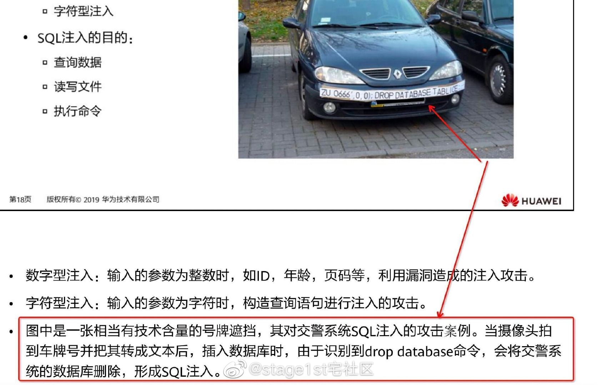

# 网络安全

> [常见的 web 安全漏洞——内网语雀](https://yuque.antfin-inc.com/jinghan/appsecurity/web)
## 1 XSS 攻击
> [前端安全系列（一）：如何防止XSS攻击？——美团技术团队](https://tech.meituan.com/2018/09/27/fe-security.html)

XSS （Cross-Site Scripting 跨站脚本攻击）通常指的是通过利用网页开发时留下的漏洞，通过巧妙的方法**注入恶意指令代码到网页**，使用户加载并执行攻击者恶意制造的网页程序。

### 1.1 原理

XSS 的本质是恶意代码未经过滤，**浏览器无法分辨哪些脚本是可信的，导致恶意脚本被执行**。因为是在终端直接执行，恶意代码能够直接获取用户的信息，并利用这些信息向网站发起恶意请求。

#### 1.1.1 攻击分类

依靠注入方式的区别，可分为以下三类。

- 存储型：攻击者将恶意代码提交到目标网站的数据库中
   - 常见于论坛、商品评论、用户私信等有用户输入的场景
- 反射型：攻击者在正常 url 后拼接恶意代码，通过服务器后反射回页面
   - 常见于网站搜索、跳转等通过 url 传参的场景
- DOM 型：攻击者以某种方式将恶意代码注入 DOM 模型
   - 使用到 innerHTML、eval、document.write 等场景

> [DOM-XSS 攻击原理与防御](https://www.cnblogs.com/mysticbinary/p/12542695.html)
> 
> DOM 型 XSS 攻击中，取出和执行恶意代码由浏览器端完成，属于前端 JavaScript 编写时的安全漏洞，而其他两种 XSS 都属于服务端的安全漏洞。

### 1.2 预防

XSS漏洞的本质是**数据和代码没有分离**，用户输入所有的输入均为数据，但却被作为代码执行了。

XSS 攻击有两大要素：攻击者以某种方式提交恶意代码、浏览器执行。对于明确的输入类型，如数字、URL 、电话号码等，可以进行输入过滤以防止攻击者提交恶意代码。

## 2. CSRF 攻击
> [前端安全系列之二：如何防止CSRF攻击？——美团技术团队](https://segmentfault.com/a/1190000016659945)

CSRF（Cross-site request forgery，跨站请求伪造）：攻击者诱导受害者进入第三方网站，在第三方网站中，向被攻击网站发送跨站请求。利用受害者在被攻击网站已经获取的注册凭证，绕过后台的用户验证，达到冒充用户对被攻击的网站执行某项操作的目的。

### 2.1 原理

CSRF 漏洞的是利用了服务器对用户的信任（请求是来源于可信用户的），CSRF攻击使得授权用户毫无感知的情况下作了某种操作，**攻击目的不是为了获取数据，而是让被害者执行某种操作**。

### 2.2 攻击步骤

1. 受害者登录 `a.com`，并保留了登录凭证（Cookie）。
2. 攻击者<mark>引诱受害者</mark>访问了`b.com`。
3. `b.com` 向 `a.com` 发送了一个请求：`a.com/act=xx`。浏览器会默认携带`a.com`的 `Cookie` 。
4. `a.com`接收到请求后，对请求进行验证，并确认是受害者的凭证，误以为是受害者自己发送的请求。
5. `a.com`以受害者的名义执行了`act=xx`。
6. 攻击完成，攻击者在受害者不知情的情况下，冒充受害者，让`a.com`执行了自己定义的操作。

#### GET 类型
```html

```
在受害者访问含有这个img的页面后，浏览器会自动向 `http://bank.example/withdraw?account=xiaoming&amount=10000&for=hacker` 发出一次HTTP请求。bank.example就会收到包含受害者登录信息的一次跨域请求。

#### POST 类型
```html
 <form action="http://bank.example/withdraw" method=POST>
    <input type="hidden" name="account" value="xiaoming" />
    <input type="hidden" name="amount" value="10000" />
    <input type="hidden" name="for" value="hacker" />
</form>
<script> document.forms[0].submit(); </script> 
```
一种自动提交的表单，访问该页面后，表单会自动提交，相当于模拟用户完成了一次POST操作。

#### 链接类型
```html
<a href="http://test.com/csrf/withdraw.php?amount=1000&for=hacker" taget="_blank">
  重磅消息！！
<a/>
```
需要用户点击链接才会触发。这种类型通常是在论坛中发布的图片中嵌入恶意链接，或者以广告的形式诱导用户中招，攻击者通常会以比较夸张的词语诱骗用户点击。

由于之前用户登录了信任的网站A，并且保存登录状态，只要用户主动访问上面的这个PHP页面，则表示攻击成功。


### 2.3 攻击特点

- 攻击一般发起在第三方网站，而不是被攻击的网站。被攻击的网站无法防止攻击发生。
- 攻击利用受害者在被攻击网站的登录凭证，冒充受害者提交操作；而不是直接窃取数据。
- 整个过程攻击者并不能获取到受害者的登录凭证，仅仅是“冒用”。
- 跨站请求可以用各种方式：图片URL、超链接、CORS、Form提交等等。部分请求方式可以直接嵌入在第三方论坛、文章中，难以进行追踪。

> CSRF **通常是跨域**的，因为外域通常更容易被攻击者掌控。

### 2.4 预防
CSRF漏洞防范的关键是**验证操作是用户主动发起的**，验证方式主要有以下几种：

1. 验证码
   - 提交请求时比如有服务器端下发的验证码，服务器接受到请求后先校验验证码是否正确
2. token
   - 提交请求时下发一个 token，在执行其它提交时，要求携带 token 进行验证
   - 攻击者无法获取该 token


- 当前用户打开其他用户填写的链接时，告知风险
- 对于用户上传的图片，进行转存或者校验。不要直接使用用户填写的图片链接
- 严格管理所有的上传接口，防止任何预期之外的上传内容（例如HTML）

##  3. SQL 注入
> [举世闻名的 SQL 注入是什么？这个漫画告诉你！](https://juejin.cn/post/6936793563854274597)

### 3.1 原理

SQL 注入漏洞是由于用户输入的数据被作为SQL语句执行导致的，其本质和 XSS 漏洞是一样的，**根本原因是数据与代码没有分离**。



SQL 数据库的操作是通过 SQL 语句来执行的，执行代码和数据项都在 SQL 语句之中。这就导致如果我们在数据项中加入了某些 SQL 语句关键字（比如说 SELECT、DROP 等等），这些关键字就很可能在数据库写入或读取数据时得到执行。

### 3.2 预防

- 尽量避免使用常见的数据库名和数据库结构
- 使用正则表达式等字符串过滤手段限制数据项的格式、字符数目

## 4. 业务逻辑漏洞

单个应用的业务逻辑漏洞本身是一种设计缺陷，是由于应用功能设计或者开发阶段考虑的不全面或者假设的某种条件存在明显或者隐含的缺陷而导致的。

多应用之间相互打通调用也会存在业务逻辑漏洞，是由于应用之间没有彻底的了解，导致可能调用错误的接口。

### 4.1 防范
对于单应用，在设计、开发、测试阶段能更多的逆向思维，覆盖到所有的异常流，避免流程控制被绕过，场景限制被打破等情况。

对于多应用，更多是要沟通到位，测试尽可能覆盖全面。

## 5. 文件上传漏洞

有些应用允许用户上传文件。用户可能会上传包含执行代码的恶意文件。

### 5.1 防范
- 控制文件存储路径
- 限制文件类型、大小
- 文件重命名
- 解析文件内容
