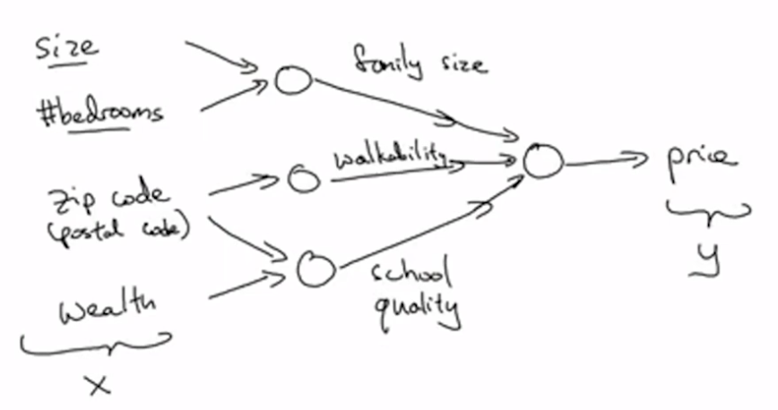
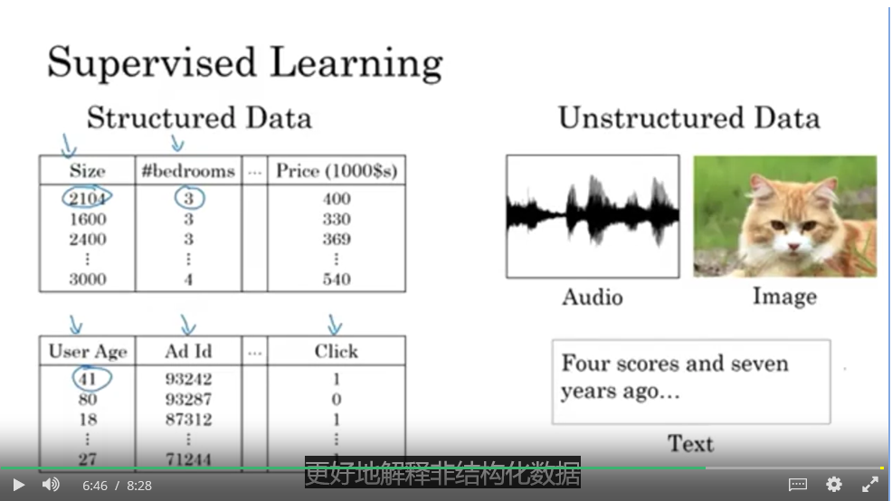
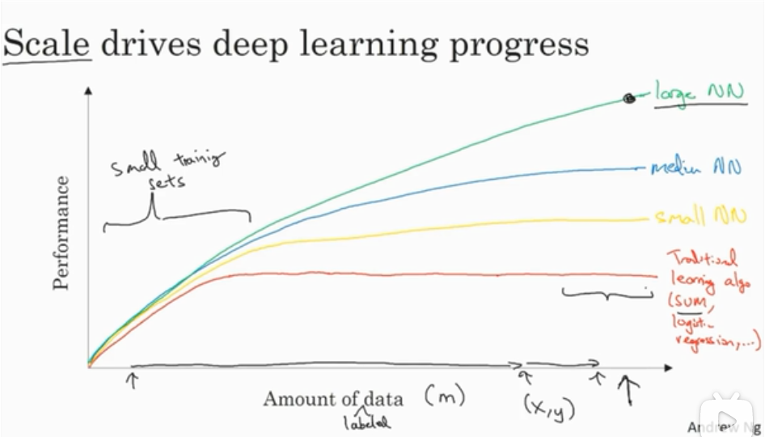
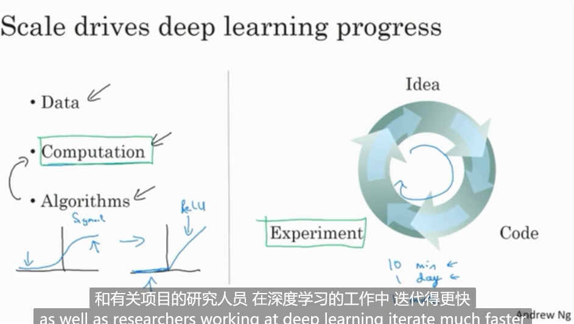

# 介绍深度学习

## 1. 什么是深度学习

深度学习一般是指训练神经网络。

那什么是神经网络呢？

从个人理解上，神经网络就是一个回归分析，输入一堆数据和结果值，拟合出一个回归函数。

### 神经元与神经网络

一个单一的神经元，就是接收一个输入值进行简单运算，得到一个输出值。有点像一个函数。

神经网络就是将这些神经元堆叠起来，成为一个大的系统。

神经网络的神奇之处在于，**当你实现它之后，你要做的只是输入 x，就能得到输出 y，不管训练集有多大，所有中间过程都会自己完成。**

## 2. 监督学习

迄今为止，深度学习大部分有价值的创造都来自于监督学习。

监督学习是训练集的每个 x 都有着对应的 y 来帮助其学习。

许多成功的应用都是在特定问题下，巧妙地建立 x 对应 y 的函数映射关系，通过监督学习拟合数据，成为某个复杂系统的一部分，如自动驾驶的交通工具。

### 结构化数据与非结构化数据

结构化数据是数据库的数据，意味着每个特征都有着清晰的定义。

非结构化数据如图像或文本。

多亏深度学习，现在计算机能够更好地解释非结构化数据：图像识别、自然语言处理……

神经网络在很多短期经济价值的创造是基于结构化数据的，如更好的广告系统、更好的获利建议，或更好地处理公司的海量数据库，并用这些数据去预测未来趋势等。

## 3. 深度学习为什么兴起

神经网络的思想很多年前就被提出来了，为什么最近才飞速发展起来。

### 数据规模

### 计算能力的提升

CPU 到 GPU 的硬件能力提升，有效加快了想法的迭代。

### 算法创新

sigmod 函数到 ReLU 函数的改变，使得梯度下降法的训练更快了。
