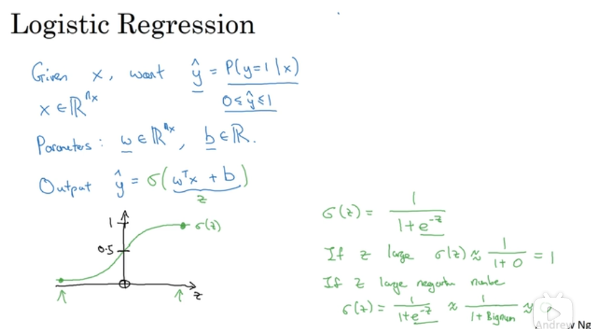
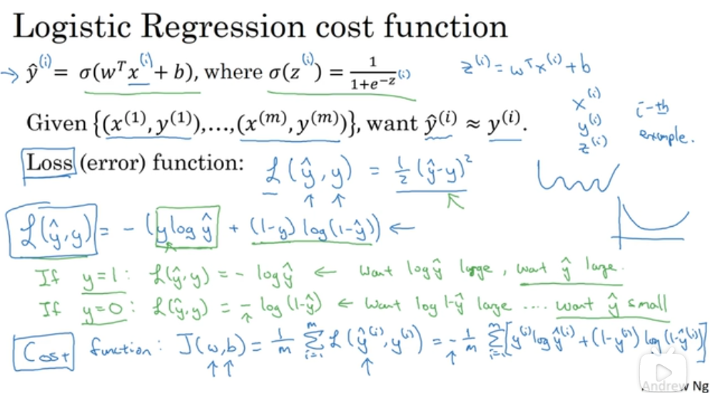
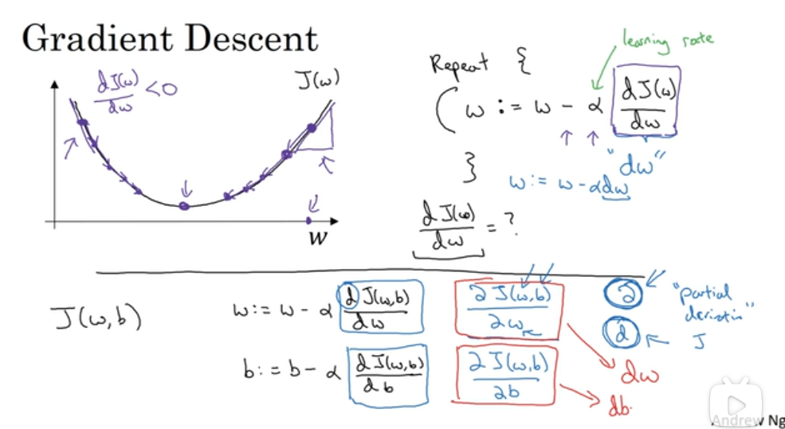
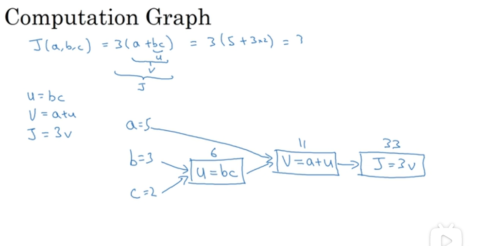
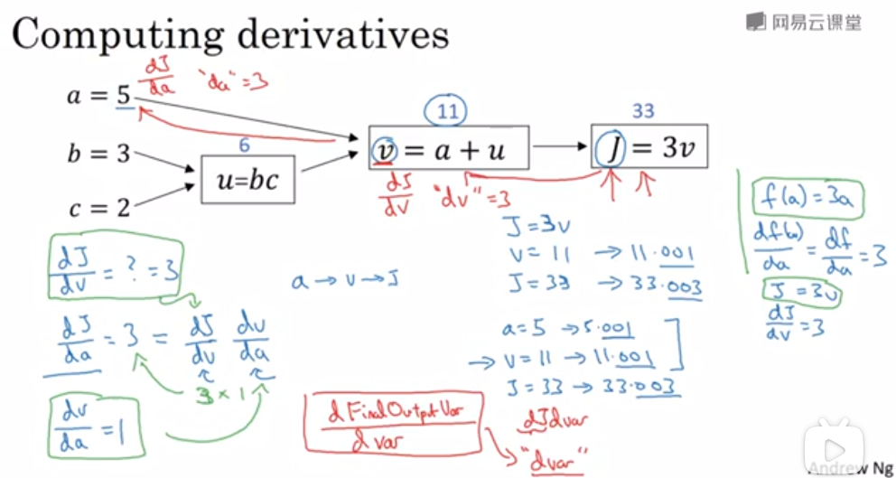
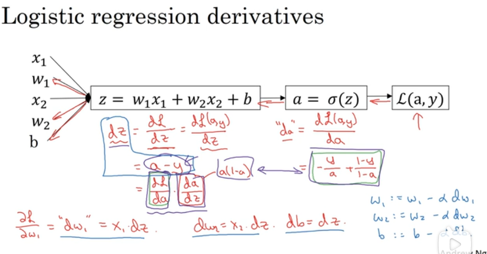
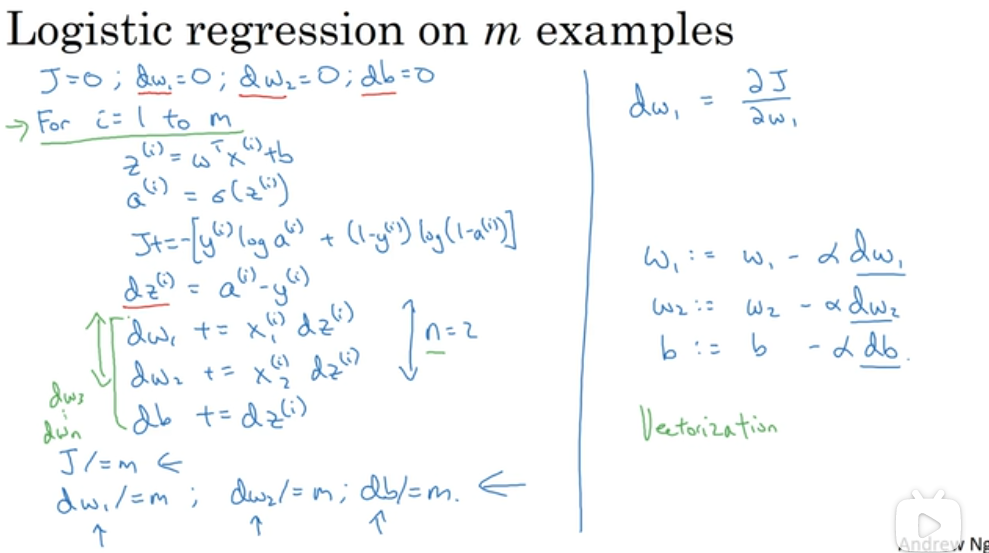

# 逻辑回归

## 1. 二分分类与逻辑回归

> [逻辑回归——知乎](https://zhuanlan.zhihu.com/p/28408516)

逻辑回归（Logistic Regression）是一种用于解决二分类（0 or 1）问题的机器学习方法，用于估计某种事物的可能性。

逻辑回归（Logistic Regression）与线性回归（Linear Regression）都是一种广义线性模型（generalized linear model），与线性回归有很多相同之处。逻辑回归假设因变量 y 服从伯努利分布，而线性回归假设因变量 y 服从高斯分布。

逻辑回归以线性回归为理论支持，通过 Sigmoid 函数引入非线性因素，以处理 0/1 分类问题。 

因此去除 Sigmoid 映射函数的话，逻辑回归算法就是一个线性回归。

## 2. 逻辑回归

在二分分类问题中，目标是训练出一个分类器，以图片的特征向量 x 作为输入，预测输出的结果标签 y 是1 还是 0。

### 逻辑回归中的维度

- $nx$ 表示特征数量，$m$ 表示样本数量
- $(x_i, y_i)$ 表示一个单独的样本
  - $x_i$ 是一个 $(nx, 1)$ 维特征向量
  - $y_i$ 是一个标量，表示 0 或 1
- $W = [w_1, w_2, ..., w_{nx}]^T$ 表示参数 W，维度为 $(nx, 1)$
- b 表示偏置量，为一个实数
- **向量化**
  - $X = [x_1, x_2, x_3, ..., x_m]$ 表示样本矩阵，其维度为 $(nx, m)$
  - $Y = [y_1, y_2, y_3, ..., y_m]$ 表示标签矩阵，维度为 $(1, m)$

## 3. 回归函数

使用线性回归函数可以拟合出特征与结果的映射关系：

$$\hat y_i = W^Tx_i + b$$

由于逻辑回归是处理二分法问题的，其结果应在区间 $[0, 1]$ 之中，所以需要对 $\hat y$ 进行处理：

$$\sigma(z) = {1 \over 1 + e^{-z}}$$

sigmoid 函数图像如下：

## 4. 损失函数与成本函数

### 损失函数

所谓损失，就是预测值与真实值的偏离程度。损失越小，表示学习结果越好。

损失函数定义了回归在单个训练样本上的表现：

$$L(\hat y, y) = -(y{log\hat y} + (1 - y)log(1 - \hat y))$$

### 成本函数

损失函数只定义了回归在**单个训练样本**上的表现，成本函数则衡量了在全体训练样本上的表现，其计算公式为所有训练样本的损失值求平均：

$$J(w, b) = {1 \over m} \sum^m_{i = 1}L(\hat y^{(i)}, y^{(i)}) $$

## 5. 导数与梯度下降

成本函数 $J(w, b)$ 需要是一个凸函数，以便于找到最小值。

$$w := w - \alpha dw$$

### 导数
导数就是斜率。

### 梯度下降法

### 计算图

### 向后传播

### 逻辑回归的梯度下降

单个样本的梯度下降

m 个样本的梯度下降

