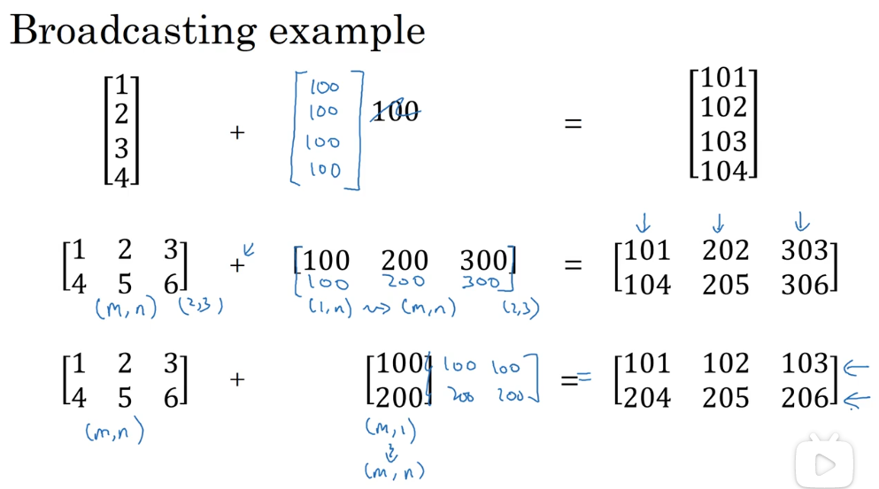

# python 与向量化

## 1. 向量化

借助 `numpy` 等库的内部函数使用向量化，实现了 `SIMD` 并行计算，能够充分利用 `CPU` 和 `GPU` 的能力。

### CPU 与 GPU

还有一种方式也可以更加快速的计算，就是GPU，它可以实现更好的并行操作，从而加快计算速度。（以下部分简单了解即可）

CPU是一个有多种功能的优秀领导者。它的优点在于调度、管理、协调能力强，计算能力则位于其次。而GPU相当于一个接受CPU调度的“拥有大量计算能力”的员工。

当需要对大数据bigdata做同样的事情时，GPU更合适，当需要对同一数据做很多事情时，CPU正好合适。

GPU能做什么？关于图形方面的以及大型矩阵运算，如机器学习算法等方面，GPU就能大显身手。

简而言之，CPU擅长统领全局等复杂操作，GPU擅长对大数据进行简单重复操作。CPU是从事复杂脑力劳动的教援，而GPU是进行大量并行计算的体力劳动者
。

### 代码实现

```python
import numpy as np

a = np.random.rand(1000000)
b = np.random.rand(1000000)

# 使用向量化
c = np.dot(a, b)

# 使用 for 循环
c = 0
for i in range(1000000):
  c += a[i] * b[i]
```

## 2. 逻辑回归中的向量化

### 矩阵运算的相关基础

矩阵乘法：

### 变量的形状定义

- $nx$ 表示特征数量，$m$ 表示样本数量
- $(x_i, y_i)$ 表示一个单独的样本
  - $x_i$ 是一个 $(nx, 1)$ 维特征向量
  - $y_i$ 是一个标量，表示 0 或 1
- $W = [w_1, w_2, ..., w_{nx}]^T$ 表示参数 W，维度为 $(nx, 1)$
- b 表示偏置量，为一个实数
- **向量化**
  - $X = [x_1, x_2, x_3, ..., x_m]$ 表示样本矩阵，其维度为 $(nx, m)$
  - $Y = [y_1, y_2, y_3, ..., y_m]$ 表示标签矩阵，维度为 $(1, m)$

### 前向传播
所谓前向传播，即是通过样本特征和参数值计算预测值。

对于单个样本，计算公式为：

$$\hat y^{(i)} = W^Tx^{(i)} + b$$

为了得到所有训练样本的预测值，势必要使用 `for i in range(m)` 的显式循环。使用向量化可以避免这一循环操作：

$$Z = W^TX + b = np.dot(W.T, X) + b$$

其中，`W.shape = (nx, 1)`，`X.shape = (nx, m)`，`np.dot(W.T, X).shape = (1, m)`，向量与实数相加用到了 numpy 中的向量广播特性，最终得到的 $Z$ 形状为 $(1, m)$。

得到的向量 Z 通过 sigmoid 函数进行激活，得到最终结果：

$$A = \sigma(Z) = {1 \over 1 + e^{-Z}}$$

### 后向传播

后向传播的目的是为了更新参数值。首先计算各参数相对于成本函数的偏导数，然后将其与学习率相乘，最后更新参数：

对于单个样本：

$$dz^{(i)} = a^{(i)} - y^{(i)}$$

对于参数的更新：

$$dw = {1 \over m} \sum^m_{i = 1}x^{(i)}dz^{(i)}$$
$$db = {1 \over m} \sum^m_{i = 1}dz^{(i)}$$
向量化之后：

$$dZ = A - Y$$
$$dW = {1 \over m}X{dZ}^T = {1 \over m}np.dot(X, dZ.T)$$
$$db = {1 \over m}np.sum(dZ)$$

参数更新：

$$W := W - \alpha dW$$
$$b != b - \alpha db$$

### 迭代

通过前向传播加后向传播的方式，我们完成了参数的一次更新，当然学习一次是远远不够用的。为了完成多次学习迭代，还是需要使用显式的 for 循环来实现：

```python
# 初始化 W，b

# 假设学习 3000 次
for i in range(3000):
  # 前向传播
  # 后向传播
  # 更新参数
```

## 向量的广播

广播的原则：

- $(m, n) +-*/ (1, n)  => (m, n)$
- $(m, n) +-*/ (m, 1)  => (m, n)$
- $(m, 1) +-*/ R  => (m, 1)$
- $(m, 1) +-*/ R  => (m, 1)$



### 关于向量维度的一些最佳实践
由于广播机制，python 代码可能出现尽管运行成功，结果却在预期之外的情况。为了避免这些问题，有必要保持一些良好的习惯：

1. 不要使用秩为 1 的向量
2. 经常使用 np.reshape() 来确保向量形状符合需要
3. 使用 assert(a.shape == (5, 1)) 来断言向量形状
