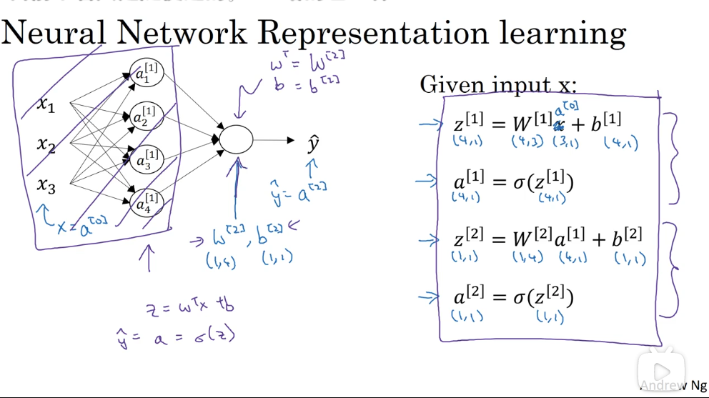

---
---
# 浅层网络

## 1. 神经网络概览

### 1.1 概览

对于单个神经元节点，具有输入、参数、输出。

神经网络是对许多神经元节点的组合，每个节点独立的工作同它们单独执行的工作类似。

为了便于计算参数，会将其向量化，以层为单位，批量计算输出，更新参数集。

### 1.2 神经网络的表示

- 特征输入层：Input Layer
- 输入层与输出层中间的层级：Hidden Layer
  - 隐藏层的含义是，在训练过程中，这些节点计算得到的结果我们是不知道的。
  - 实际上，我们只是通过许多隐藏层叠加计算，得到输出结果，用成本函数反推来更新隐藏层的参数。我们并不关心隐藏层计算的结果。
  - 可能有多个层
- 输出层：Output Layer

激活值表示该层最终传递给下一层的值。

### 1.3 符号约定

- $a^{(n)}$：使用小括号上标，表示样本编号，即第 n 个样本
- $a^{[n]}$：使用中括号上标，表示层数，即第 n 层
- $a_n$：下标数字表示该层的第 n 个节点
- 示例：$a^{(2)[1]}_3$ 表示第 2 个样本第 1 层神经网络中第 3 个节点计算得到的激活值

## 2. 神经网络的计算实现

### 2.1 参数的随机初始化

不能把参数都初始定义为 0，这样会导致同一层的所有隐藏节点计算同样的内容，进行同样的更新，失去了隐藏层多节点的作用。下图是证明：

更好的方式是将其初始化为一个非常小的随机值：

$$W^{[1]} = np.random.randn((2, 2)) * 0.01$$

非常小的原因是，避免其激活值落在非常大或非常小的区间，那里的导数很小，梯度下降法会非常慢，减小了学习速度。

至于偏置数 b，初始可以设为 0。

$$b^{[1]} = np.zeros((2, 1))$$

### 2.2 计算单个训练样本的输出

每个节点的输出计算公式如下：

将其向量化：

向量化之后，不再需要挨个节点计算 w、b，而是直接计算每层的输出：

对于第 m 个样本，其最终的计算公式如下：

$$z^{[1](m)} = W^{[1]}a^{[0](m)} + b^{[1]}$$

$$a^{[1](m)} = \sigma(z^{[1](m)})$$

$$z^{[2](m)} = W^{[2]}a^{[1](m)} + b^{[2]}$$

$$\hat y^{(m)} = a^{[2](m)} = \sigma(z^{[2](m)})$$

其中，$a^{[n]}$ 为第 n 层的激活值，第 0 层是输入层，所以 $a^{[0]}$ 等于输入的训练样本 $x$，而第 2 层为输出层，故 $a^[2]{}$ 等于所求的输出结果 $\hat y$。$W^{[n]}$、$b^{[n]}$ 为第 n 层网络的参数。

这里的向量化实际上是把一层中所有神经节点的参数向量化，由 $w^{[n]}_1, w^{[n]}_2, w^{[n]}_3, ... $ 变为 $W^{[n]}$，简化了单层中的节点计算问题。

### 2.3 多个样本的向量化计算

上面解决了单个样本的结果计算问题，由于训练样本数量巨大，对于样本的循环计算仍旧是个代价很大的过程。

通过将样本集向量化，能够改善这一局面。

其原理性推导如下：

最终得到的计算公式为：

$$Z^{[1]} = W^{[1]}A^{[0]} + b^{[1]}$$

$$A^{[1]} = \sigma(Z^{[1]})$$

$$Z^{[2]} = W^{[2]}A^{[1]} + b^{[2]}$$

$$\hat Y = A^{[2]} = \sigma(Z^{[2]})$$

其中，$A^{[0]} = X$。

与 2.1 中的公式相比，似乎只是换了字母的大小写，实际上这种变化也意味着，每个变量指代的值由单个样本结果转变为多个样本结果，即 $Z^{[n]}[m - 1]$ 就等于第 m 个样本的 $z^{[n](m)}$。

下图对公式（1）的正确性进行了更细致的证明：

### 2.4 反向传播

梯度下降原理：

梯度下降是更新深度学习参数的一种方法，其理论基础是找到参数的成本函数，然后对各参数求偏导，使其朝向成本更小的方向更新，以找出使成本函数尽可能小的参数集。

根据前向传播的公式，得到反向传播的公式，这些公式是通过导数计算推导出来的：

成本函数：

$$J(W^{[1]}, b^{[1]}, W^{[2]}, b^{[2]}) = {{1 \over m} \sum ^m_{i = 1}L(\hat y^{(i)}, y^{(i)})}$$

计算导数：

$$dZ^{[2]} = A^{[2]} - Y$$

$$dW^{[2]} = {\delta J \over \delta W^{[2]} } = {{1 \over m} dZ^{[2]}{A^{[1]}}^T}$$

$$db^{[2]} = {\delta J \over \delta b^{[2]}} = {{1 \over m} {np.sum(dZ^{[2]},axis = 1,keepdims=True)}}$$

$$dZ^{[1]} = {W^{[2]}}^T dZ^{[2]} * {g^{[1]}}^{'}(Z^{[1]})$$

$$dW^{[1]} = {\delta J \over \delta W^{[1]} } = {{1 \over m} dZ^{[1]}{A^{[0]}}^T}$$

$$db^{[1]} = {\delta J \over \delta b^{[1]}} = {{1 \over m} {np.sum(dZ^{[1]},axis = 1,keepdims=True)}}$$

更新参数：

$$W^{[2]} := W^{[2]} - \alpha dW^{[2]}$$

$$b^{[2]} := b^{[2]} - \alpha db^{[2]}$$

$$W^{[1]} := W^{[1]} - \alpha dW^{[1]}$$

$$b^{[1]} := b^{[1]} - \alpha db^{[1]}$$

其中，$\alpha$ 是学习率。

## 3. 关于激活函数

### 3.1 激活函数类型

$$\sigma (z) = {1 \over {1 + e ^ {-z}}}$$

$$tanh(z) = {{e^z - e^{-z}} \over {e^z + e^{-z}}}$$

$$relu(z) = max(0, z)$$

ReLU 函数的一个缺点是当值小于 0 时，斜率为 0。

$$leakRelu(z) = max(0.01z, z)$$

### 3.2 选择激活函数的一些经验法则

- 如果输出值是 0 和 1，$\sigma$ 函数可以作为输出层的激活函数，其它单元用 ReLU

sigma 函数得到的结果介于 0 和 1 之间，而 tanh 函数的结果在 -1 和 1 之间，tanh 函数得到的值的平均分布更靠近 0，有类似数据中心化的效果，这使得下一层的学习更方便一点。所以 tanh 函数几乎在所有场合都比 sigma 函数更为优越。

$sigma$ 函数只能用在二元分类的输出层。

sigma 和 tanh 函数共有的一个缺点是，如果 z 特别大或者特别小，那么激活函数的导数的梯度（亦即该函数的斜率）会变得很小，这会拖慢梯度下降算法。

深度学习的一个特点是，在建立神经网络时经常有很多不同的选择，如隐藏单元数、激活函数、权重的初始化等。很难有一个明确的准则，规定在解决问题时应该如何选择。

### 3.3 为什么激活函数都是非线性的

非线性激活函数的必要性：如果激活函数是线性的，那么多层网络就失去了意义，最终计算出的值只是特征的简单线性关系。

