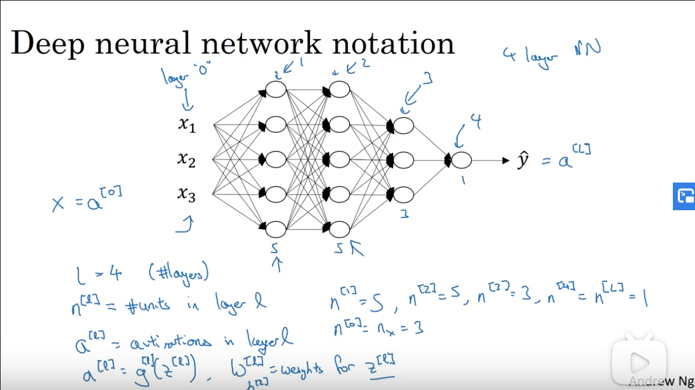
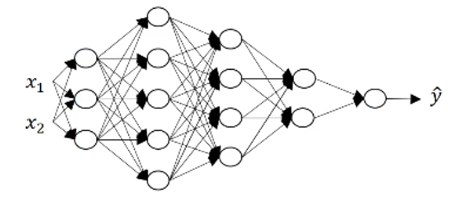
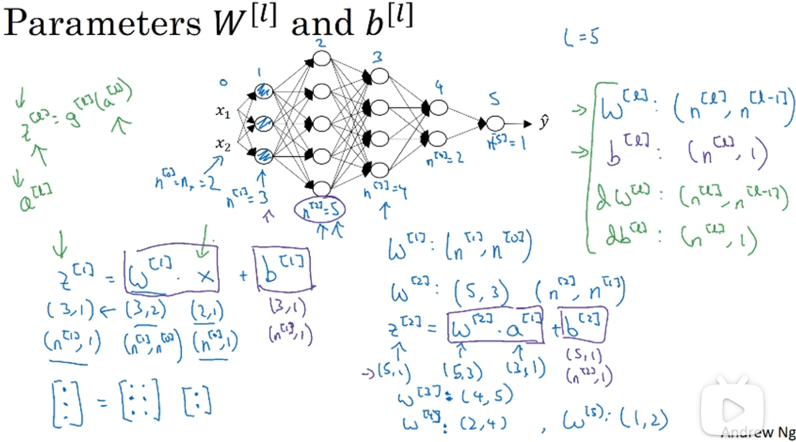
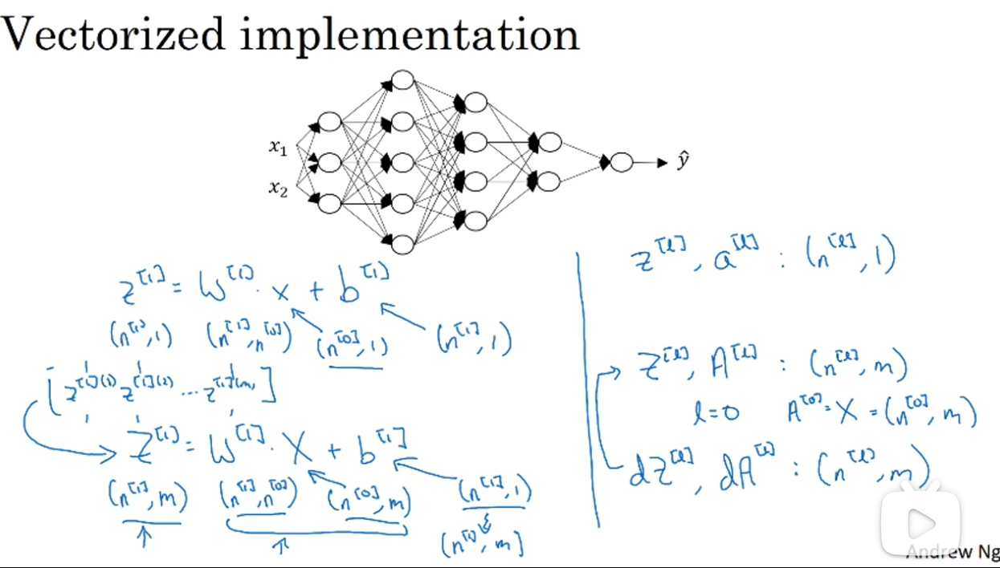
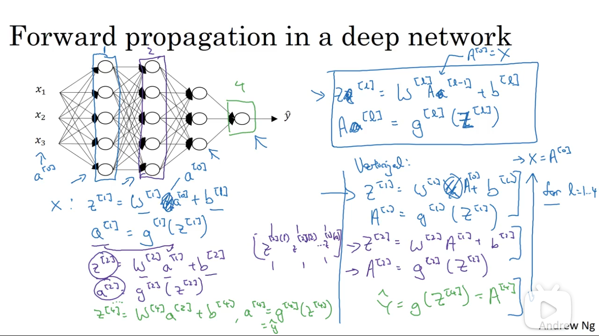
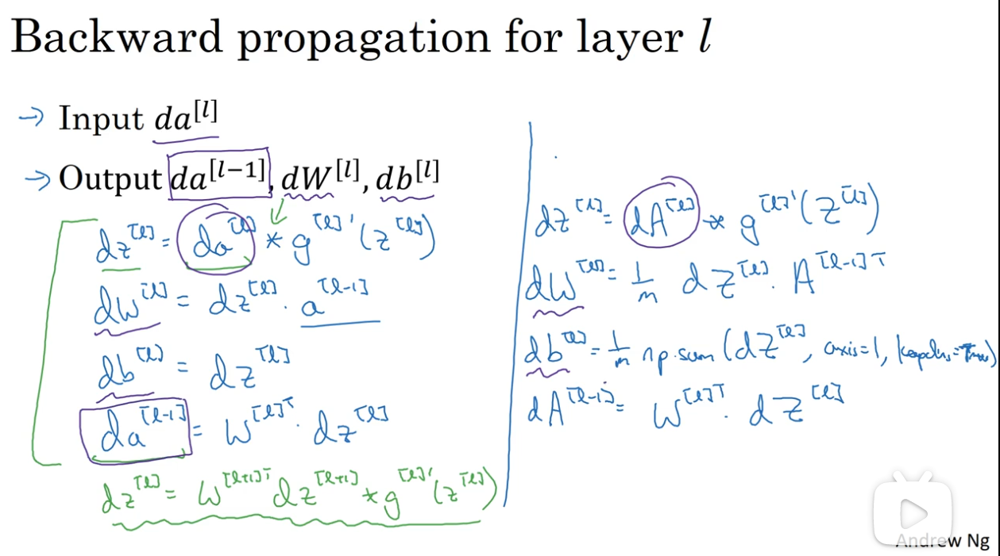
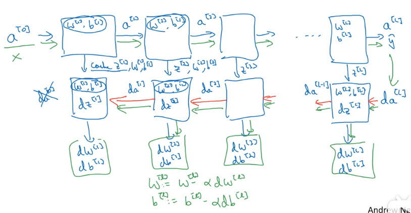
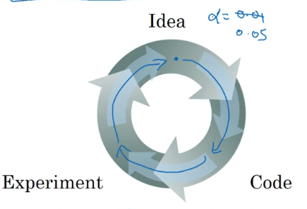
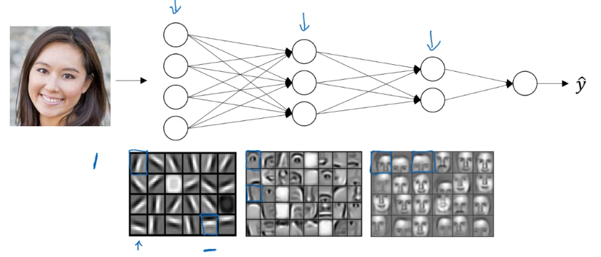

# 深层神经网络

## 1. 概述

### 1.1 符号定义

## 2. 深层网络的计算

### 2.1 核对各层矩阵的维数

一种比较有效减少模型 bug 的方法，就是拿张纸过一遍算法中矩阵的维数。基本方法就是根据当前层所需结果反推参数矩阵的维数。

以 $n^{[L]}$ 表示第 L 层的节点个数。

举例 $z^{[1]} = (n^{[1]}, 1)$，而输入 $A^{[0]} = (2, 1)$，根据计算公式，$W^{[1]}$ 的维度需要等于 $(3, 2)$ 才能保证 $z^{[1]}$ 的维度准确。

归纳可得，$W^{[L]}$ 的维度等于 $(n^{[L]}, n^{[L - 1s]})$，$b^{[L]}$ 的维度等于 $(n^{[L]}, 1)$。

且 dW 的维度同 W，db 的维度同 b。

对于多个样本，向量化之后，$Z^{[L]}$ 的维度变为 $(n^{[L]}, m)$，其中 $m$ 为样本个数。而 $dZ$、$dA$ 与其相同。

### 2.2 前向传播

对于正向传播，其输入输出如下：

- Input: $A^{[L - 1]}$
- Output: $A^{[L]}$
- cache: $Z^{[L]}$ （将中间结果缓存下来，以便反向传播时使用）

按照顺序，先计算前一层，然后再计算下一层。这里可以（大概也只能）使用显式的 for 循环。

### 2.3 反向传播

其输入输出如下：

- Input: $dA^{[L]}$
- Output: $dA^{[L - 1]}, dW^{[L]}, db^{[L]}$

传播公式如下：

### 2.4 一次学习迭代的完整流程

一次完整的学习迭代是对数据集进行一次正向传播与反向传播，更新一次模型参数。其中所需的计算如下：

## 3. 深度学习中的参数与超参数

### 3.1 超参

深度学习模型中，除了训练所需的参数 W,b ，还有一些参数也需要输入模型之中：

- learning rate: 
- iterations
- hidden layers
- hidden units
- choice of activation function

这些数据被称为超参数，因为这些数据如何设置，最终决定了参数 W 和 b 的学习结果。

### 3.2 超参的设置

当你自己着手于训练自己的深度神经网络时，你可能发现超参的选择上有很多可能性，所以你需要多做尝试。

今天的深度学习应用领域还是很经验性的过程。通常你有一个想法，比如可能大概知道一个较好的学习率是 0.01，然后你尝试一下。然后基于尝试的结果发现学习率的调整方向。

## 3. 为什么需要深层网络

其实深度学习的网络并不需要很大（即节点数不需要特别多），但是其中隐藏层最好多一些。

### 3.1 深层网络在构建什么

直觉上，可以把其浅层看作是探测一些低层级的简单特征，之后把它们在深层结合起来，以学习更复杂的特征，类似下面这种：

浅层可能学习一些图像的基本特征，如边缘。渐渐地组合出人脸的局部特征，如眼睛、鼻子等，进而识别出整张人脸。

### 3.2 用电路理论来解释深层网络存在的意义

如果不扩展深度，而是增加单个层级的神经节点，那么最终会使得节点数成指数级增加。

## 4. 大佬的只言片语

**我必须要说，即使到现在我在实现一个算法的时候，有时候我也会惊讶怎么莫名其妙就成功了。那是因为机器学习里的复杂性是来源于数据，而不是那一行行代码。**

所以有时候你会感觉，你实现了几行代码，但是不太确定它具体做了什么，但是奇迹般地成功了。那其实是因为真正神奇的不是你写的程序，通常情况下你的代码段不会很长，虽然也不太简单，但至少不需要一万行代码。但有时当你喂入超多数据之后，就算我已经搞了好多年机器学习，有时还是会在算法管用的时候惊讶一下下。因为实际上你的算法的复杂性来源于数据，而不是你写的代码。

**神经网络与大脑毫无关系。**
