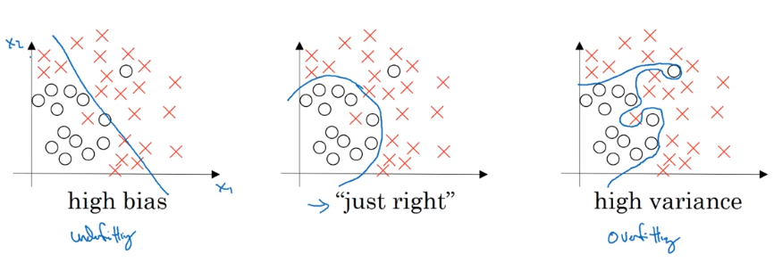
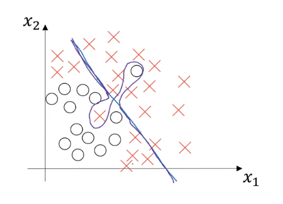
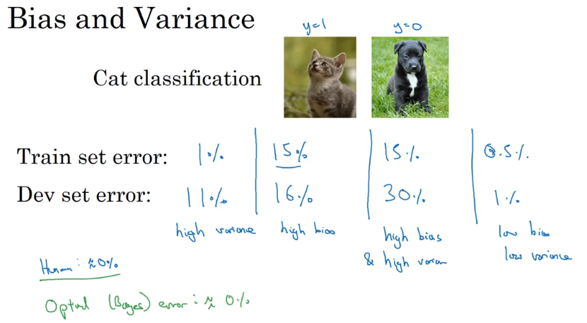
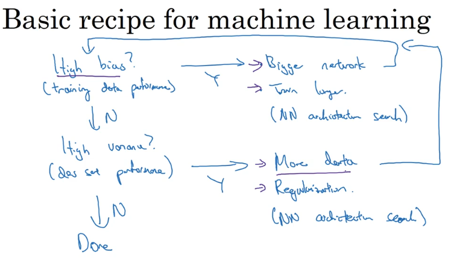

# 设置你的机器学习应用

## 1. 训练集的设置

创建高质量的训练数据集、验证集和测试集，有助于提高循环效率。

### 1.1 数据分类

一堆数据拿过来，通常将其分为三个部分：训练集、验证集、测试集。

在训练集上进行模型参数学习，通过验证集对模型的超参进行调整，最后在测试集上评估模型的性能。

这里简单说了下三部分数据的作用，更详细的介绍可见这篇[博客](https://machinelearningmastery.com/difference-test-validation-datasets/)。

### 1.2 如何分配数据

几年前的数据量可能只有几百到几万条数据，其最佳实践是：

- 如果没有设置验证集，可以采用三七分的原则，70% 作为训练集，30% 作为测试集。
- 如果有验证集，可以采用 60% 训练集、20% 验证集、20% 测试集的分法。

但是在大数据时代，数据量可能达百万级。为了提高模型的训练速度和评估速度，通常不需要给验证集和测试集那么大的数据量，更可能的分法是：

- 99 万训练集、1 万验证集、1 万测试集
- 99.5% 训练集、0.4% 验证集、0.1% 测试集

> 如果不需要无偏评估的话，可以不设置测试集。

### 1.3 数据分布问题

很多情况下，训练集与测试集来自不同的数据分布。最佳实践是保证验证集与测试集为同一分布。

## 2. 偏差与方差

易学难精的两个概念。

### 2.1 高偏差与高方差的简单可视化

偏差大表示样本数据拟合不够，方差大表示过拟合？

一个高方差且高偏差的例子是它在大部分时候没有拟合数据，而在有些部分又过拟合：

即模型的有些区域方差高，有些区域偏差高。

### 2.2 训练集误差与验证集误差

可以通过训练集误差和验证集误差来分析模型的偏差和方差情况：

如上图示，其首先假设问题的最优误差接近 0%，对于不同训练模型的误差表现，即可判断模型的偏差与方差：

误差 | 模型一 | 模型二 | 模型三 | 模型四
---|---|---|---|---
训练集误差 | 1% | 15% | 15% | 0.5%
验证集误差 | 11% | 16% | 30% | 1%
**评估** | 高方差 | 高偏差 | 高方差且高偏差 | 低方差且低偏差

## 3. 机器学习基础

### 3.1 拟合数据

拟合数据是机器学习的最低目标，你的模型至少要能拟合训练数据吧。实在不行过拟合也凑合啦。

### 3.2 根据偏差情况进行模型优化

