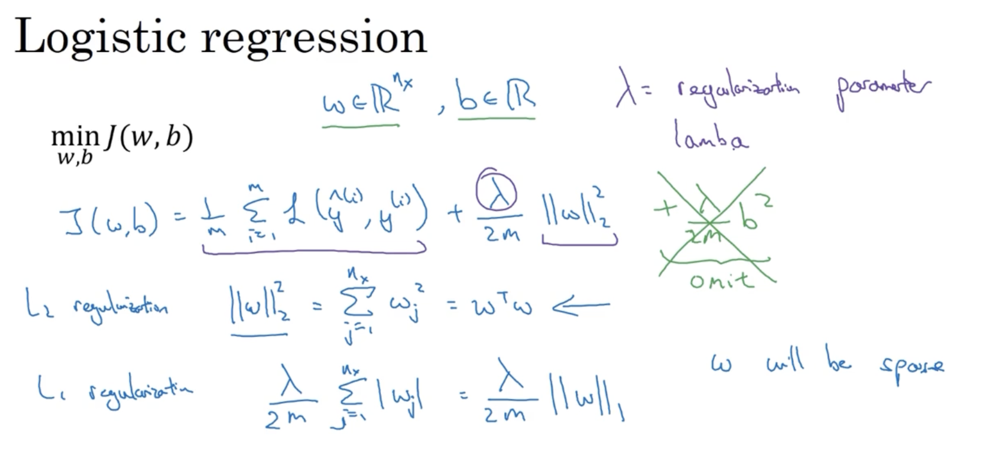
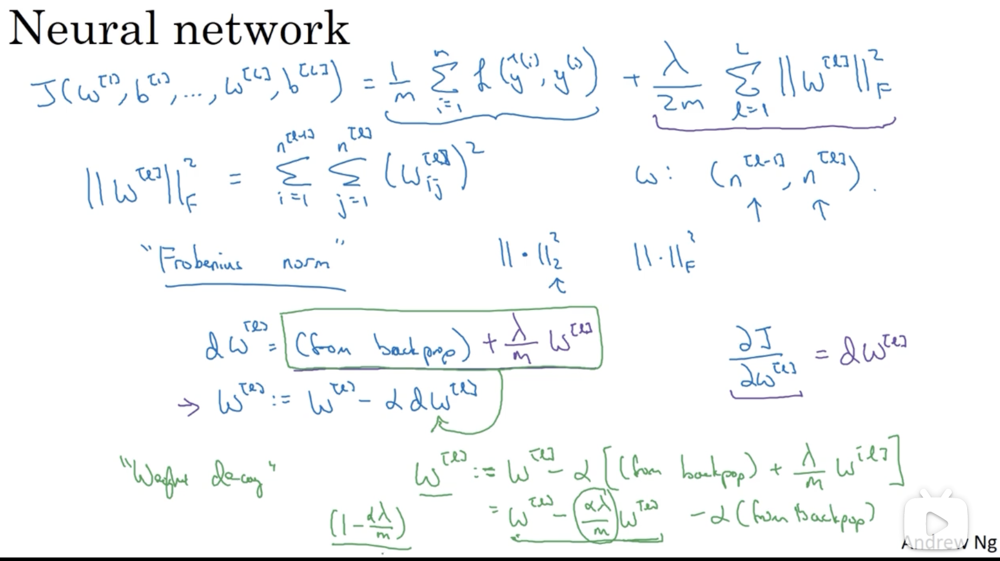
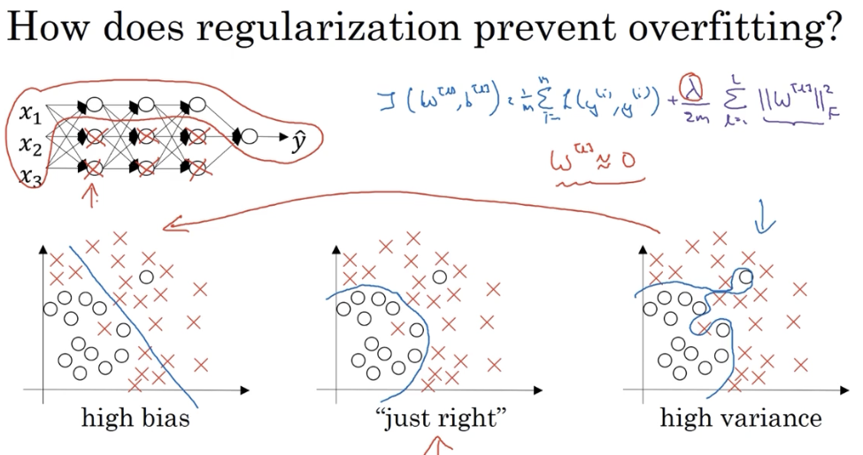
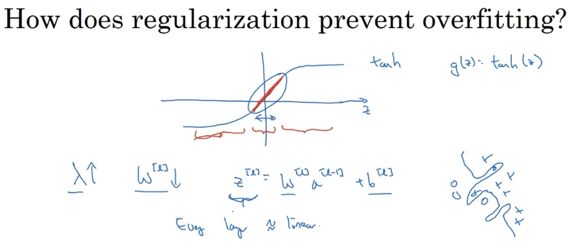
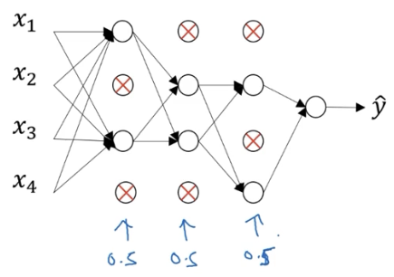
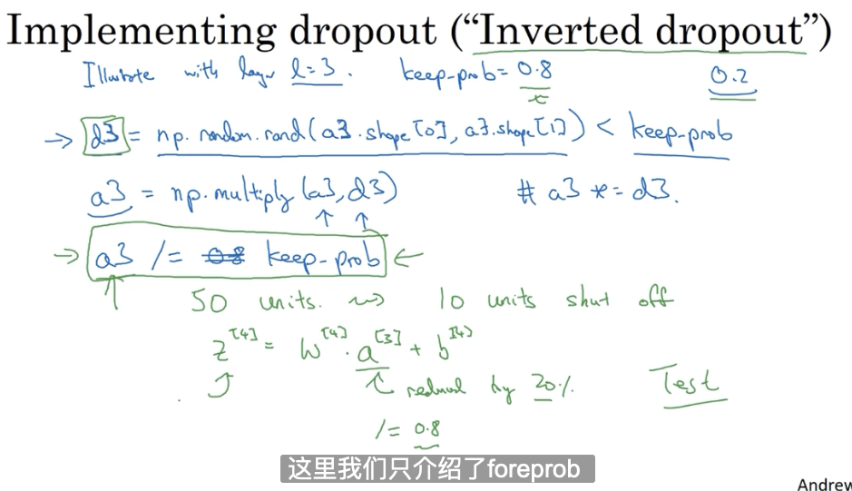
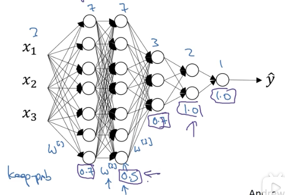
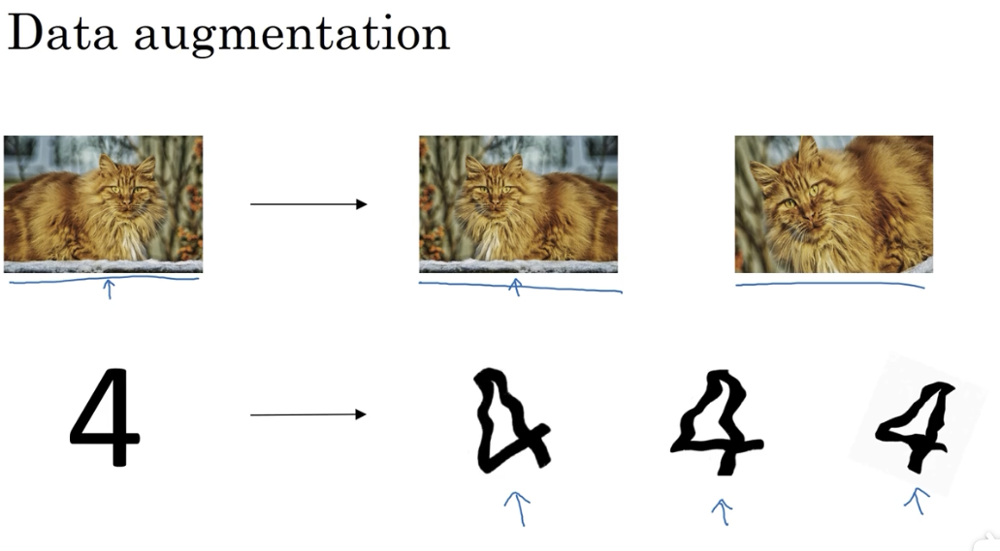
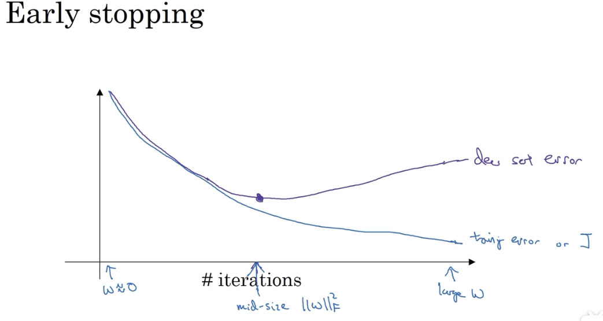

# 正则化

如果怀疑网络过拟合了数据，即存在高方差的情况，其中一个解决办法就是正则化。

当然，另一个方式就是准备更多数据，也很有用。
## 1. 什么是正则化

正则化在成本函数中添加了一个与 W 有关的项和超参。

### 逻辑回归中的正则化

$$J(W, b) = {1 \over m} \sum^m_{i = 1}L(\hat y^{(i)}, y^{(i)}) + {\lambda \over {2m}}||W||^2_2$$

其中，${\lambda \over {2m}}||W||^2_2$ 即为 L2 范数，其定义为：

$${\lambda \over {2m}}||W||^2_2 = \sum ^{n_x}_{j = 1}W^2_j = W^TW$$

### 神经网络中的正则化

正向传播的成本函数公式为：

$$J(W^{[1]}, b^{[1]}, ..., W^{[L]}, b^{[L]}) = {1 \over m}\sum ^m_{i = 1}L(\hat y^{(i)}, y^{(i)}) + {\lambda \over {2m}} \sum ^L_{l = 1}||W^{[l]}||^2_F$$

其中，${\lambda \over {2m}} \sum ^L_{l = 1}||W^{[l]}||^2_F$ 类似逻辑回归中的 L2 范数，这里被称为弗罗贝尼乌斯范数（Frobenius norm），其含义表示为 $W^{[L]}$ 中所有项的平方和：

$${\lambda \over {2m}} \sum ^L_{l = 1}||W^{[l]}||^2_F = \sum ^{n^{[L]}}_{i = 1} \sum ^{n^{[L - 1]}}_{j = 1}(W^{[L]}_{ij})^2$$

$W^{[L]}$ 的维度为 $(n^{[L]}, n^{[L - 1]})$。

### 使用该范数实现梯度下降

正则化对于模型的影响，就在于其参与了反向传播的过程，对参数的更新产生了作用：

$$dW^{[L]} = (origin backprop) + {\lambda \over m} W^{[L]}$$

$$W^{[L]} := W^{[L]} - \alpha dW^{[L]} = (1 - {\alpha \lambda \over m})W^{[L]} - \alpha (origin backprop)$$

它与未正则化的模型相比，在于更新 $W^{[L]}$ 的时候，为原 $W^{[L]}$ 添加了一个小于 1 的系数（该系数包含 $\alpha, \lambda$ 两个超参），使得 $W^{[L]}$ 梯度的下降更快了，因此该方法又被称为 **weight decay** 。

## 2. 为什么正则化可以预防过拟合

### 2.1 例证 1

假设未添加正则式之前，模型处于过拟合的状态。在添加正则式之后，如果 $\lambda$ 值足够大，会使得 $W^{[L]}$ 趋近于 0。当寻找到一个合适的 $\lambda$ 值时，就使模型避免了过拟合的情况。 

直观理解就是正则化使得隐藏层中的许多节点不起作用，变成一个相对简单的模型。节点并未消失，只是没起到作用。

### 2.2 例证 2

根据正则化后的成本函数，当 $\lambda$ 变大时，$W^{[L]}$ 变小，使得 $Z^{[L]}$ 值也变小。

根据激活函数的设计，当 $Z^{[L]}$ 值一直处于比较小的区间时，激活函数更接近于线性函数。而当神经网络的每一层都是线性回归时，事实上其整体计算的也是线性回归，无法执行很复杂的预测（自然也就不可能有过拟合的效果）。

## 3. Dropout 正则（随机失活）

### 3.1 思想

Dropout 模型通过在训练时随机删除网络中的神经单元，实现模型的正则化。

对于一个样本的一次训练过程，dropout 会遍历网络的每一层，并设置消除神经网络中节点的概率。得到需要删除的隐藏层节点，然后删掉从该节点进出的连线，最终得到一个节点更少、规模更小的网络。然后使用该样本对网络进行一次训练。

对于其他样本，同样以概率消除节点的方式进行模型精简并训练。

### 3.3 实现

实现 Dropout 正则化有很多方式，这里采用 Inverted dropout 方法实现。

在 foreprop 阶段：

**在测试阶段，不使用 Dropout，因为我们不希望测试阶段得到的预测结果是随机的。**

### 3.3 理解

一个直观理解是，每次 Dropout 都会使神经网络变成一个更小的网络，因此能够避免过拟合。

通过 Dropout 的训练，神经单元不能依赖任何一个特征或神经单元，因为对方有可能被随机清除，即该神经单元的输入是不稳定的。因此，它不会给任一输入加上过分的权重。

每个神经单元都这样做，权重传播下去，使得 Dropout 产生收缩权重的平方范数的效果。

### 3.4 与 L2 范数的比较

Dropout 正则化实现了类似 L2 正则化的效果，甚至比它的应用范围还要更广。

Dropout 可以为不同隐藏层设置不同的 `keep_prob` 系数：

当值为 1 时，表示对该层节点不做随机删除。

使用 Dropout 的一个缺点是，损失函数不再有很明确的定义，对于模型的调试成为问题。最佳实践是先把所有的 `keep_prob` 设为 1 以关闭 Dropout，跑一遍模型，以确保损失函数是单调递减的。然后再打开 Dropout 进行训练。

## 4. 其他正则化方法

### 4.1 Data augmentation（增加数据）

- 镜像图片
- 随机翻转并裁减

### 4.2 Early stopping

提前终止的一个缺点在于，它虽然避免了过拟合，但它的提前终止也放弃了进一步优化损失函数的可能性。

## 附

深度学习的几个步骤：

- 选择一个算法来优化损失函数
  - 梯度下降
  - Momentum
  - RMSprop
  - Adam
- 避免过拟合
  - 正则化（会增加超参的选择成本）
  - 扩增数据