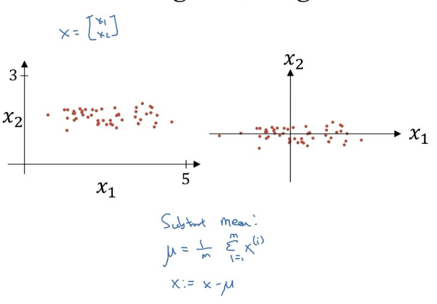
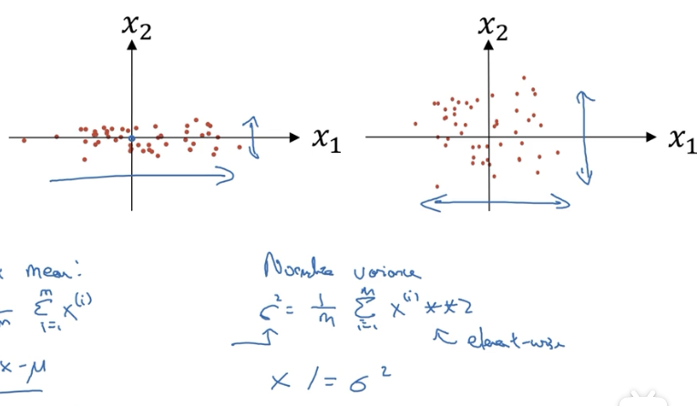
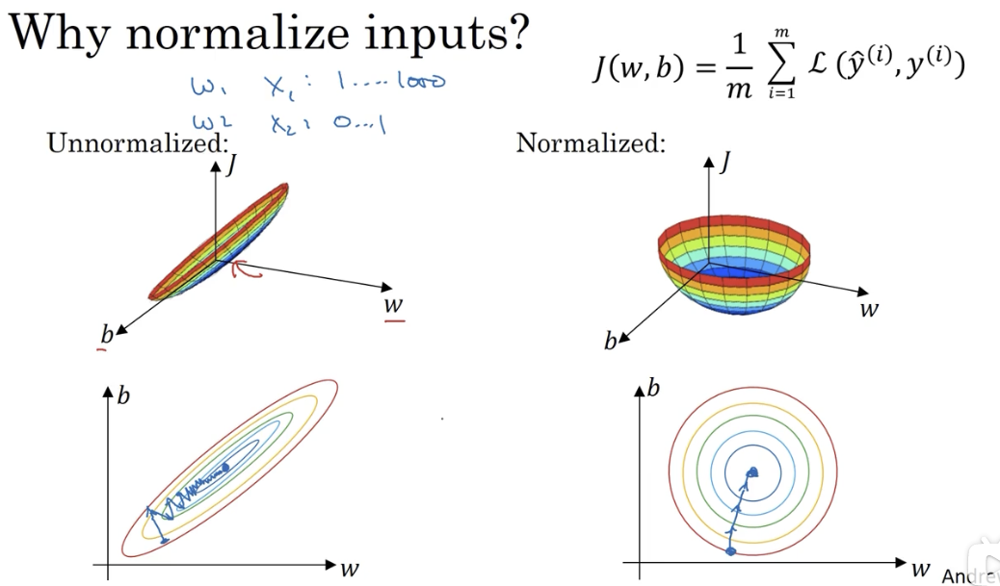
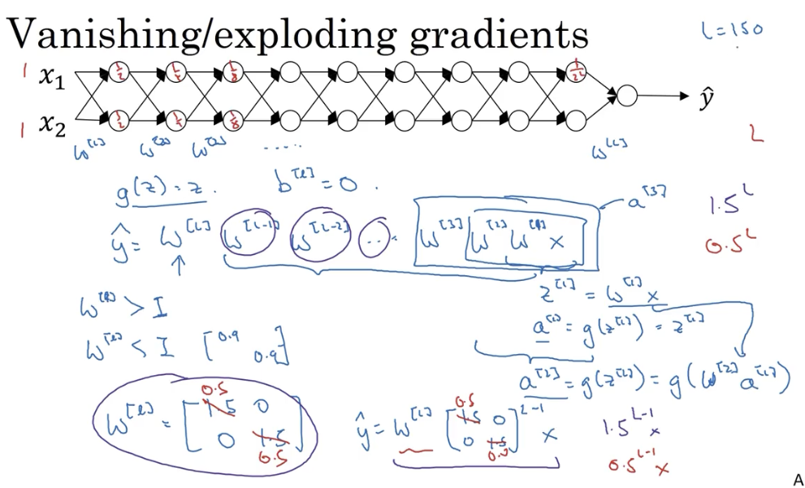
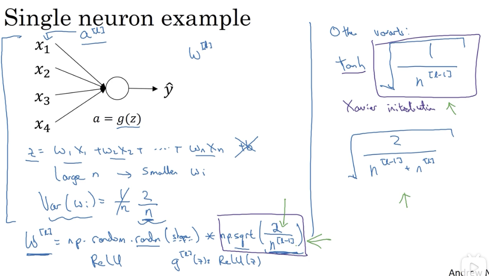
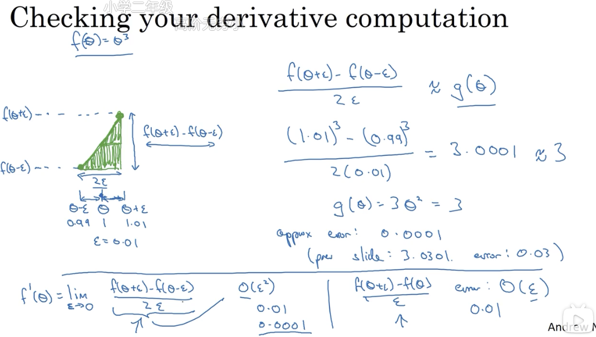
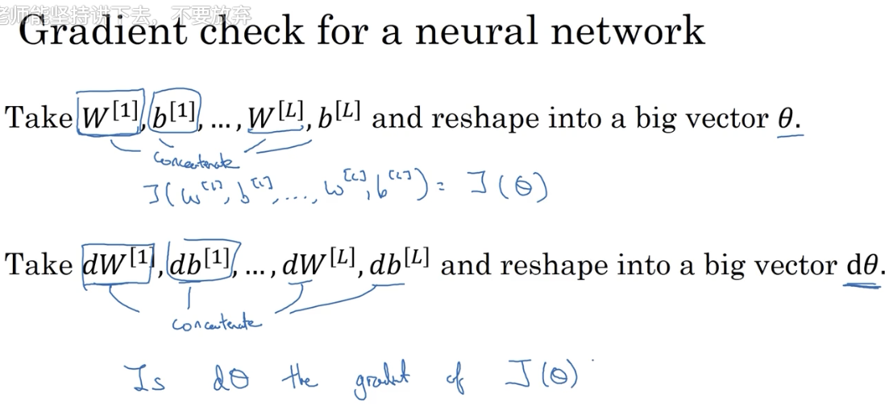
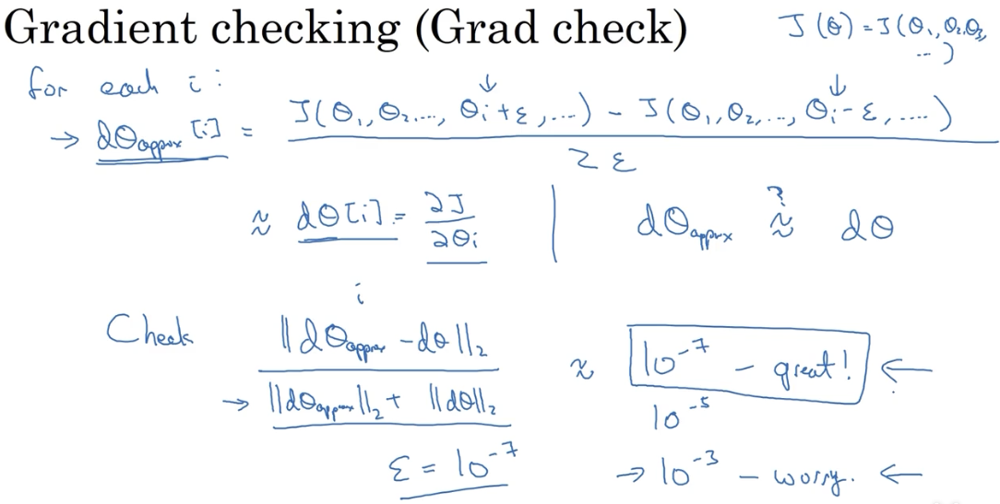
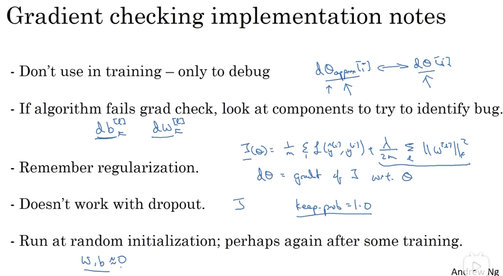

# 配置优化问题

## 1. 归一化输入特征

归一化输入能够加快模型的训练过程。

### 1.1 第一步：零均值化

### 1.2 第二步：归一化方差

ps：需要用同样的值对训练集和测试集数据进行归一，而不是分别计算。

### 1.3 为什么要归一化输入

原因是如果不同特征的数据区间相差很大，那么对应的参数 W 可能差别也很大，代价函数将是一个狭长的函数，必须使用一个很小的学习率才能让梯度下降符合预期。

而归一化之后，参数的代价函数比较对称，可以在梯度下降时使用更大的步长：

## 2. 梯度消失与梯度爆炸

### 2.1 梯度爆炸

## 3. 权重初始化

## 4. 梯度检验

使用梯度检验，以确保**向后传播**的正确性。

### 4.1 对计算梯度做数值逼近

使用微积分理论中的「双边误差」对梯度进行数值逼近：

### 4.2 进行梯度检验

第一步，把所有参数转换为一个巨大的向量数据 $\theta$，公式计算得到的梯度导数也合并为一个巨大的向量数据 $d\theta$（两个向量维度应当是一致的）：

第二步，使用 for 循环，对每一个参数都使用微积分方法计算它的偏导数，得到一个偏导的大向量 $d\theta _{approx}$：

第三步，使用欧几里得范数计算 $d\theta$ 和 $d\theta _{approx}$ 的距离，再用向量的长度做归一化，以验证梯度的计算是否正确：

### 4.3 注意事项

梯度检验只是用来 debug 的，不要在正式训练过程中使用（高计算成本）。

当出错时，检查相应的参数值。

注意正则化（如果有正则化，在计算损失函数的导数时，也要把正则的那个式子计算在内）。

不能与 Dropout 一起使用，因为它会随机消除某些节点，影响导数的计算。

第五条没有看懂……