# 优化算法

优化算法能够让模型训练得更快。

## 1. Mini-batch 梯度下降法

向量化使得模型计算的速度更快，但是如果样本量特别大的时候，执行一次学习迭代需要计算所有样本一次，代价仍然太大。

Mini-batch 的思想就是在训练整个数据集之前，先使用部分数据集让梯度下降一些，以提高训练速度。

### 1.1 切分数据集

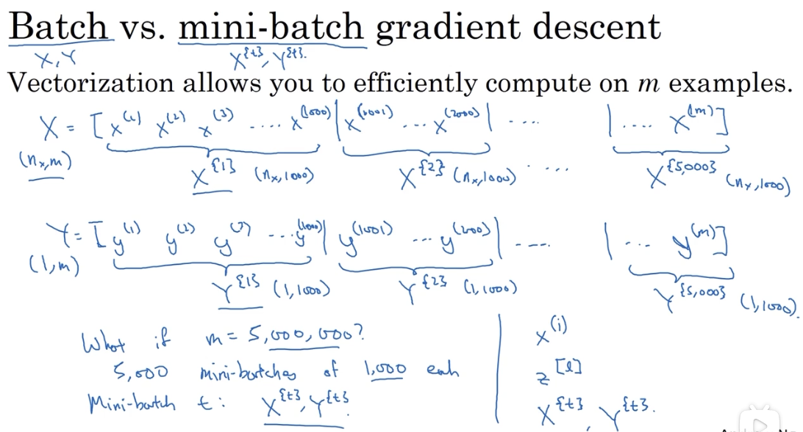

### 1.2 训练过程

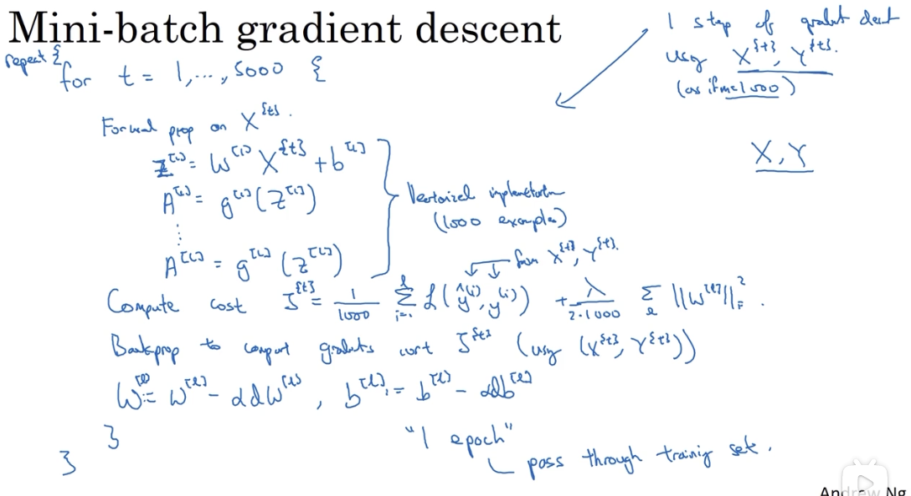

### 1.3 对 Mini-batch 算法的理解

在使用 Mini-batch 进行训练时，相邻的两步梯度下降都是在不同的数据集上进行的，所以它的下降曲线并不是平滑的：

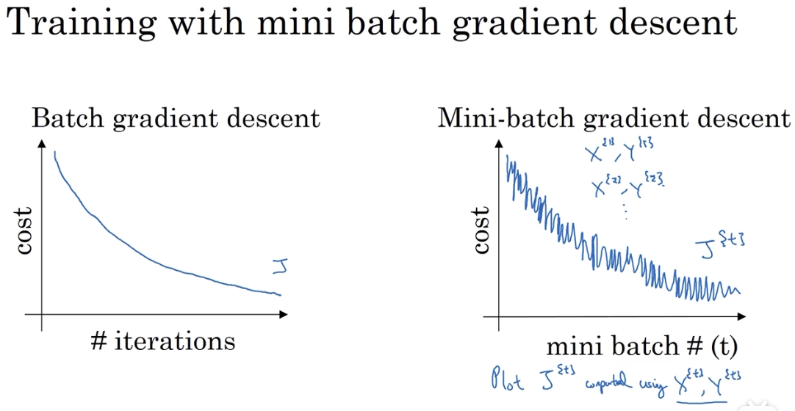

### 1.4 Mini-batch 的分包大小选择问题

一个 batch 中包含的样本数量 m 是一个超参，它对训练的影响如下：

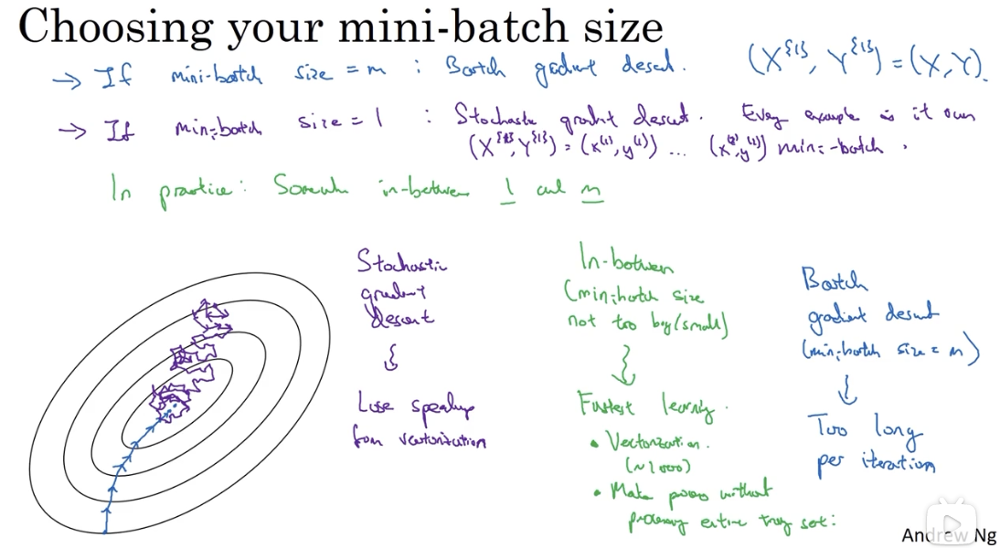

当 m 等于整个数据集的大小时，它实际上就等同于普通的 Batch 算法，还是会面临迭代一次就要计算整个数据集一次的成本问题。

当 m 等于 1 时，它是随机梯度下降法，随机梯度下降法永远不会收敛到最小值，而是在最小值附近波动。它失去了向量化带来的多个样本计算加速优势。

所以，m 的取值通常介于 1 和 max 之间，既能够加快梯度下降速度，又有向量化的加成。

## 2. 指数加权平均

指数加权平均是使用其他优化算法的基础。

### 2.1 指数加权平均法的原理

关键公式：

$$v_t = \beta v_{t - 1} + (1 - \beta)\theta _t$$

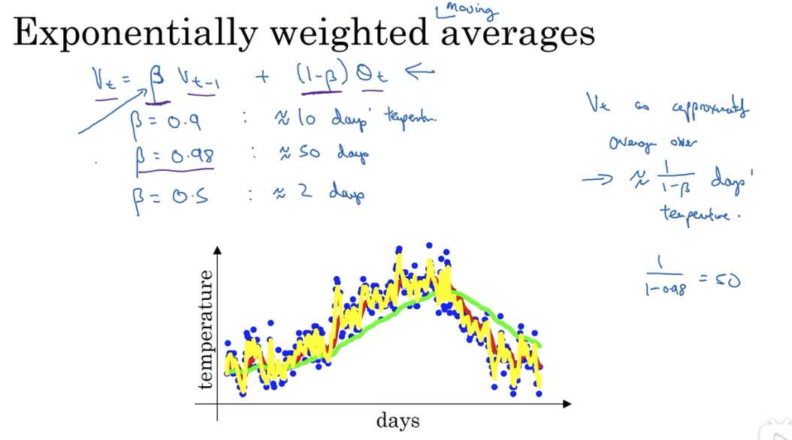

### 2.2 理解指数加权平均法

指数加权平均法的关键参数是 $\beta$，它的取值决定了当前数据会受到之前多久数据的影响。

实现：

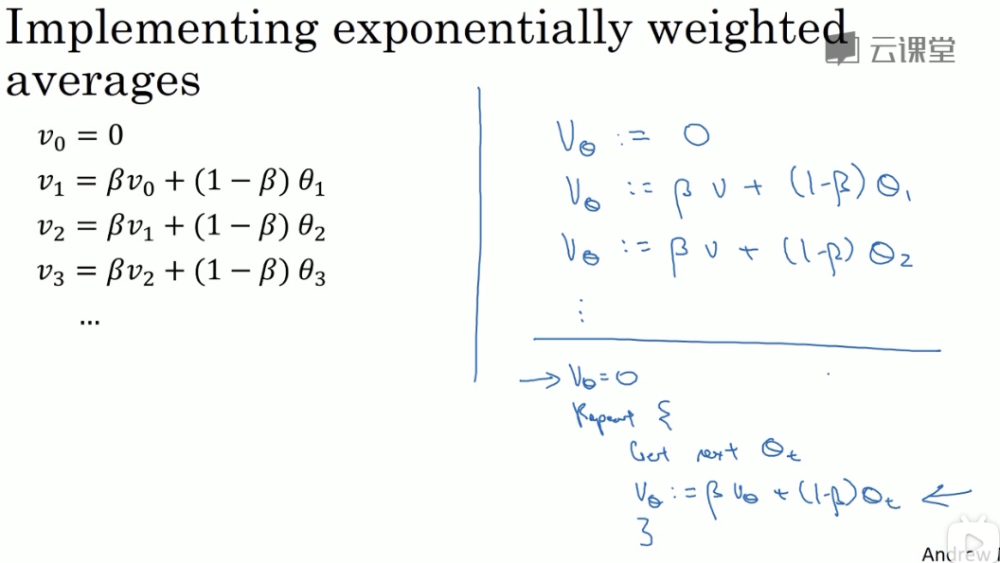

其与一般平均法的优势在于：

1. 代码量小，只需要一行代码
2. 内存占用小：它只需要存储前一天的数据即可

### 2.3 指数加权平均法的偏差修正

因为指数加权平均法在实现时，首先把第零天初始化为 0，所以前几天的数据会出现偏差：本应是绿线，但实际为紫线：

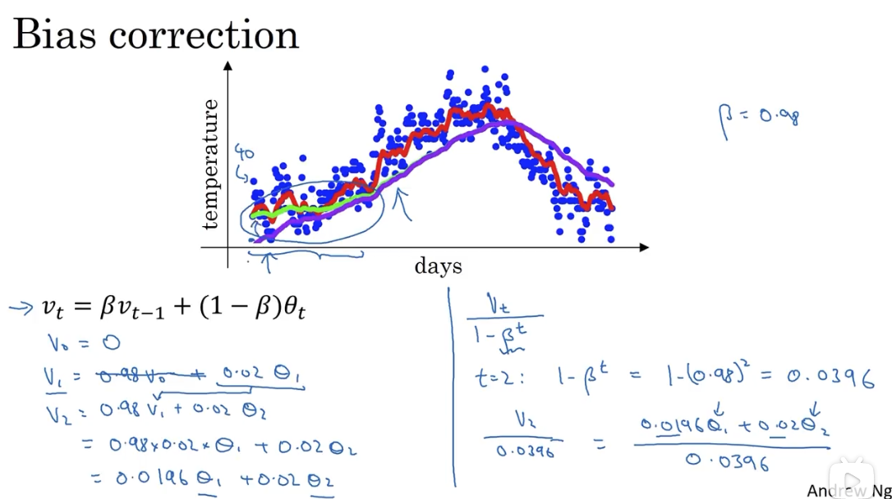

通过加入偏差修正，能够矫正初期的数据偏差，但是在深度学习中，很多人并不在意这个修正。
## 3. Momentum 动量梯度下降法

其基本思想是计算梯度的指数加权平均数，然后用计算后的梯度来更新权重。

### 3.1 momentum 解决的问题

在使用 Mini-batch 方法时，由于它是波动式地接近最小值，所以无法使用较大的学习率训练，速度很低。因为使用较大的学习率，其波动幅度更大，结果可能会偏离函数的范围。

目标就是减少纵向的震荡，加快横向的移动。

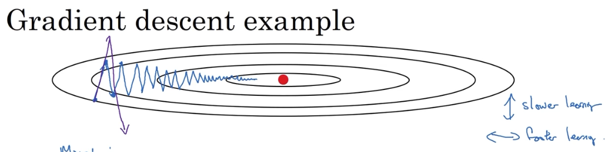

### 3.2 它是如何解决的：从碗中滚下的球

通过使用指数加权平均法，每次迭代对权重参数更新时，不再是与之前的迭代相独立，而是加权了前 n 次迭代的影响。n 的大小取决于超参 $\beta$ 的选取。

其实现如下：

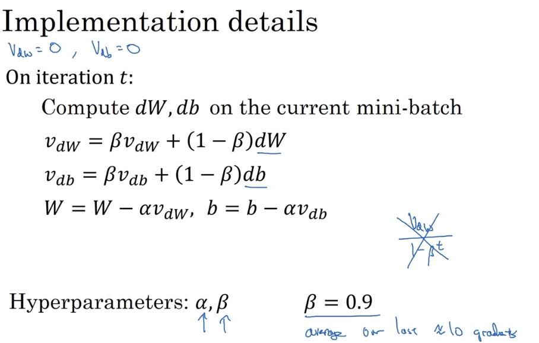

ps：深度学习中不关注偏差修正，是因为在迭代十次（估值）以后，移动平均过了初始阶段，就不再是一个具有偏差的预测。

## 4. RMSprop （root mean square prop 算法）

另一个能够加快梯度下降的方法。

对该方法的直观理解是，对于 W 的更新幅度要大，所以在最后除了一个较小的值 $\sqrt {S_{dW}}$，而对于 b 的更新幅度要小，所以在最后除了一个较大值 $\sqrt {S_{db}}$。

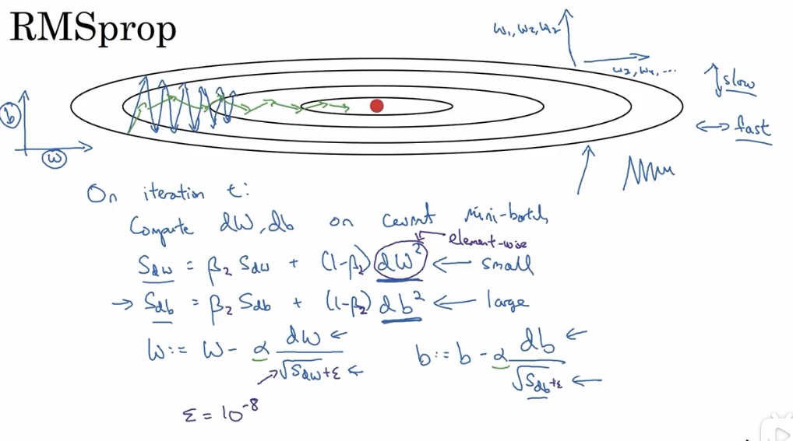

ps：一个细节点上为了避免在分母位置出现近乎 0 的可能，会在分母位置添加一个常数 $\varepsilon$，取值通常为 $10^{-8}$。

可以消除梯度下降时的摆动，以允许在训练时使用更大的学习率，从而加快算法的学习速度。

## 5. Adam （Adaptive Moment Estimation）优化算法

### 5.1 adam 实现

Adam 算法把 Momentum 和 RMSprop 结合使用。其实现如下：

### 5.2 adam 中的超参

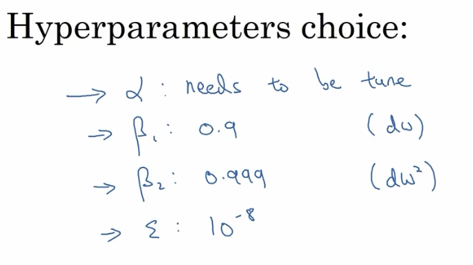

关于超参值的选择上，$\beta _1, \beta _2, \varepsilon$ 通常选用上述推荐缺省值（业内大佬不会去调参它们），通过训练去调整学习率 $\alpha$ 的值。 

## 6. 关于学习率衰减

### 6.1 为什么要减小学习率

慢慢减少学习率的本质在于，在学习初期，可以接受较大的步伐。但是当收敛开始之后，较小的学习率能让步进小一些：

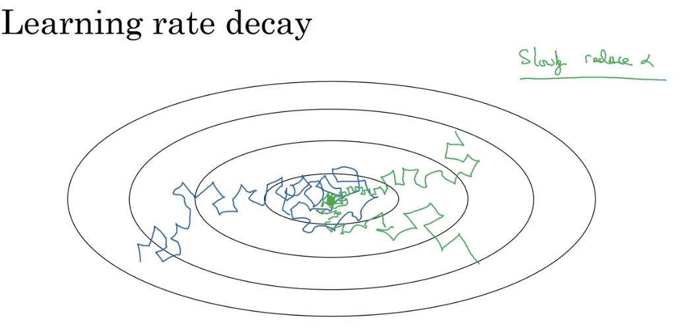

### 6.2 实现

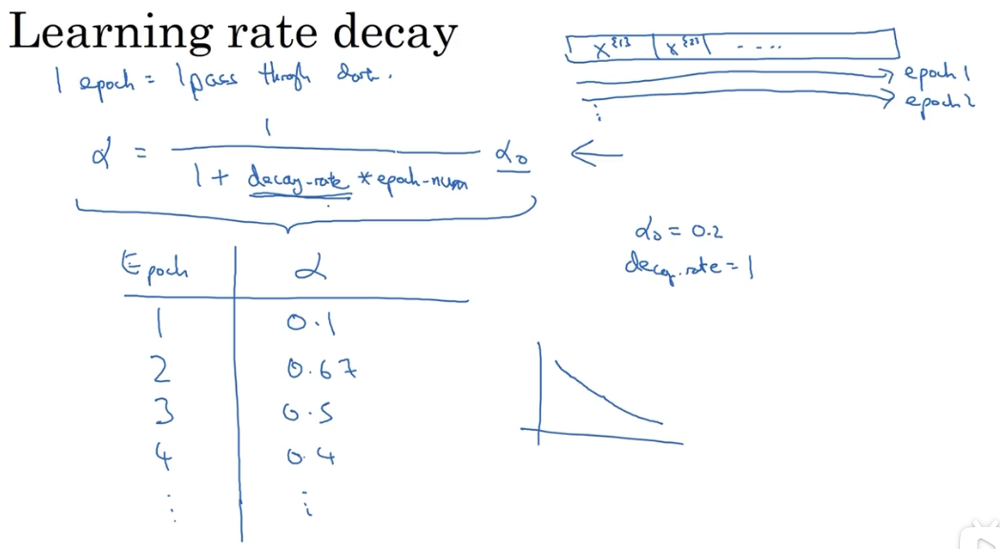

### 6.3 其他衰减方法

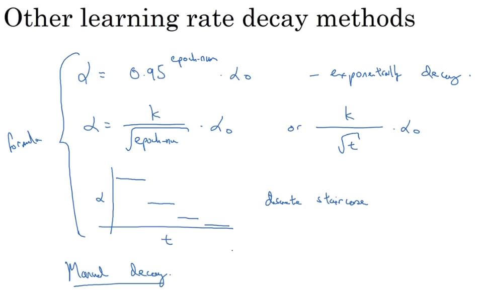

## 7. 局部最优的问题

我们在低维空间的大部分直觉，并不能用在高维空间。

在低维想象中，损失函数可能会有很多局部最优解，像下图左边所示。而在高维中更可能的情况是像右边的马鞍形

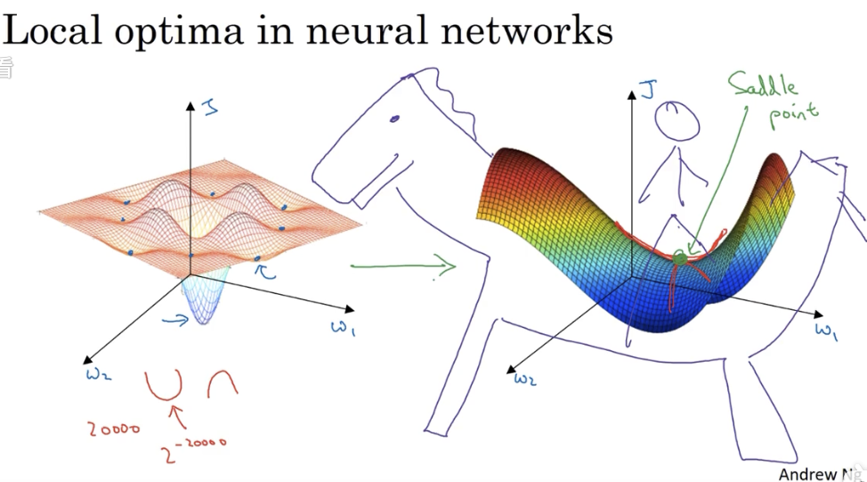

寻求高维最优解的过程，更可能是首先在平稳段达到马鞍点，然后再往下走。平稳段的梯度下降会很慢，这也就是前述的一些优化措施起作用的地方：

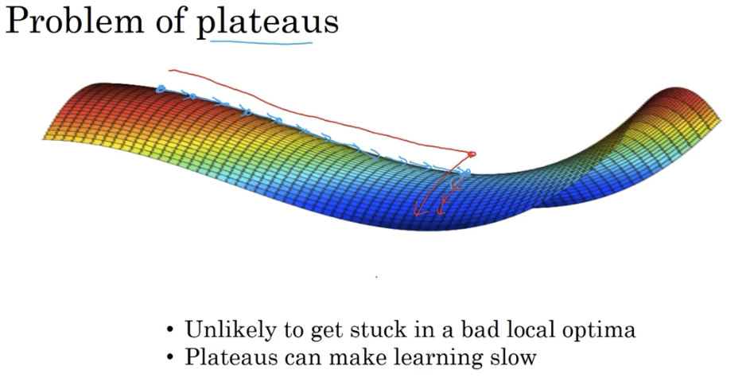
