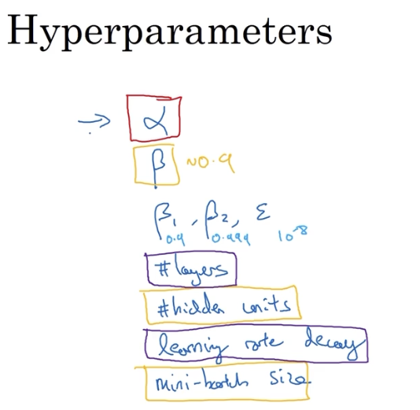
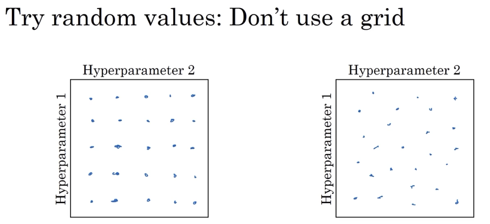
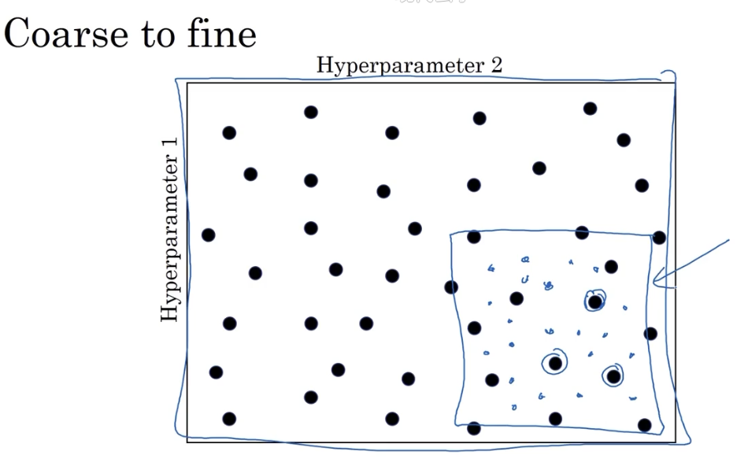
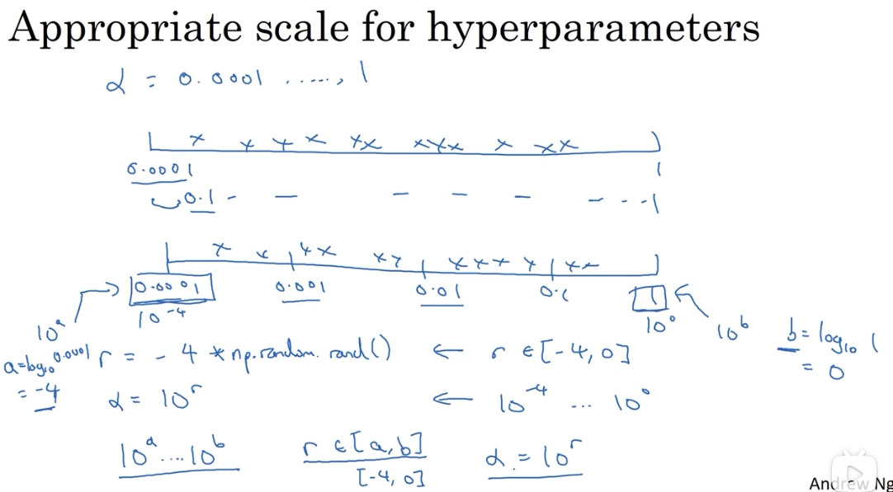
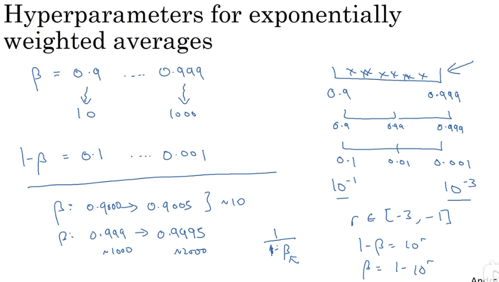
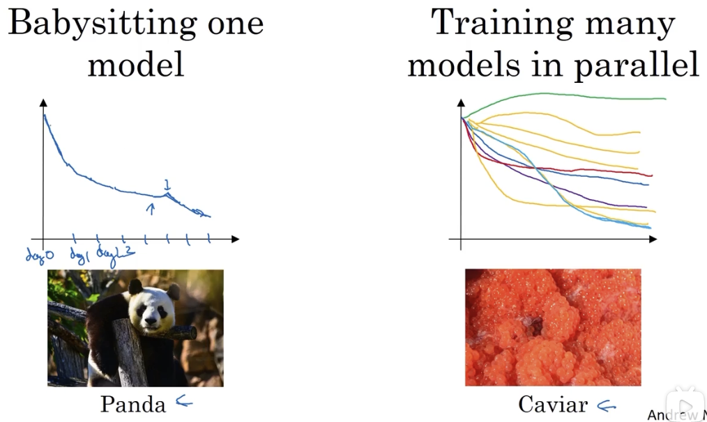

# 超参调整

## 1. 调试处理

### 1.1 超参种类

### 1.2 随机替代格网

使用随机选样替代格网式选样的好处是，你很难提前确定哪个参数更有用，格网式对于每个参数实际只有 5 个有效试验值，而随机选样对于每个参数都有 25 个有效试验值。

### 1.3 由粗糙到精细

在整个方格进行粗略搜索后，可能会发现在某块区域的值表现得更好，这时可以对该小区域进行密集搜索。

## 2. 为超参选择合适的范围

随机取值并不是在有效值范围内的随机**均匀**取值，而是选择合适的步进值，用以探究这些超参。

### 2.1 使用对数取值法

### 2.2 取 $\beta$ 的例子

## 3. 超参取值搜索的一些建议

不同应用领域出现交融。

至少几个月一次，对超参进行重新评估。

### 3.1 两种调参方式：熊猫与鱼子酱

根据所拥有计算资源的不同，造就的两种不同调参方式。

一种是在一个模型的训练过程中，不断地加以细心调整（微操大师）。另一种是训练多个模型，选择表现更好的。

**穷则战术穿插，达则轰它丫的。**
