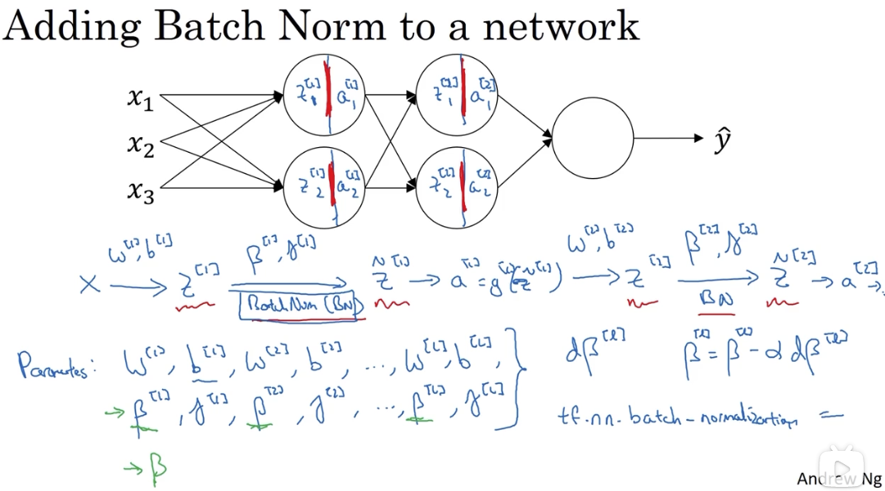
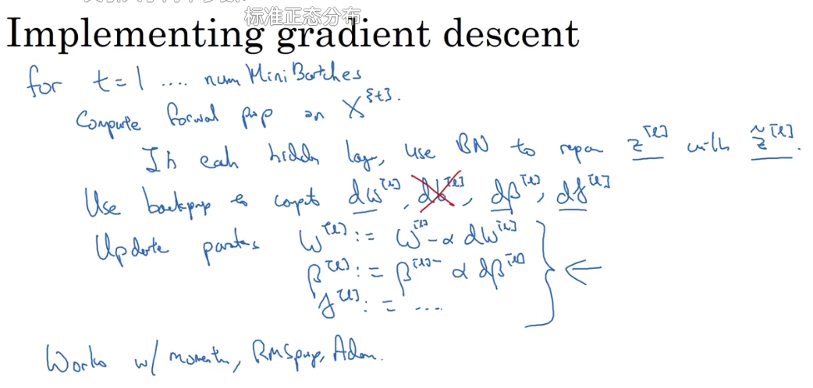
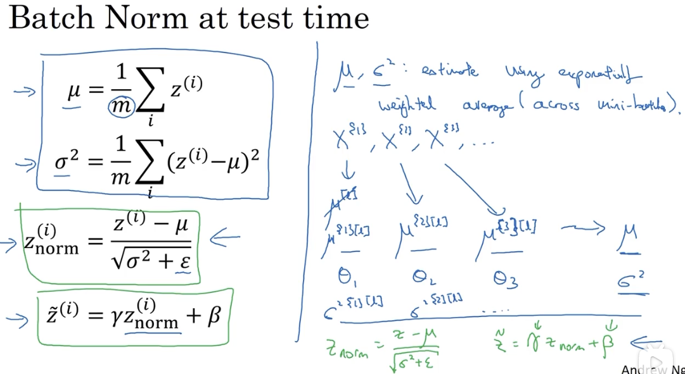
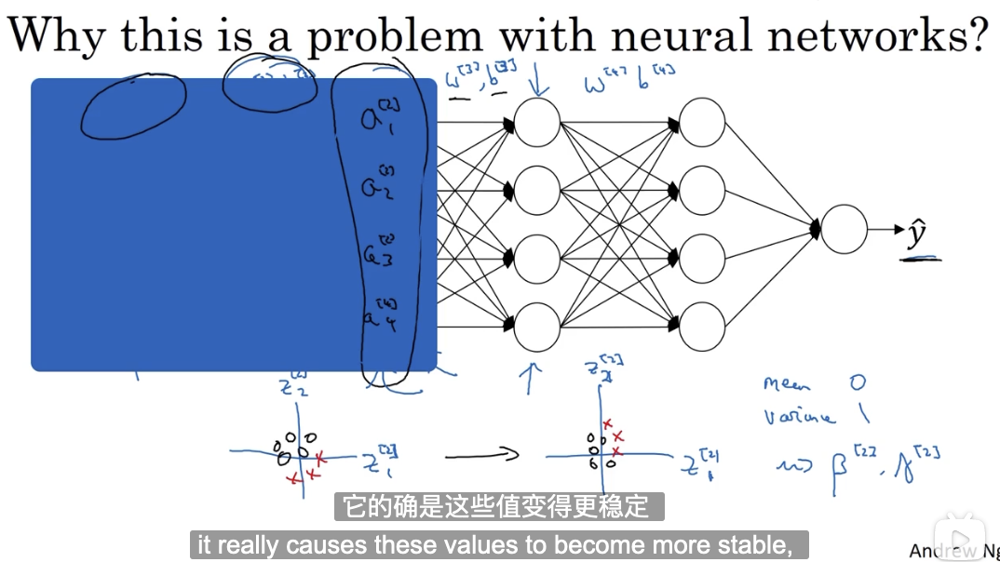
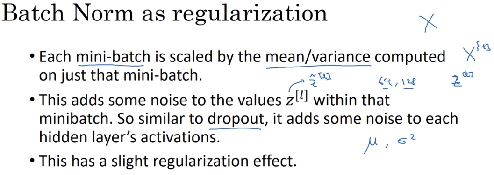

# Batch normalization（Batch 归一化）

## 1. Batch 归一化

Batch 归一化能使参数搜索问题变得很容易，使神经网络对超参的选择更加稳定，超参的范围会更庞大，效果更好，使深层网络模型更容易训练。

### 1.1 归一化

归一化就是计算数据集的平均值，从数据集中减去平均值；计算方差，根据方差归一化数据集。

$$\mu = {1 \over m} \sum_i X^{(i)}$$

$$X = X - \mu$$

$$\sigma ^2 = {1 \over m} \sum_i{X^{(i)}}^2$$

$$X = X / \sigma ^2$$

### 1.2 对 $Z^{[l]}$ 的归一化

正如将训练数据集归一化能够有效促进模型参数的训练，对每一个隐含层激活前的值进行归一化，也有助于其下一层参数的学习。

具体过程如下：

$$\mu = {1 \over m} \sum_i Z^{(i)}$$

$$Z = Z - \mu$$

$$\sigma ^2 = {1 \over m} \sum_i{Z^{(i)}}^2$$

$$Z_{norm} = {{Z - \mu} \over \sqrt {\mu ^2 + \varepsilon}}$$

由于我们并不想把每一层的 Z 值都集中在 [0, 1] 的范围，所以还会对其进行如下处理：

$$\tilde Z = \gamma Z_{norm} + \beta$$

其中，$\gamma$ 和 $\beta$ 都是待训练优化的参数，这两个参数的作用是使隐藏单元值的均值和方差标准化，并控制其具体取值。

### 1.3 将 Batch Norm 拟合进神经网络

加入 batch-norm 后，前向传播和后向传播发生了一些改变：

整体过程的变化：

### 1.4 测试中的 Batch norm

因为 $\mu$ 和 $\sigma ^2$ 是从整个数据集（或者单个Mini-batch）中计算得来的，在对模型效果进行样本测试时，显然无法对单个样本计算这两个值。

可以在训练过程中，对每个 mini-batch 计算得到的 $\mu$ 和 $\sigma ^2$ 求指数平均值 cache。

然后在测试中，使用 cache 值来计算其 $\tilde z^{[l]}$。

## 2. 为什么有效

### 2.1 它控制了数据的均值和方差

### 2.2 使输入值更稳定

它使权重更深层的权重比浅层的权重更能经得起数据的变化？

它限制了浅层参数变化对深层输入值的影响程度，使其输入值保持在一定的均值和方差范围内。各层之间的相互影响变小，独立性提高了，加速了整个网络的学习。

一言以蔽之，它使该层接收到的输入值更稳定了。

### 2.3 有轻微的正则化效果

batch norm 为数据增加了噪音，使得下一层网络不过分依赖任何一个隐藏单元，起到了类似 Dropout 的效果。

这个效果比较轻微，类似副作用。
