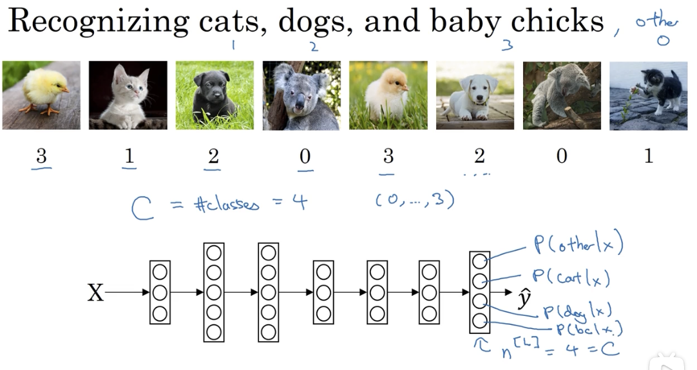
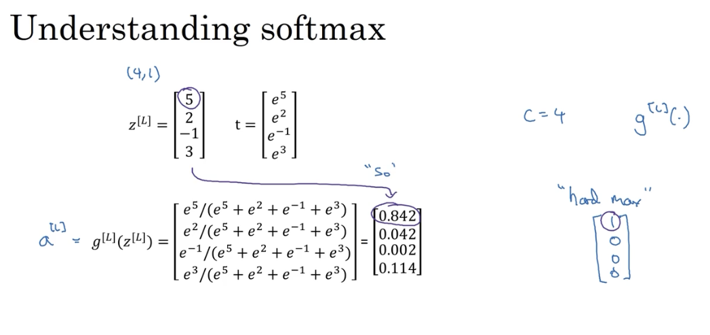
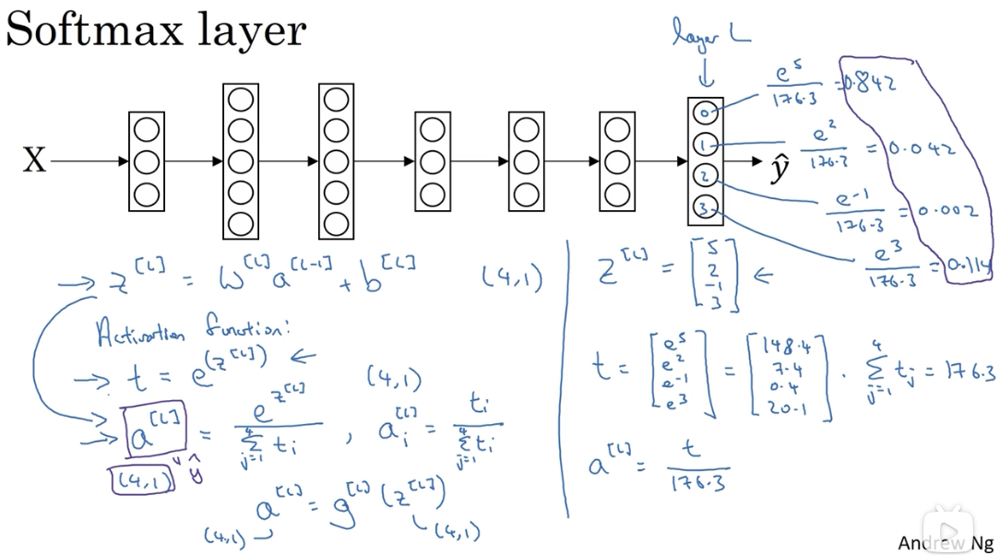
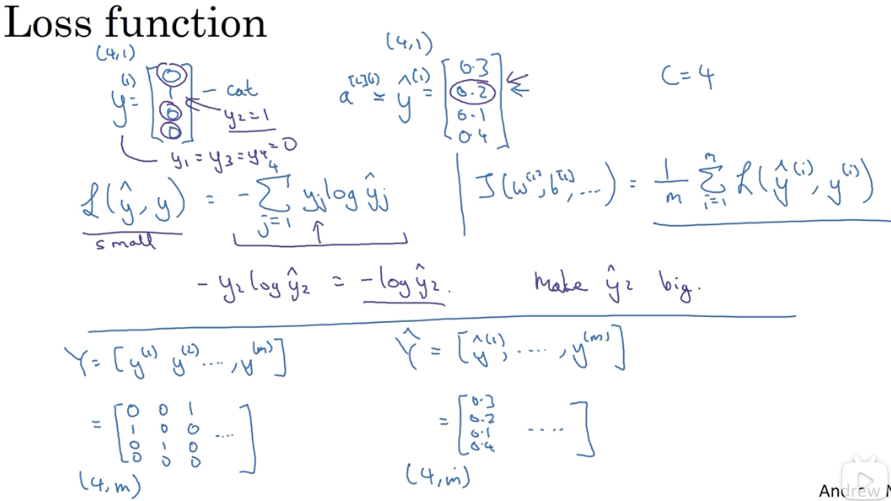
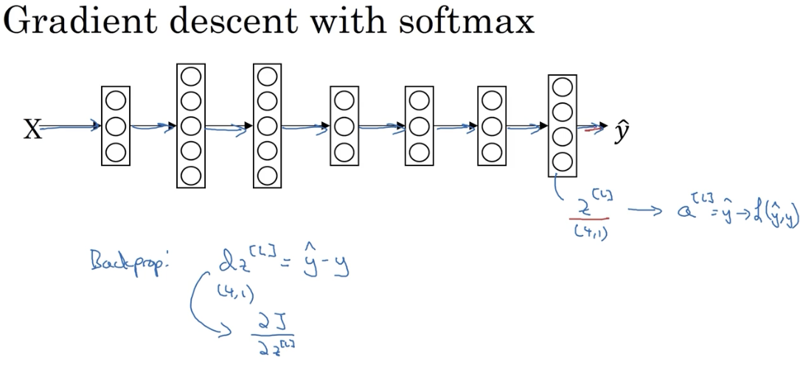

# 多结果分类器：Softmax 回归

## 1. 多结果情形

Logitic 回归输出结果为 0 / 1，当结果有多个可能性时，就不适用了。

## 1.1 Softmax 回归

假设，训练得到了四个数据，需要通过这四个数值映射到分类结果，一种思路就是将最大值置为 1，其它都看作 0。这种映射方式太生硬。

相对的，Softmax 方法本质上就是使这个过程更加温和（Soft）。

### 1.1 直观理解 Softmax 做了什么

## 2. Softmax 的训练

### 2.1 损失函数定义

### 2.2 梯度下降

含有 softmax 层的模型与前述模型相比，最大的不同点是 $dZ^{[L]}$ 的计算，其公式如下：

### 2.3 后向传播

