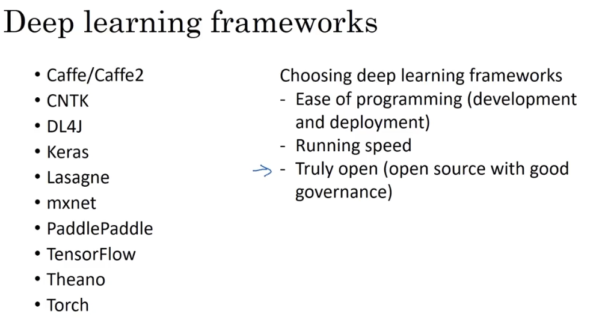

# 深度学习框架

## 1. 现有框架介绍

许多框架开发出来针对某类或某些应用，因此各有千秋。



选择指南：

- 方便编程
- 运行速度快
- 真正开源（有些项目开着开着就闭了）

当然，对于现阶段的初学者来说，还不太需要考虑那么多，多关注下编程语言才是正途。

## 2. TensorFlow

### 2.1 实现梯度下降

假设要训练下面这个损失函数：

$$J(w) = w^2 - 10w + 25$$

需要学习参数 $w$，使得 $J(w)$ 最小。

从直观的数学公式计算可知，$w = 5$ 时 $J(5) = 0$ 最小。而深度学习的逻辑，就是通过梯度下降的方法，一步步降至最优解。

```python
# 引包
import numpy as np
import tensorflow as tf

# 定义变量
w = tf.Variable(0, dtype = tf.float32)
# 计算损失函数
# cost = tf.add(tf.add(w ** 2, tf.multiply(-10., w)) 25)
# tensorflow 重载了运算符，所以可以用更简洁的形式
cost = w ** 2 - 10 * w + 25
# 定义训练模型
train = tf.train.GradientDescentOptimizer(0.01).minimize(cost)

init = tf.global_variables_initializer()
session = tf.Session()
session.run(init)

# 训练迭代
for i in range(1000):
  session.run(train)

# 打印训练所得到的参数
print(session.run(w)) # 4.99999
```

### 2.2 实现数据注入

在上述实现中，损失函数的参数 $w$ 的系数是固定写死的，而在深度学习的训练过程中，其系数是通过前向传播计算得到的 $A^{[L]}$，在每一轮迭代中都是变化的。假如使用的 Mini-batch 优化方法，那么对于每一个 Batch 也是不同的。

该系数需要动态注入，其实现如下：

```python{2,3}
# 引包
import numpy as np
import tensorflow as tf

# 定义需要注入的数据（该数据也可能在训练过程中产生）
coefficients = np.array([[1.], [-10.], [25.]])

# 定义变量
w = tf.Variable(0, dtype = tf.float32)
# 定义一个占位变量，维度为 (3, 1)，分别替代损失函数中的三个系数
x = tf.placeholder(tf.float32, [3, 1])
# 计算损失函数（使用注入的系数）
cost = x[0][0] * w ** 2 + x[1][0] * w + x[2][0]
# 定义训练模型
train = tf.train.GradientDescentOptimizer(0.01).minimize(cost)

init = tf.global_variables_initializer()
session = tf.Session()
session.run(init)

# 训练迭代
for i in range(1000):
  # 向模型注入占位数据的真实值
  session.run(train, feed_dict = {x: coefficients})

# 打印训练所得到的参数
print(session.run(w)) # 4.99999
```
