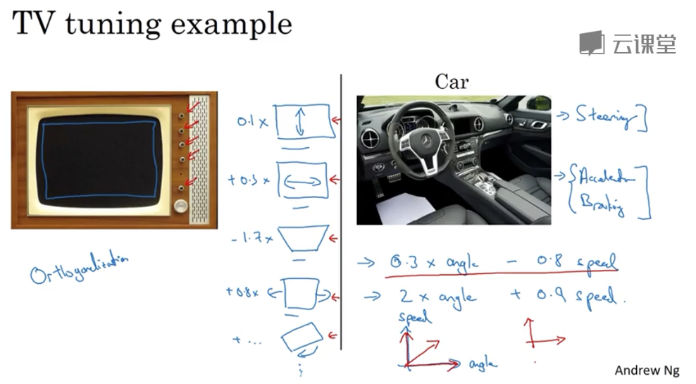
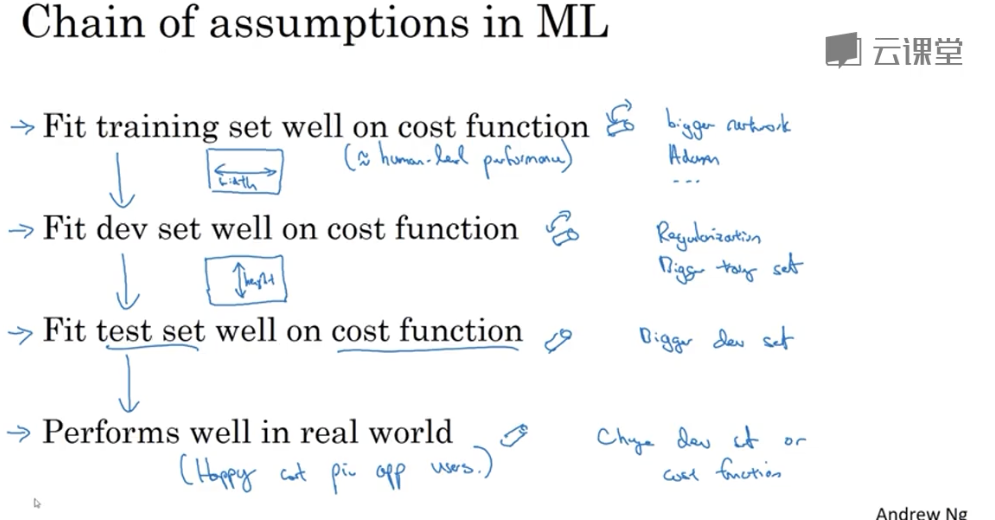

# 机器学习策略

## 1. 什么是机器学习策略

深度学习过程中，有太多可以做的优化选择。有些优化有效果，有些优化则针对当前的问题是南辕北辙的。

如何做出有效的优化，需要机器学习策略。

## 2. 正交化

### 2.1 什么是正交化

搭建机器学习系统的挑战之一是，可以尝试和改变的东西太多了，比如有那么多超参可以调整。有些效率很高的机器学习专家思路清晰，对于调整什么以达到何种效果有着清楚的认识。这就是正交化。

电视机设计中的正交化，就是设计出一些旋钮，使这些旋钮每个只调整图像的一个性质。

而深度学习中的正交化，就是对于深度学习要达到的四个目标，尽量找出一些方式，只对某个目标发生作用：

- 适应训练集（达到人类程度）
- 适应验证集
- 适应测试集
- 适应真实应用环境

