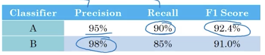
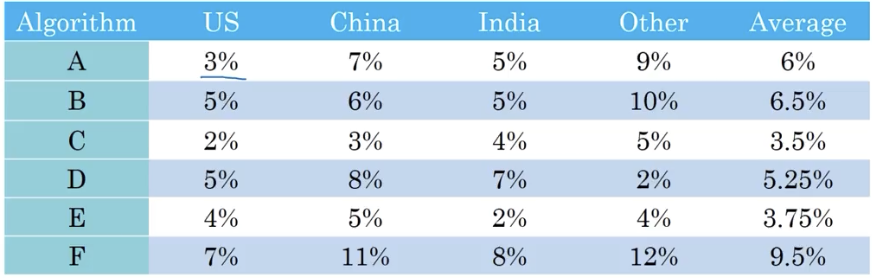
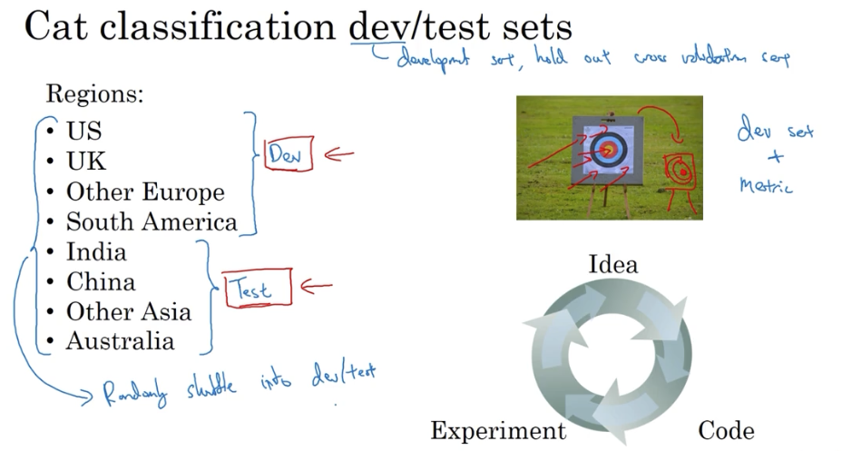
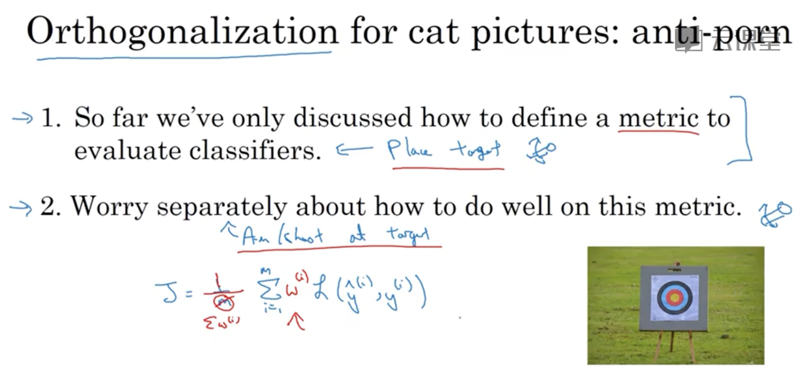
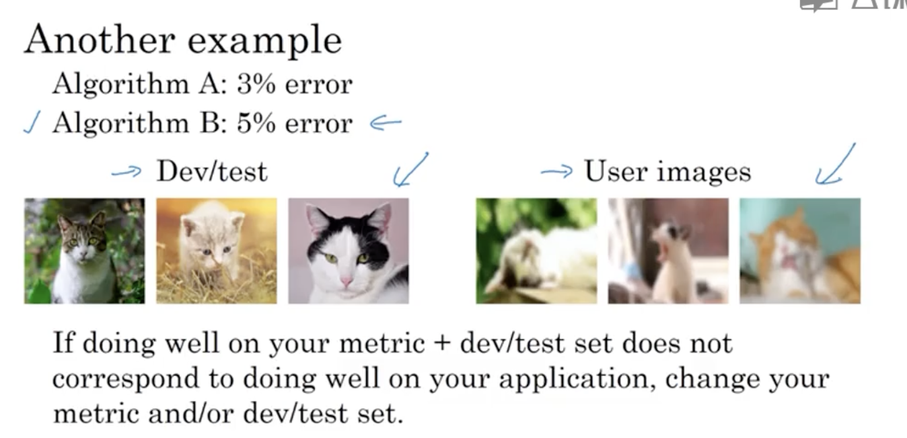

# 设定目标

## 1. 单一数字评估指标

为你的问题设置一个单实数评估指标，能够提高团队做出模型选择决策上的效率。

### 1.1 查准率与查全率

以猫咪学习系统为例，查准率（Precision）是指在分类器标记为猫的例子中，有多大比例真的是猫；查全率（Recall）是指对于所有真的是猫的图片，分类器正确识别出了多大比例。

### 1.2 F1 Score

我们希望分类器的查准率和查全率都尽可能高，但对于两个不同的分类模型，很可能在两个指标上具有各自的优势。

这时就需要一个能够把两个指标综合考虑的一个单指标：

$$F1 = {2 \over {{1 \over P} + {1 \over R}}}$$

### 1.3 一个更复杂的情况

## 2. 满足与优化指标

把所有需要统一在一个单实数评估指标里有时并不现实。这时，设置一个满足指标和优化指标也是一个不错的选择。

### 2.1 例子

比如，在一个对模型准确性和运行时间都有要求的问题上，与其生硬地将两个指标综合成一个单实数评估指标，不如设定如下指标：

**在满足运行时间要求的前提下，最大限度地提高准确度。**

这时，运行时间是满足指标，即只要在要求的运行时间内，模型都是可以接受的；准确度是优化指标，在保证满足指标的基础上，准确度越高越好。

这是一种明确判断哪个分类器更好的评价方式。

## 3. 数据集的划分

数据集的划分极大程度上影响了建立机器学习应用上取得进展的速度。

机器学习的工作流程是，你尝试了很多思路，用**训练集**训练不同的模型，然后使用**开发集**评估之，然后选择一个模型在**训练集**上不断迭代优化，以改善其在**开发集**上的性能，直到最后，得到一个令人满意的成本，然后再用**测试集**去评估。

### 3.1 开发验证集的设置

一个首要标准，就是保证**开发集**和**测试集**的数据分布一致。

否则就是训练打的靶子和测试打的靶子并非同一个。

### 3.2 关于测试集与验证集的大小

传统经验上，使用 7/3 原则或 6/2/2 原则划分数据集。

而在大数据时代，如果依旧给测试集 20% 的比例，就过于庞大了。以百万级为例，测试集大概只需要 1%，即 10,000 的数据量。

## 4. 指标优化和数据集调整

如果指标无法正确匹配针对应用更好的分类器，那就该考虑调整指标了。

### 4.1 确定指标的步骤

在定指标时，也有一个正交的思想：

1. 第一步，先明确正确评估模型的指标
2. 第二步才是考虑如何让自己的模型在这个指标上表现更好。

### 4.2 模型表现不佳时

如果根据指标选出的分类器中在真实应用中表现不佳，就要考虑调整指标，或者调整开发/测试的数据集。

