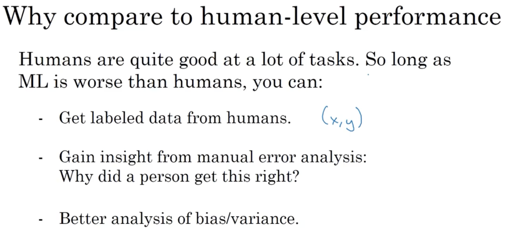
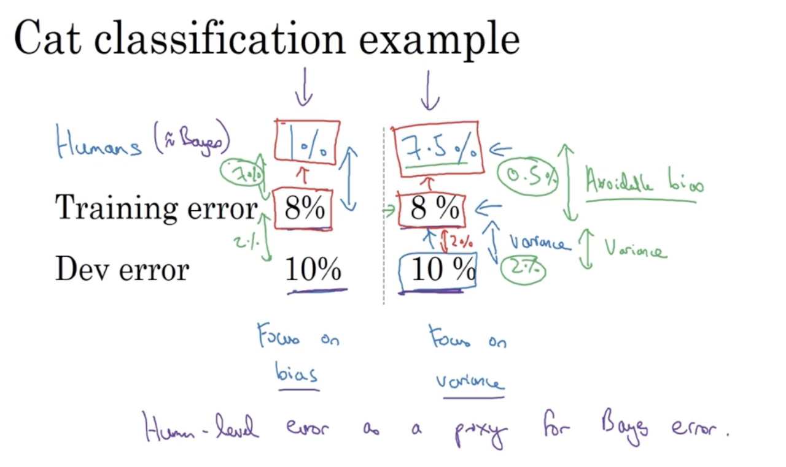
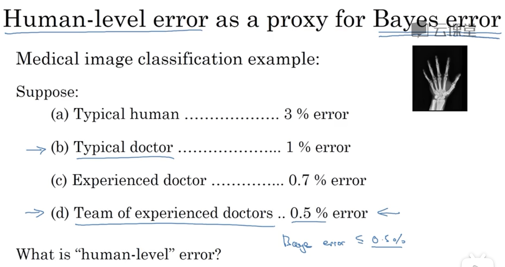
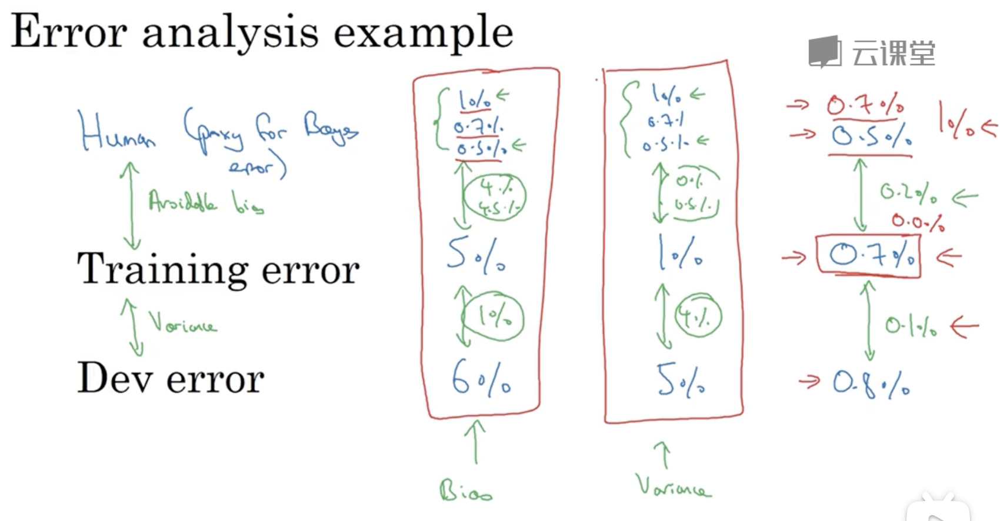
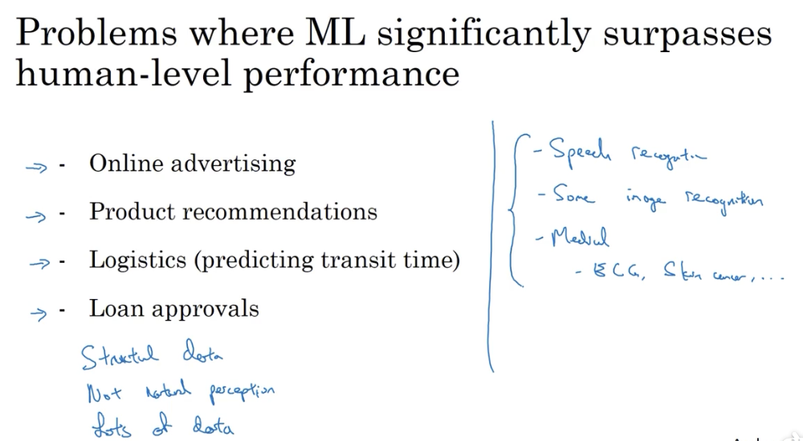
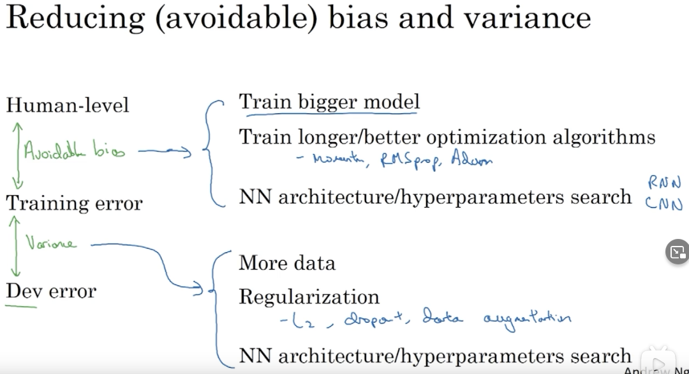

# 与人类的表现比较

## 1. 为什么要让模型和人比较

一方面是机器学习算法突然变得更好，甚至开始威胁到人类的表现了。其次是，当你通过精心设计的机器学习模型算法，试图让机器学会做人类能做的事，提高工作效率，那么比较机器和人类的表现就是很自然的事。

### 1.1 贝叶斯最优错误率

很多时候，一件事成功的概率并不是 100%，例如图像识别算法中，总会有些图片模糊到人类都分辨不出来的程度。

因此，在寻找从 x 拟合到 y 的理论最优函数，也无法超越贝叶斯最优错误率。

### 1.2 算法优化

只要算法还没达到人类的水平，人类总是有办法帮助算法去提高。

## 2. 可避免偏差

可避免偏差这个概念，是让深度学习模型以贝叶斯最优误差为基准，来描述其训练误差和验证误差。即使用误差的相对值而非绝对值，来明确下一步优化的决策方向。

## 3. 人的表现

### 3.1 理解人的表现

在定义人类水平错误率的时候，要弄清目标所在。

比如要发论文，可能要把专家团队的低错误率作为人类水平；要部署应用，可能只需要达到一个普通专家的错误水平。

### 3.2 根据人类水平分析可避免偏差

当越接近人类水平时，就越难分辨模型此时的错误主因，应当是偏差还是方差。也就越难进一步优化。

### 3.3 超过人的表现

### 3.4 改善模型的表现

对模型的优化步骤就是根据可避免偏差，判断模型当前存在的主要问题是偏差问题还是方差问题。然后采取对应的优化措施。

可避免偏差、偏差、方差的概念易学难精，需要通过练习，加强对概念的理解。
