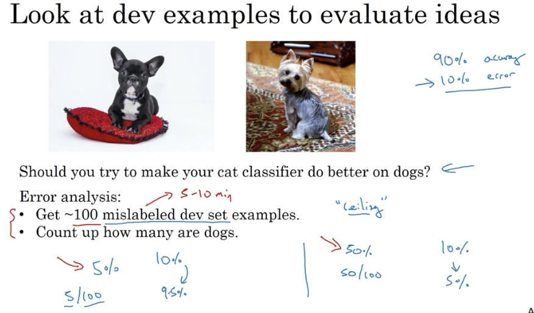
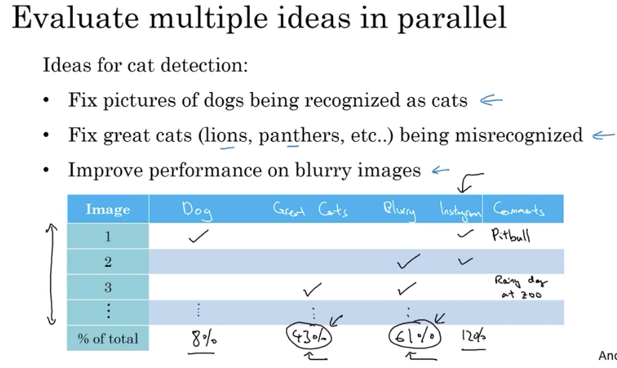
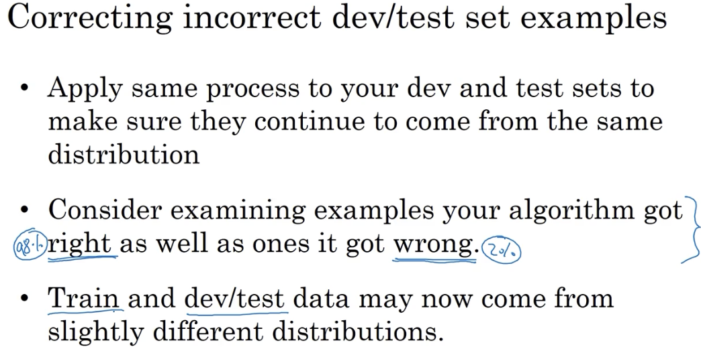
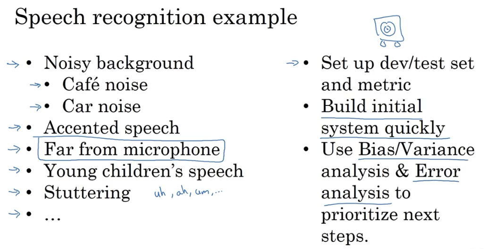

# 误差分析

## 1. 进行误差分析

### 1.1 关于性能上限的一个例子

通过对识别出错的样本进行人工统计，可以分析出某类错误的占比情况，以估算处理该类错误所能得到的性能优化上限。从而决定是否要花精力去解决该类错误：

### 1.2 同时评估多类错误

通过制表，为错误样本进行分类：

## 2. 关于标记错误的样本

### 2.1 关于随机错误

通常如果错误样本足够随机，且样本数据量足够大，那么训练出的分类器实际效果并不会很差。

但是系统性的错误对于深度学习模型会有很大的影响。

### 2.2 分析标记错误的影响

主要看标记错误所引发的错误在整个错误中的占比，以重点改善：

### 2.3 几点原则

关于深度学习的几点建议是：

1. 虽然很多从业者都说在深度学习中要减少人为干预，但是在模型训练过程中，还是会加入很多人工错误分析，很多人类见解；
2. 花些时间对于错误样本进行分析通常是值得的。

## 3. 快速搭建第一个学习系统，然后迭代之

### 3.1 以构建一个语音识别系统为例

搭建一个语音系统也有很多个可以着力的方向，最关键的就是先搞出一个简单系统来，然后快速分析迭代。

### 3.2 建议

对于一个新方向，最重要的是先快速搭建出一个 「quick and dirty」的系统，然后用它做偏差/方差分析，再决定下一步的迭代方向。

至于一些比较成熟的方向、或比较老练的团队，也许一开始就能够做出非常复杂的模型系统。