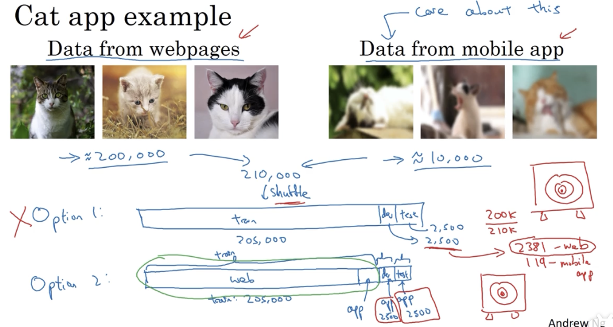
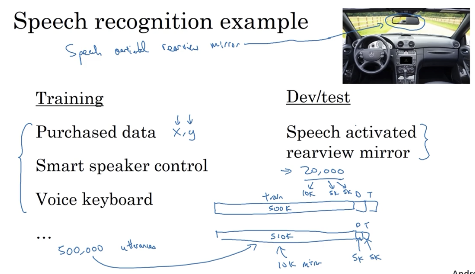
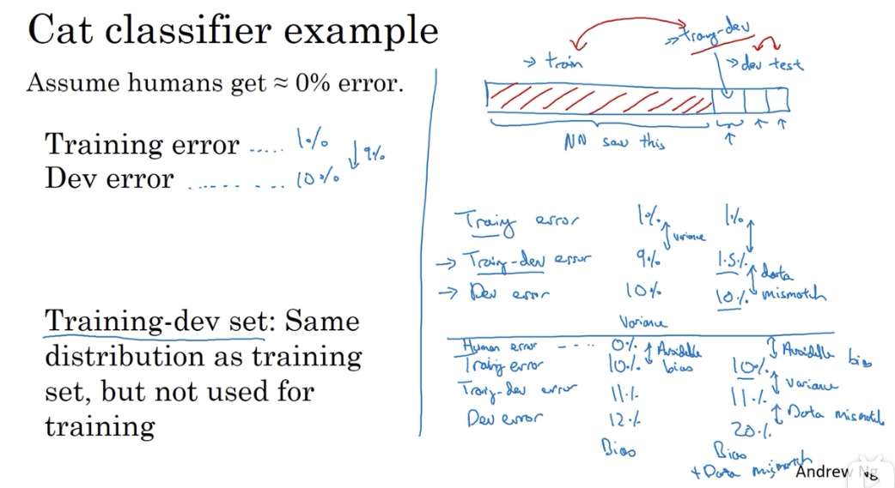
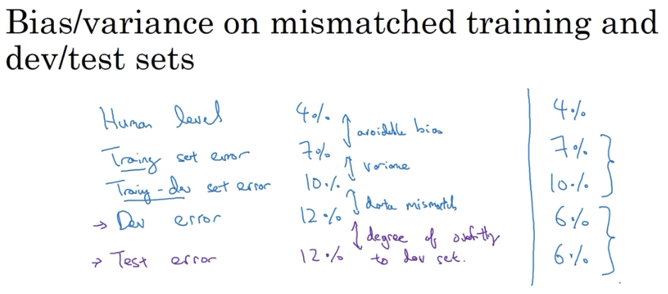
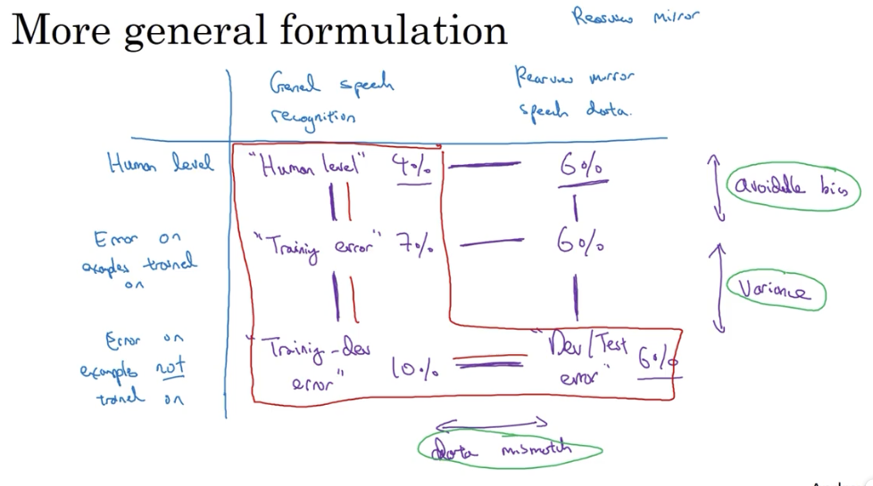
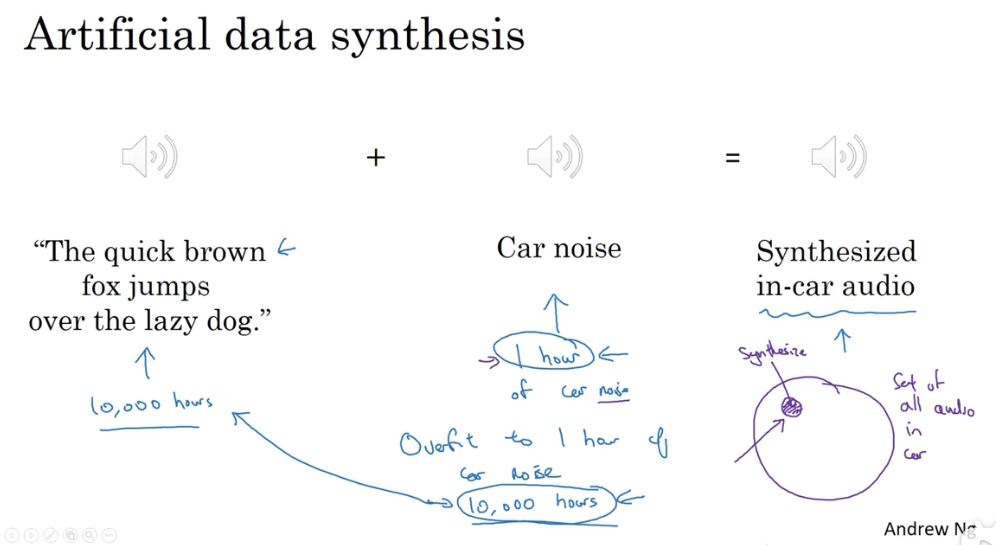

# 不匹配的数据集

## 1. 训练集和测试集的不同分布

### 1.1 一个例子

### 1.2 另一个例子

## 2. 不匹配数据下的误差分析

当数据不匹配时，training set 和 dev set 并不来自同一分布，这使得原来进行方差分析的方法变得不准确：无法确定误差是源于训练时的过拟合，还是源于数据分布问题。

### 2.1 training-dev 数据集

为了明晰上述问题，可以设立一个 train-dev 数据集，即从原 training set 中分一点出来做 dev set，以对模型进行方差分析。

### 2.2 误差分析

通过 training-dev set 的加入，就可以判断数据的不匹配程度。

有时会发现 dev error 比 training-dev error 表现还要好，有可能是因为目标任务中的数据比收集的 training set 更好识别。

## 3. 处理数据不匹配问题

并没有系统处理数据不匹配的方案，但有些方法可以尝试下。

### 3.1 数据分析

第一步，做数据分析，尝试了解训练集与开发测试集的具体差异。

然后通过收集或制造数据，使训练数据更接近开发集。

但在模拟数据时，要注意避免过拟合。

