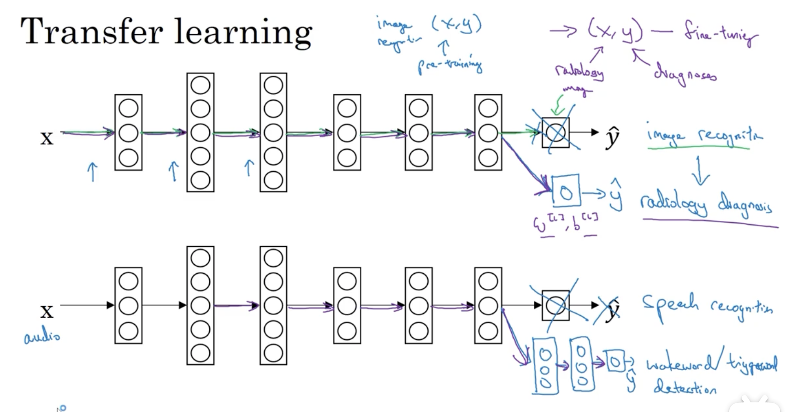
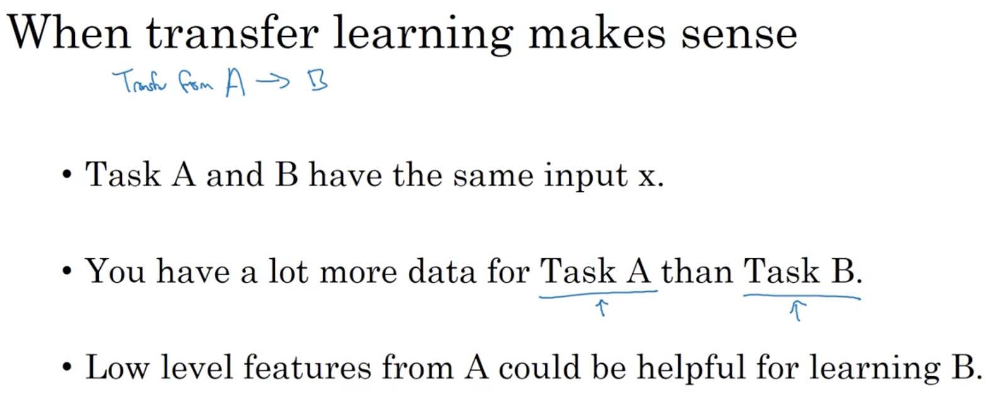
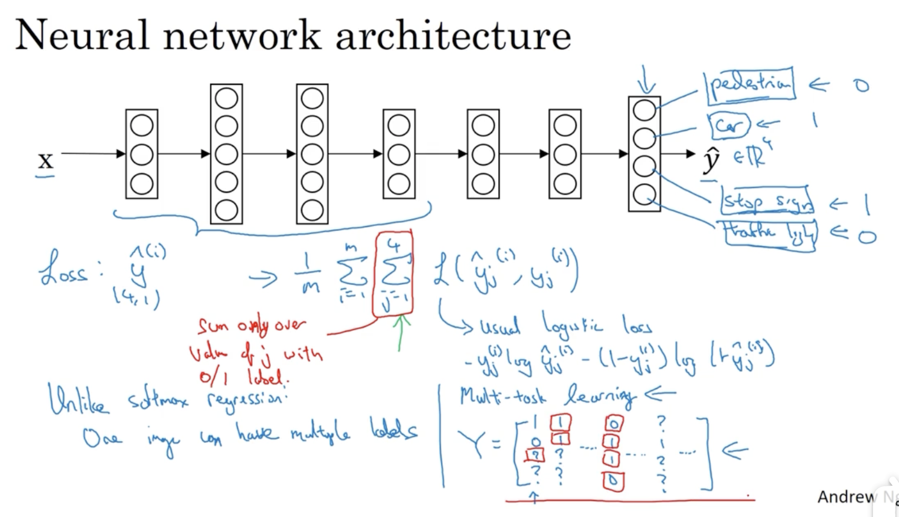
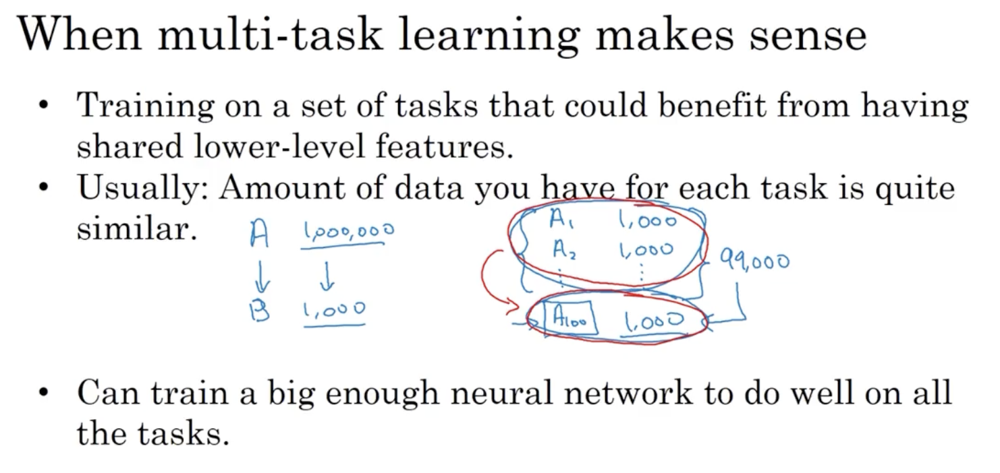

# 多任务

## 1. 迁移学习

训练了一个识别任务 A 的网络，然后用它来训练一个任务 B，这就叫迁移学习。

### 1.1 迁移学习的实现

迁移学习能够成立的原因是任务 A 在浅层学习到的许多特征是可以用在任务 B 上的，使模型对任务 B 的学习更快，或需要的数据量更小。

### 1.2 什么时候使用迁移学习

## 2. 多任务学习

迁移学习的过程是串行的：先学习任务 A，然后再学习任务 B。而多任务学习是并行的，试图让神经网络同时做几件事，并且希望这里的每个任务都可以帮助到其它任务。

### 2.1 多任务学习的实现案例

假如想同时识别一张图片里有无车辆、行人、树木、信号灯，这就是一个多任务学习。

其与 Soft-max 的区别是，Soft-max 最终只给图片贴一个标签，而多任务会给一张图片贴 4 个标签。

### 2.2 适用时机

