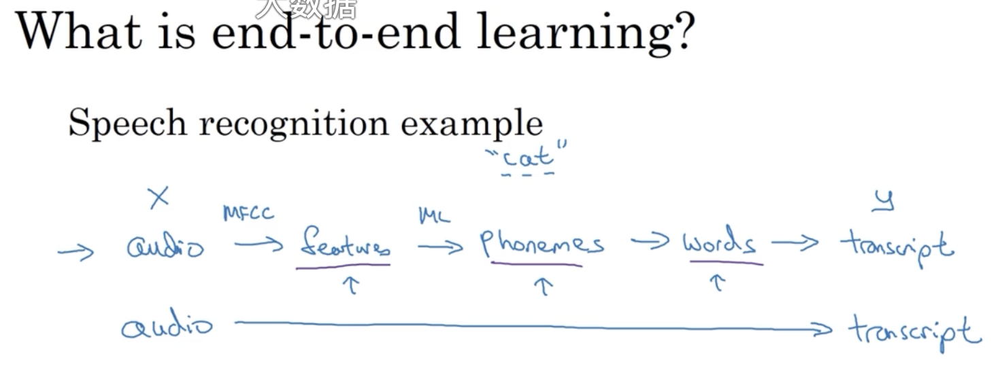
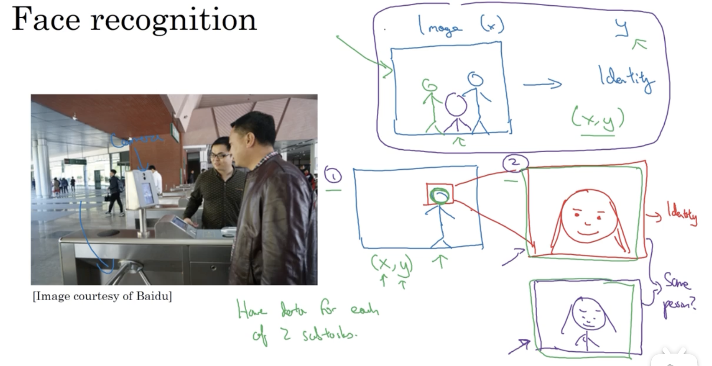
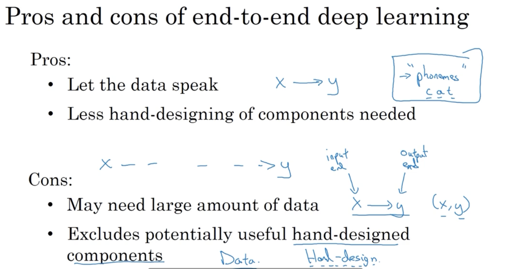
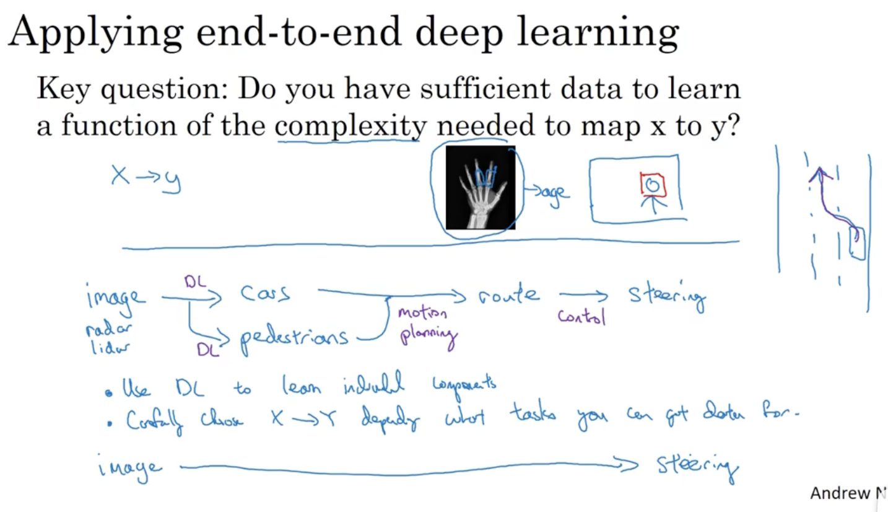

# 端到端的深度学习

## 1. 什么是端到端的深度学习

### 1.1 一步到位

端到端是相比于传统流水线而言：

但是端到端的学习算法需要大量的样本数据。

### 1.2 任务分解

相比于一步到位，对任务进行分解也是一个不错的方式。

以人脸识别的门禁系统为例，相比于通过一张照片直接定位人员 id，更好的做法是将任务分解为两步：第一步从照片中识别出人脸位置；第二步确定给定人脸的 id。

这样做的好处是每一个子任务都能更好地搜集到大量样本数据。

### 1.3 优缺点

### 1.4 关键性问题

端到端的应用前景并没有那么鲜明，也许在很多时候，使用中间组件能够带来更好的效果。·

