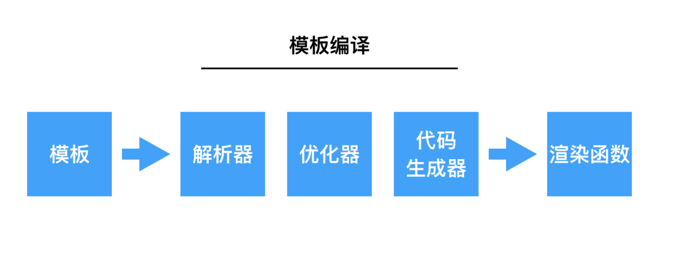
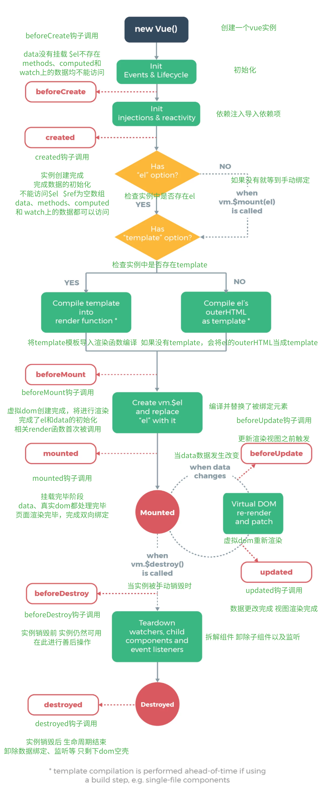

# vue 面试指南

[[toc]]

> 《深入浅出vuejs》
> 
> [「面试题」20+Vue面试题整理](https://juejin.im/post/6844904084374290446)
> 
> [从源码解读Vue生命周期，让面试官对你刮目相看](https://juejin.im/post/6844903879100858382)

## 响应式原理

object 和 array 的变化侦测采用了不同的处理方式。
### Object 的侦测
js 中有两种方法可以侦测变化： `Object.defineProperty` 和 `Proxy` 。

考虑到早期浏览器对 `es6` 的支持问题， vue2.0 使用前者。

> 在 vue3 中，已替换为 `Proxy` 方式。

Object 通过 `Object.defineProperty` 将属性转换为 `getter/setter` 形式。在读取数据时，在 `getter` 中收集使用了数据的依赖，当 `setter` 被触发时，通知 `getter` 收集的依赖数据发生了变化。通过创建 `Observer` 类，将一个 object 中的所有数据转换为 getter/setter 形式进行追踪变化。

不足：
-  `getter/setter` 只能追踪数据修改，无法追踪新增和删除，因此 vue 提供了 `vm.$set` 、 `vm.$delete` 来解决。

> [图片来源](https://blog.csdn.net/Xu_pengtao/article/details/104488594)

### array 的侦测
之所以 array 的侦测方式跟 object 的方式不一样，是因为我们可以通过 Array 的原型方法来改变数组内容，不会触发 getter/setter 。

vue 使用一个拦截器覆盖了 Array.prototype ，之后使用 Array 的原型方法实质上是在使用拦截器提供的方法。通过拦截器追踪到 Array 的变化。即函数劫持。

为了避免污染全局的 Array ，在 Observer 类中对需要侦测的数据进行判断，判断为数组时， 修改其 `__proto__` 。如果不支持 `__proto__`，直接简单粗暴地将方法挂载到被侦测的数组上。

Array 收集依赖依然是在该数组的 getter 中进行。

即通过 getter 收集依赖，通过拦截器提供的方法触发依赖。

由于它是通过拦截方法实现侦听，则有些操作同样是无法追踪的：

- 直接修改数组 length ：array.length = 0
- 使用索引修改数组： array[0] = newValue
## 虚拟 DOM 原理
为了避免频繁操作 DOM 导致的性能问题， vue 通过声明式操作 DOM ：通过描述状态和 DOM 之间的映射关系，将状态渲染成视图。开发者只需要进行状态变化，从状态改变到视图改变的过程，由 vue 来实现。这本质上是使用 js 的运算成本来替换 DOM 操作的执行成本，因为 js 的运算速度比 DOM 快很多，所以这样很划得来。

虚拟 DOM ：通过状态生成一个虚拟节点树，使用虚拟节点树进行渲染。在状态发生变化时，生成新的虚拟节点树，并将新树与旧树进行对比，只渲染不同的部分。

vue 的变化侦测方案是：使用组件级的变化侦测器监听状态变化，当变化发生时，通知到组件，组件内部通过虚拟 DOM 进行对比和渲染。

### 虚拟节点树 VNode
VNode 是一个类，可以生成不同类型的 vnode 实例：元素节点、组件节点、函数式节点、文本节点、注释节点、克隆节点。

不同类型的 vnode 与不同类型的 DOM 元素相映射，通过状态生成 vnode ，使用 vnode 渲染为真实的 DOM 。

### patch/diff 算法    
patch 是虚拟 DOM 最核心的部分，它负责将 vnode 渲染成真实的 DOM 。

patch 的过程就似乎创建节点、删除节点、修改节点的过程。

之所以需要 diff 算法来对比两个节点的差异，针对节点进行更新，是出于性能的考虑。

通过 patch 我们可以对比新旧两个虚拟 DOM，从而只针对发生了变化的节点进行视图更新的操作。

**从虚拟节点创建真实节点，并更新到视图的过程**

只有三种类型的节点需要创建并插入到 DOM 中：元素节点、注释节点、文本节点

1. 判断 vnode 是否是元素节点
    - 有 tag 属性：元素节点
    - 无 tag ，isComment 为 true ：注释节点
    - 文本节点
2. 调用 document.createElement / createTextNode / createComment 方法创建真实节点
3. 使用 parentNode.appendChild 方法将元素渲染到视图

**diff 算法**

## 模板编译原理
**模板编译的目标是生成渲染函数，渲染函数的作用是每次执行都使用当前最新状态生成一份新的 vnode 。**

### 编译过程

先将模板解析成 AST(抽象语法树) ，遍历 AST ，标记静态节点以优化后续渲染，然后再使用 AST 生成渲染函数。

### 解析器
解析器的目标就是把模板解析为 AST ，其中又包括HTML 解析器、过滤器解析器、文本解析器。

vue 定义了各种解析使用的钩子函数，当解析时触发不同的钩子函数，构建出不同的节点。通过栈来得到当前节点的父节点，将构建出的节点添加给父节点。

HTML 解析器一小段一小段地截取模板字符串，根据截取出的字符串类型触发钩子函数，直到模板字符串截空。运行完毕后，就得到了一个完整的带 DOM　层级关系的　AST　。

### 优化器
优化器从解析器生成的　AST　树中找出静态子树并做标记，每次重新渲染或　patch　时不需要为静态子树重新创建节点，达到优化渲染的目的。

静态子树是一些永远不会发生变化的节点，譬如一个纯文本节点（带变量的文本节点则会随变量变化）。

通过递归的方式实现。
### 代码生成器
将 AST 转换为渲染函数中的内容，即代码字符串。

每处理一个　AST　节点，即生成一个与节点类型对应的代码字符串。最先生成根节点，然后通过递归，继续生成它的子节点。

## MVVM 设计
> [MVC，MVP 和 MVVM 的图示——阮一峰](http://www.ruanyifeng.com/blog/2015/02/mvcmvp_mvvm.html?20171129201312)
所有软件系统都做一件事：将数据展示给用户看，并处理用户对界面的操作。由此衍生出三种软件架构。

### MVC 模式

MVC 模式把应用分为三块： Model 、 View 、 Controller 。

View 是用户视图， Model 是数据模型， Controller 是控制器。

- View 传送指令到 Controller
- Controller 完成业务逻辑后，要求 Model 改变状态
- Model 将新的数据发送到 View，用户得到反馈

用户与视图交互，这种交互传递给 Controller ， Controller 操作 Model ，并把 Model 返回的信息。

### MVP 模式
MVP 模式将 MVC 模式中的 Controller 改为 Presenter，同时改变了通信方向。

- View 与 Model 不发生联系，都通过 Presenter 传递。
- Presenter 与 View 和 Model 的联系都是双向的
- View 非常薄，不部署任何业务逻辑，称为"被动视图"（Passive View），即没有任何主动性
- Presenter非常厚，所有逻辑都部署在那里。

### MVVM 模式
MVVM 模式将 MVP 模式中的 Presenter 改名为 ViewModel ，基本上与 MVP 模式完全一致。

ViewModel 采用双向数据绑定的方式， View 的变动会自动反应在 ViewModel 中， ViewModel 的变化也会在 View 中体现。

这使得 Model 和 View 的数据同步工作完全自动化，无需人为干预。开发者只需关注业务逻辑，不需要手动操作 DOM , 不需要关注数据状态的同步问题，复杂的数据状态维护完全由 MVVM 来统一管理。

## 生命周期

beforeCreate 是 new Vue() 之后触发的第一个钩子，在当前阶段 data 、 methods 、 computed 以及 watch 上的数据和方法都不能被访问。

created 在实例创建完成后发生，<mark>当前阶段已经完成了数据观测</mark>，也就是可以使用数据，更改数据。在这里更改数据不会触发 updated 函数。**可以做一些初始数据的获取**，在当前阶段无法与 Dom 进行交互，如果非要想，可以通过 `vm.$nextTick` 来访问 Dom 。

beforeMount 发生在挂载之前，在这之前 template 模板已导入渲染函数编译。而当前阶段虚拟 Dom 已经创建完成，即将开始渲染。在此时也可以对数据进行更改，不会触发 updated 。

mounted 在挂载完成后发生，在当前阶段，真实的 Dom 挂载完毕，数据完成双向绑定，可以访问到 Dom 节点，使用 $refs 属性对 Dom 进行操作。

beforeUpdate 发生在更新之前，也就是响应式数据发生更新，虚拟 Dom 重新渲染之前被触发，你可以在当前阶段进行更改数据，不会造成重渲染。

updated 发生在更新完成之后，当前阶段组件 Dom 已完成更新。要注意的是避免在此期间更改数据，因为这可能会导致无限循环的更新。

beforeDestroy 发生在实例销毁之前，在当前阶段实例完全可以被使用，我们可以在这时进行善后收尾工作，比如清除计时器。

destroyed 发生在实例销毁之后，这个时候只剩下了 DOM 空壳。组件已被拆解，数据绑定被卸除，监听被移出，子实例也统统被销毁。

### 父子组件的生命周期顺序
组件的调用顺序都是`先父后子`，渲染完成的顺序是`先子后父`。

组件的 beforeDestroyed 是`先父后子`， destroyed 的顺序是`先子后父`。

父组件加载渲染过程
`父beforeCreate -> 父created -> 父beforeMount -> 子beforeCreate -> 子created -> 子beforeMount -> 子mounted -> 父mounted`

子组件更新过程
`父beforeUpdate->子beforeUpdate->子updated->父updated`

父组件销毁过程
`父beforeDestroy->子beforeDestroy->子destroyed->父destroyed`

## nextTick 原理
> [通俗易懂了解Vue中nextTick的内部实现原理——源码讲解](https://www.cnblogs.com/wangjiachen666/p/11610289.html )

Vue 实现响应式并不是数据发生变化之后 DOM 立即变化，而是等同一事件循环的所有数据变化完成之后，再统一进行视图更新。

nextTick 的作用就是使得回调函数保证在下次 DOM 更新循环结束之后调用。

在 nextTick 的实现中，使用队列收集所有加入的回调函数。并在同一事件循环第一次执行 nextTick 时，将其加入到 JavaScript 引擎的任务队列（根据环境检测，优先加入微队列）中，等待事件循环机制来执行 nextTick 任务，该任务会遍历调用队列中的所有回调函数。

应用场景
- created 钩子函数中对 DOM 元素的访问；
- 在刚修改数据之后，需要对变化后的 DOM 进行操作；

## 组件间通信
- 父子组件
    - `props` 、 `$on/$emit`
    - `$parent/$children`
    - `ref`
- 所有组件
    - `vuex` 状态管理库
    - `Event Bus` ： `Vue.prototype.$bus = new Vue()`

## v-if 与 v-show
当条件不成立时， v-if 不会渲染 DOM 元素。

无论条件成不成立， v-show 都会渲染 DOM 元素。只是根据条件状态切换 display 的属性。

## data 为何是一个函数
一个组件被复用多次的话，也就会创建多个实例。本质上，这些实例用的是同一个构造函数。

如果 data 是对象的话，作为引用类型，任何一个实例对 data 的操作都会影响其它实例的 data 。

## $on 事件绑定

## keep-alive
`keep-alive` 可以实现组件缓存，当组件切换时不会对当前组件进行卸载。

常用的两个属性 `include/exclude` ，允许组件有条件的进行缓存。

两个生命周期 `activated/deactivated` ，用来监听当前组件是否处于活跃状态。

## watch 与 computed
> [watch和computed区别及二者使用场景](https://www.cnblogs.com/qing-xrr/p/11248550.html)
Computed 本质是一个具备缓存的 watcher ，依赖的属性发生变化就会更新视图。适用于计算比较消耗性能的计算场景。当表达式过于复杂时，在模板中放入过多逻辑会让模板难以维护，可以将复杂的逻辑放入计算属性中处理。

Watch 没有缓存性，更多的是观察的作用，可以监听某些数据执行回调。当我们需要深度监听对象中的属性时，可以打开 deep：true 选项，这样便会对对象中的每一项进行监听。这样会带来性能问题，优化的话可以使用字符串形式监听，如果没有写到组件中，不要忘记使用 unWatch 手动注销哦。

- watch 支持异步操作， computed 不支持
- 对于开销较大的操作，建议使用 watch
- watch 是监听属性变化， computed 是根据属性计算获得需要值
- computed 具有缓存机制，当其依赖的属性没有变化时，不会进行计算
- 当一个属性受多个属性影响时，使用 computed ；当一个属性影响多个属性时，使用 watch

## scoped
这个可选 `scoped` attribute 会自动添加一个唯一的 attribute (比如 `data-v-21e5b78`) 为组件内 CSS 指定作用域，编译的时候 `.list-container:hover` 会被编译成类似 `.list-container[data-v-21e5b78]:hover`。

## vue2 与 vue3 的区别
### 数据绑定原理的区别
vue2 使用 Object.defineProperty() 对数据进行劫持，结合 发布订阅模式 的方式实现数据变化响应。对于数组，使用拦截器覆盖 Array 原型方法实现。

vue3 采用 Proxy 和 Reflect 对象对数据进行代理。

vue3 的优势：
- 可以监听全对象
- 可以监听数组
- 非侵入式

### 生命周期的变化
生命周期函数的变化：从可选项 options 变为 Composition Api

- Vue2.0: `beforeCreated -> created -> beforeMounted -> mounted -> (beforeUpdated -> updated) -> beforeDestroyed -> destroyed` 
- Vue3.0: `setup -> onBeforeMoundted -> onMounted -> (onBeforeUpdated -> onUpdated) -> onBeforeUmMounted -> onUnMounted`

## 性能优化
编码阶段

- 减少data中的数据， data 中的数据都会增加 getter 和 setter ，会收集对应的 watcher
- v-if 和 v-for 不能连用
- 使用 v-for 给每项元素绑定事件时使用事件代理
- SPA 页面采用 keep-alive 缓存组件
- 对于不会频繁显隐的元素，尽可能使用 v-if 替代 v-show
- 在 v-for 中，总是提供 key 值且保证唯一
- 使用路由懒加载、异步组件
- 防抖、节流
- 第三方模块按需导入
- 长列表滚动到可视区域动态加载
- 图片懒加载
- 使用惰性函数进行浏览器能力检测
- CSS 精灵图

打包优化
- [gzip 压缩代码](https://www.cnblogs.com/style-hyh/p/10395410.html)
- 使用 cdn 加载第三方模块

用户体验
- 骨架屏
- 使用缓存
