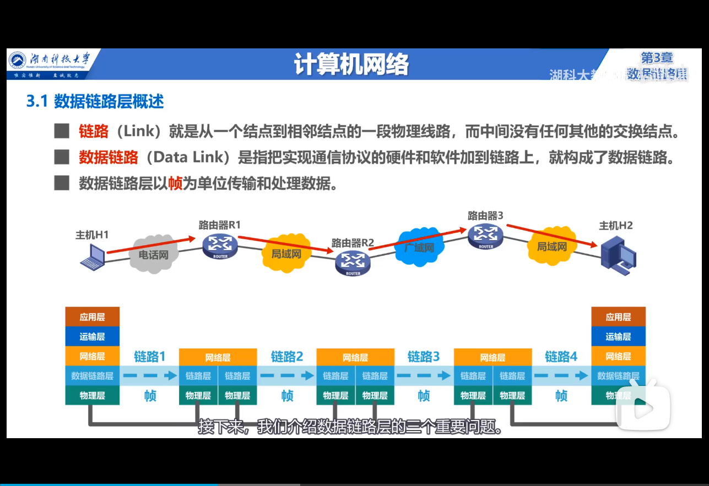
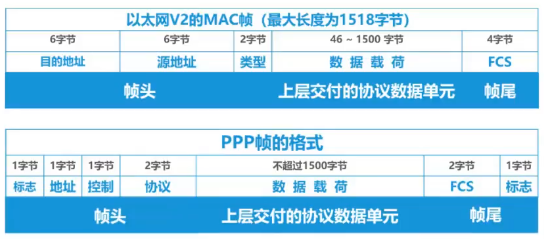
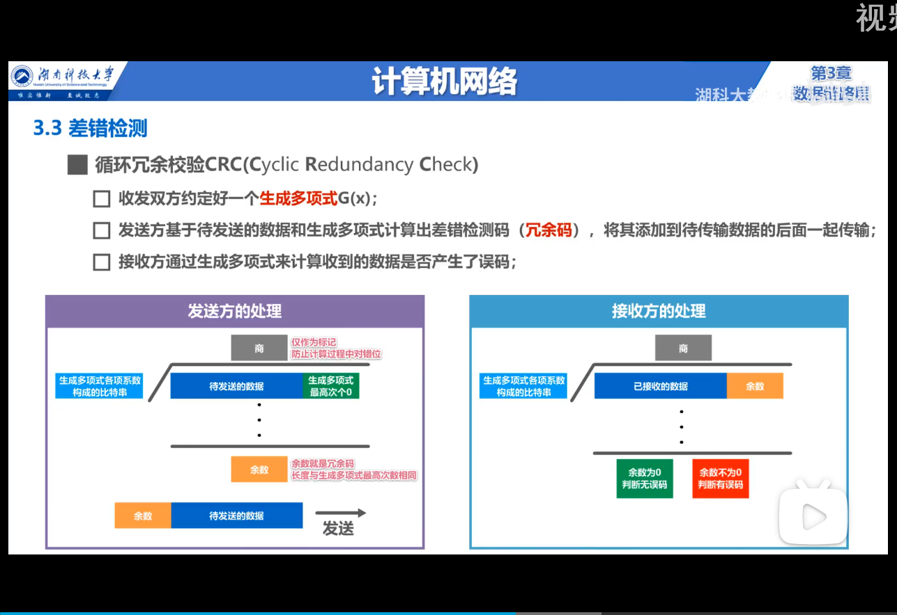
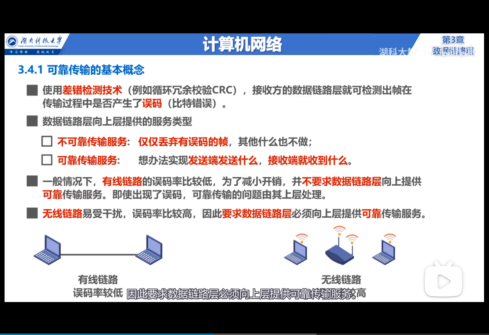
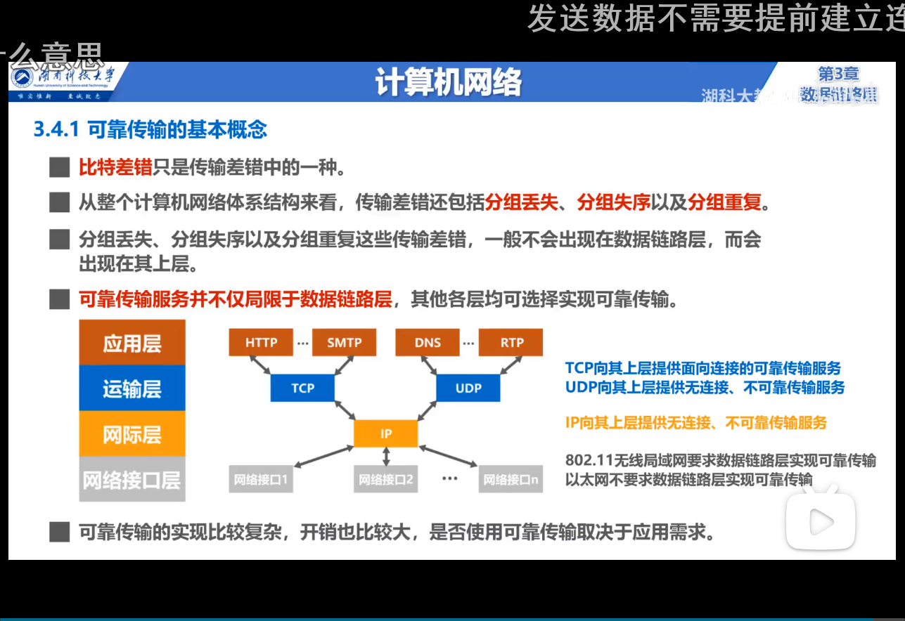
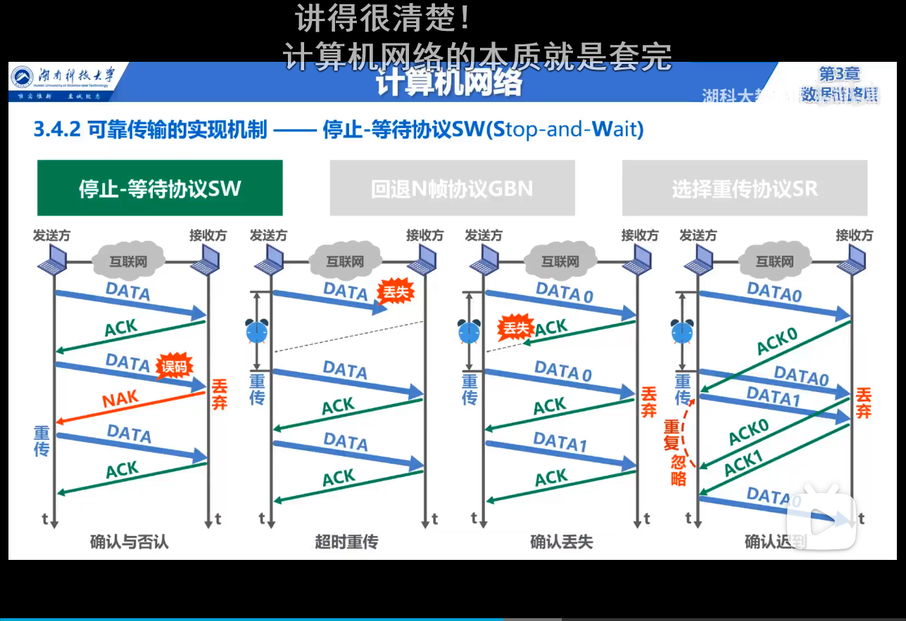
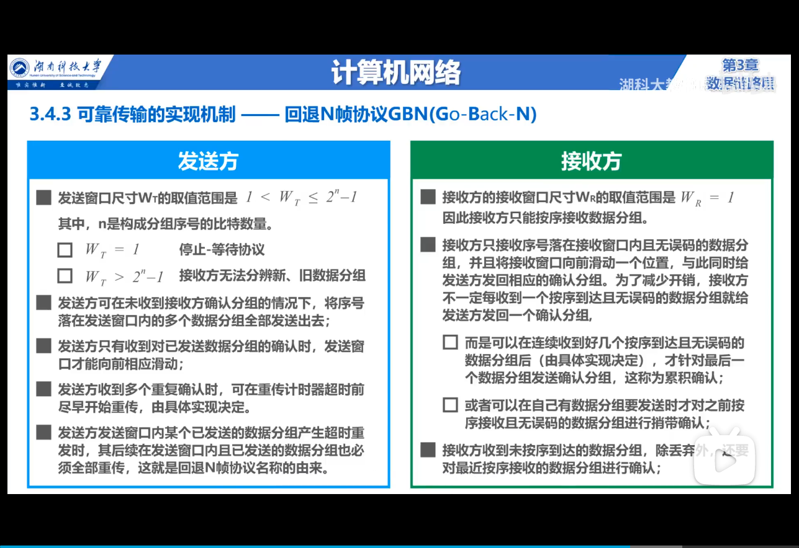
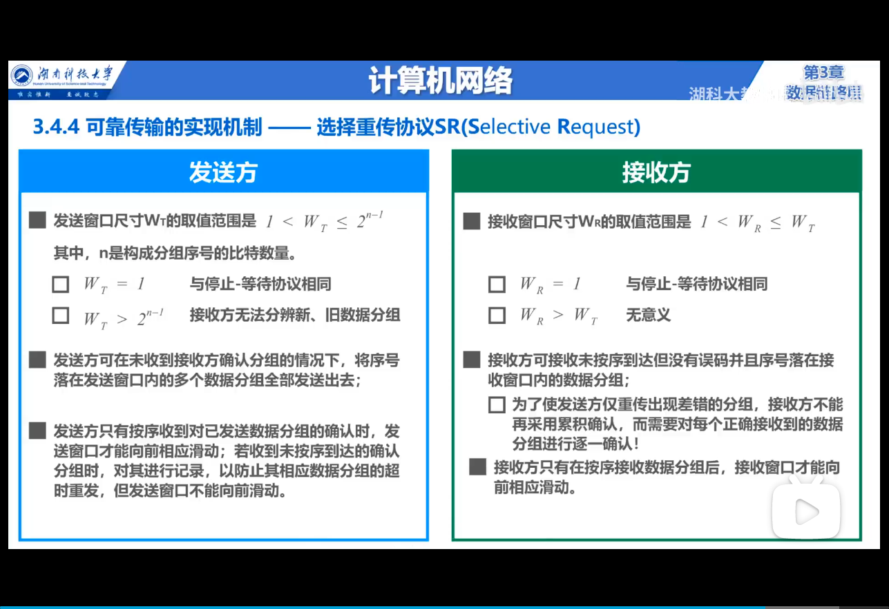

# 数据链路层

## 1. 概述

## 封装成帧
数据链路层为上层交付的数据单元添加 帧头 和 帧尾，使数据包能够以 帧 为单元进行数据传输。

- 帧头和帧尾中有重要的控制信息
- 帧尾封装错误检测码
- 帧头和帧尾包含 1 个字节的标志位（可能，MAC 帧由物理层添加前导码，不需要标志位）

### 透明传输
透明传输指数据链路层对上层交付的数据单元不做任何限制，好像链路层不存在一样。

实现的难点在于当数据单元中出现与帧头或帧尾相同的字节时，接收方有可能产生误判。为了消弭这种误判，针对不同的物理链路，有不同的处理方式：
1. 对于面向字节的物理链路：使用字节填充法（使用转义字节对数据单元中**与帧数据或转义字节相同的部分**进行转义）
2. 对于面向比特的物理链路：使用比特填充法（每 5 个连续的 1 后面追加一个 0）

## 差错检测
数据帧在传输过程中可能出现误码（0 变成 1）。

为进行错误检测，链路层在发送帧数据之前，对数据包进行计算生成检错码，封装在 帧尾。接收方同样对数据包执行检测算法，生成的检错码与帧尾对比。

> 检测算法为一个特定的 多项式。具体计算过程如下：
> 
> 
## 可靠传输
接收方收到有误码的帧后，会将其丢弃。除了误码，传输差错还包括分组丢失，分组失序，分组重复。

> 误码无法避免，但只要能够保证发送方发送什么，接收方就能接到什么，就称其为可靠传输。

### 停止-等待协议

### 回退 N 帧协议

### 选择重传协议
