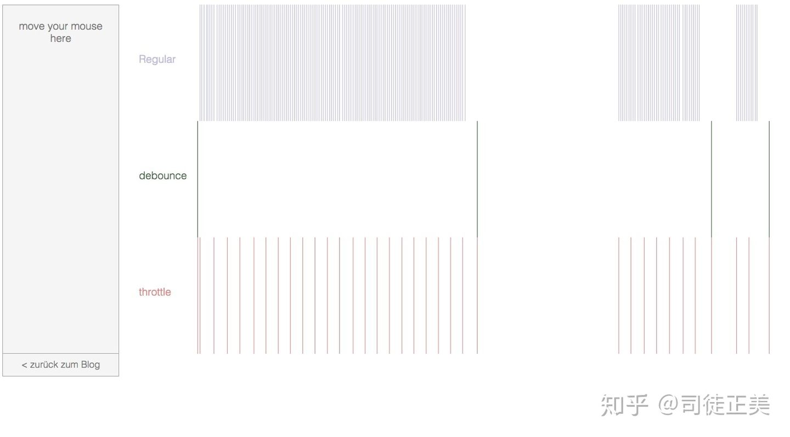

# js 实战技巧

## 高阶函数
在 JavaScript 中，函数是一等公民，可以对它进行以下操作：

- 将函数作为参数传递给其它函数（回调函数）
- 分配给变量并进行传递
- 作为其它函数的返回值

**高阶函数就是一个接收函数作为参数或将函数作为输出返回的函数。**

## 闭包

**一个函数和对其周围状态的引用捆绑在一起（或者说函数被引用包围），这样的组合就是闭包（closure）。**

也就是说，闭包是指引用了另一个函数作用域中变量的函数，通常在嵌套函数中实现。闭包让你可以在一个内层函数中访问到其外层函数的作用域。在 JavaScript 中，每当创建一个函数，闭包就会在函数创建的同时被创建出来。

一般函数执行完毕后，局部活动对象会被销毁，而闭包中，外部函数执行完毕后，由于其活动对象还存在于其内部函数的作用域链中，所以不会立即销毁。

- 通常在**使用只有一个方法的对象**的地方，都可以使用闭包。
- **使用闭包来模拟私有方法**。私有方法不仅仅有利于限制对代码的访问：还提供了管理全局命名空间的强大能力，避免非核心的方法弄乱了代码的公共接口部分。
- **解决循环中的 var 问题**（现在可以使用 let 来解决）

> **注：**
> 闭包在**处理速度和内存消耗方面**对脚本性能具有负面影响。

## 内存管理
> [内存管理机制](https://blog.csdn.net/qq_40028324/article/details/92970588)

1. 内存分配：声明变量、函数、对象时，自动分配内存
2. 内存使用：对内存的读写
3. 内存回收：变量使用完毕，垃圾回收机制自动回收不再使用的内存

## 内存泄漏

> [JavaScript 内存泄漏教程 —— 阮一峰](http://www.ruanyifeng.com/blog/2017/04/memory-leak.html)

**不再用到的内存，没有及时释放，就叫做内存泄漏（memory leak）。**

内存泄漏（Memory Leak）是指程序中已动态分配的堆内存由于某种原因程序未释放或无法释放，造成系统内存的浪费，导致程序运行速度减慢甚至系统崩溃等严重后果。JavaScript 中的内存泄漏大部分是不合理的引用导致的。

- 意外声明的全局变量：没有使用关键字声明变量，默认挂在 window 中，只要 window 未被清理，就不会消失
- 定时器的回调：通过闭包引用了外部变量，当定时器一直运行，回调函数所引用的变量就会一直占用内存；
- 闭包：内部函数未被销毁，其外部函数的上下文变量都会一直存在
- DOM 引用：对 DOM 的引用保存在数组或对象里，就算 DOM 元素移除了，依然无法进行内存回收

> **内存溢出**
> 应用系统中使用的内存过多，使得程序运行所需的内存大于系统能提供的内存。

## 垃圾回收机制
> [前端面试：谈谈 JS 垃圾回收机制——思否](https://segmentfault.com/a/1190000018605776)

> **引用计数垃圾收集**
> 最初的垃圾回收算法是看一个对象是否有指向它的引用，如果没有对象指向它了，说明该对象不再需要，可以清除掉。
> 但这种方法有一个致命问题：`循环引用` 。如果两个对象互相引用，即使它们不再被系统需要，仍然不会被回收，造成内存泄漏。

JavaScript 中的内存管理是自动执行的，而且是不可见的，其主要概念是**可达性**。

### 可达性
可达性即是如果某值是以某种方式可访问到的（可达），会被保证存储在内存中，否则就会在垃圾回收时被删除掉。

- **基本固定可达值：根**
    - 全局变量
    - 本地函数的局部变量、参数
    - 当前函数执行链上的其它函数的变量和参数
- **从根可以访问到的值**
    - 如本地函数的变量引用了另一个对象，则另一个对象也是可达的，不会被清理

### 标记-清除算法
基本的垃圾回收算法称为“标记-清除”，定期执行以下“垃圾回收”步骤:

1. 垃圾回收器获取根，并“标记”它们
2. 然后它访问并“标记”所有它们的引用
3. 然后它访问标记的对象并标记它们的引用（所有被访问的对象都被记住，以便以后不再访问同一个对象两次）
4. 以此递归下去，直到没有未访问的引用(可以从根访问)为止
5. 除被标记的对象外，所有对象都被删除

## 防抖与节流
在使用 js 对某些事件进行监听的时候，一些事件可能会持续触发，导致执行函数频繁执行，比如页面滚动、键盘输入等。非常消耗浏览器性能。

因此需要对这些事件中执行函数的执行频率进行控制，有两种方案： `debounce` 和 `throttle` 。

两者作用类似，都是减少执行函数的执行次数，策略上不相同。

### 防抖
防抖是在一定时间内函数只执行一次，如果在这个时间段中又触发事件，则重新计算时间。

防抖又分为非立即执行版和立即执行版，非立即执行版在首次触发事件时不执行，等 `delay` 时间后再执行，代码如下：

```js
// 非立即执行版
function debounce(func, delay) {
    let timeout
    return function(){
        // 如果定时器有值，则清除之
        if (timeout) clearTimeout(timeout)

        // 设置定时器，隔 delay 毫秒后执行方法
        timeout = setTimeout(() => {
            // 使用 apply 指向正确 this(箭头函数没有 this，此处 this 指向上一层函数)
            func.apply(this, arguments)
        }, delay)
    }
}

// test
var validate = debounce(function(e) {
    console.log("change", e.target.value, new Date()- 0)
}, 380);

// 绑定监听
document.querySelector("input").addEventListener('input', validate);

```

立即执行版则是首次触发即执行，然后等一定时间后再执行。

```js
function debounce(func, delay) {
    let timeout
    return function(){
        // 如果定时器存在，则清除定时器（为了重新计时）
        if (timeout) clearTimeout(timeout)
        // 如果定时器为空，则执行一次
        else func.apply(this, arguments)

        // 开启定时器，在指定时间后清空 
        timeout = setTimeout(() => {
            timeout = null
        }, delay)
    }
}

```
### 节流
节流是在连续触发事件时每隔一定时间执行一次。

```js
// 非立即执行版
function throttle(func, delay) {
    // 执行标记，如果为 false ，则拒绝执行
    let timeout
    return function() {
        if (!timeout) {
            timeout = setTimeout(() => {
                timeout = null
                func.apply(this, arguments)
            }, delay)
        }
    }
}

// 立即执行版
function throttle(func, delay) {
    let previous = 0
    return function() {
        let now = Date.now()
        if (now - previous > delay) {
            previous = now
            func.apply(this, arguments)
        }
    }
}
```
防抖与节流的事件执行频率对比：



## 惰性函数
惰性载入表示函数执行的分支只会在函数第一次掉用的时候执行，**在第一次调用过程中，该函数会被覆盖为另一个按照合适方式执行的函数，这样任何对原函数的调用就不用再经过执行的分支了。**

在开发过程中，有时候需要对浏览器环境进行检测，如封装一个为元素添加一个监听事件的方法，需要判断浏览器环境以决定使用何种添加方法。但常规写法中每次调用添加事件的函数都会对环境进行检测，而实际上只需要检测一次。

```js
function addEvent (type, element, fun) {
    // 分支判断
    if (element.addEventListener) {
        // 执行事件添加函数
        element.addEventListener(type, handler, false)
        // 修改本体函数，后续就不会再进行判断了
        addEvent = function (type, element, fun) {
            element.addEventListener(type, fun, false);
        }
    }
    else if(element.attachEvent){
        element.attachEvent('on' + type, fun)
        addEvent = function (type, element, fun) {
            element.attachEvent('on' + type, fun);
        }
    }
    else{
        element['on' + type] = fun
        addEvent = function (type, element, fun) {
            element['on' + type] = fun;
        }
    }
}
```

## 函数柯里化
> [详解JS函数柯里化](https://www.jianshu.com/p/2975c25e4d71)（可能有误，还需再加深理解）

> [函数式编程入门教程——阮一峰](http://www.ruanyifeng.com/blog/2017/02/fp-tutorial.html)
函数柯里化（ Currying ）是把接受多个参数的函数变换成接受一个单一参数（最初函数的第一个参数）的函数，并且返回接受余下的参数而且返回结果的新函数的技术。

```js
// 普通的add函数
function add(x, y) {
    return x + y
}

// Currying后
function curryingAdd(x) {
    return function (y) {
        return x + y
    }
}

add(1, 2)           // 3
curryingAdd(1)(2)   // 3
```

经典面试题
```js
// 实现一个add方法，使计算结果能够满足如下预期：
// add(1)(2)(3) == 6;
// add(1, 2, 3)(4) == 10;
// add(1)(2)(3)(4)(5) == 15;

function add() {
    // 第一次执行时，定义一个数组专门用来存储所有的参数
    var _args = Array.prototype.slice.call(arguments);

    // 在内部声明一个函数，利用闭包的特性保存_args并收集所有的参数值
    var _adder = function() {
        _args.push(...arguments);
        return _adder;
    };

    // 利用toString隐式转换的特性，当最后执行时隐式转换，并计算最终的值返回
    _adder.toString = function () {
        return _args.reduce(function (a, b) {
            return a + b;
        });
    }
    return _adder;
}

add(1)(2)(3) == 6 // true
add(1, 2, 3)(4) == 10 // true
add(1)(2)(3)(4)(5) == 15 // true
add(2, 6)(1) == 9 // true
```

### 跨域与解决办法
> [前端常见跨域解决方案（全）](https://segmentfault.com/a/1190000011145364)
**后端处理**
```js
// 允许跨域访问的域名：若有端口需写全（协议+域名+端口），若没有端口末尾不用加'/'
response.setHeader("Access-Control-Allow-Origin", "http://www.domain1.com"); 
```

**JSONP**

**NGINX 反向代理**
